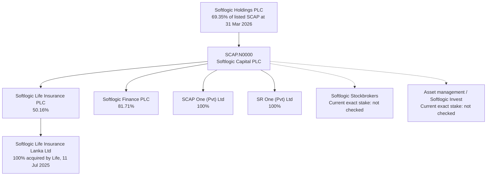
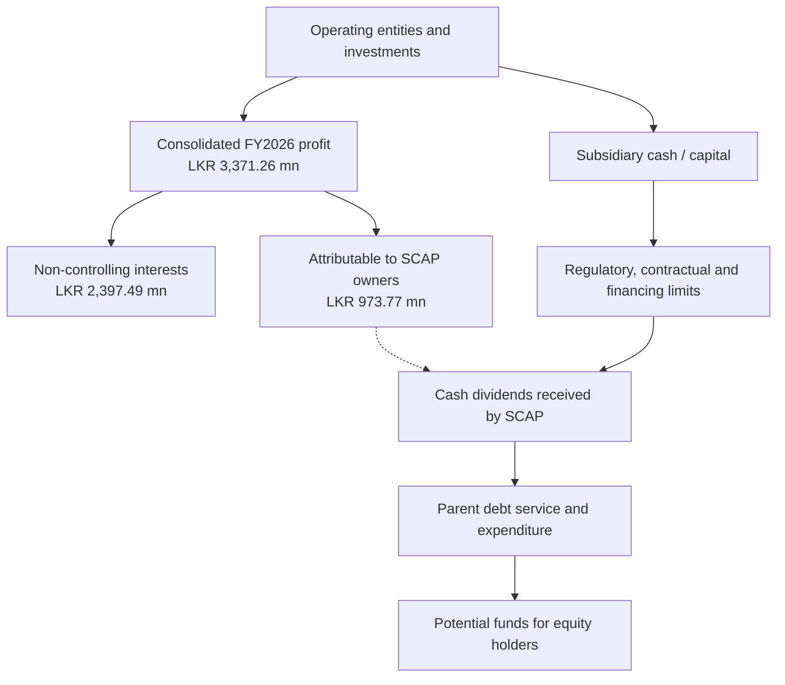

# 01 · Business Analysis — Softlogic Capital PLC

**[🧭 SWOT Analysis — dated strengths, weaknesses, opportunities and threats](SWOT-ANALYSIS.md)**

**[📊 Open the complete Business Visual Report: 16 source-labelled charts, ownership diagrams, money flows and market maps](VISUAL-REPORT.md)**

[← Fundamental analysis](../README.md) · **English** · [தமிழ்](../../../ta/01-Fundamental-Analysis/01-Business-Analysis/README.md) · [සිංහල](../../../si/01-Fundamental-Analysis/01-Business-Analysis/README.md)

> **CSE: SCAP.N0000** · **Research checked: 30 September 2026** · **Evidence: SCAP's own CSE-filed 27 May 2026 interim statements plus company disclosures.**
>
> **Partially verified — not a valuation or recommendation.** The original FY2026 annual report and June 2026 interim have not yet been fully tied out here. All holding percentages below are **as at 31 March 2026**, not assertions about today's share register. See [S1–S6](#-sources-and-quality-of-evidence).

## 🔎 What the business actually is

**Softlogic Capital PLC is the Softlogic Group's listed financial-services holding company, not a standalone life insurer or finance company.** According to its own overview, it started as Capital Reach Holdings Limited in April 2005 and was acquired by Softlogic Holdings PLC in August 2010. Its described interests span life insurance, regulated non-bank lending, stockbroking, and investment management. SCAP itself also describes an SEC investment-manager licence. **[S2, S3]**

**Controlling shareholder:** Softlogic Holdings PLC held **677,652,893 SCAP shares, 69.35%**, on **31 March 2026**. SCAP reported **977,187,200 ordinary shares** and **30.36% public holding** on the same date. **[S1, PDF pp. 15–16]**

## 🗺️ Ownership map — dated, *not* a current live shareholding chart

| Legal entity / exposure | SCAP holding reported at 31 Mar 2026 | What is established | Main remaining question |
|---|---:|---|---|
| Softlogic Life Insurance PLC | **50.16%** | SCAP corporate-information table **[S1, PDF p. 19]** | Any subsequent ownership changes, insurer distributable capital |
| Softlogic Finance PLC | **81.71%** | SCAP list, independently reflected in finance-company shareholder disclosure **[S1, p. 19; S4]** | Encumbrances, later capital and ownership changes |
| SCAP One (Pvt) Ltd | **100%** | SCAP corporate-information table **[S1, p. 19]** | Assets, liabilities, and why held |
| SR One (Pvt) Ltd | **100%** | SCAP corporate-information table **[S1, p. 19]** | Transferred assets, recoveries and funding structure |
| Softlogic Stockbrokers (Pvt) Ltd | **Not established from that ownership table** | Issuer lists stockbroking among its businesses **[S2, S3]** | Current equity percentage; standalone income |
| Softlogic Asset Management / Softlogic Invest | **Current percentage not verified** | Issuer website calls Softlogic Invest 100%-owned, but the description is not dated **[S3]** | Match current legal entity, stake and AUM |

**Important indirect holding:** SCAP's filing says Softlogic Life acquired **100%** of Softlogic Life Insurance Lanka Limited (formerly Allianz Life) on **11 July 2025**, paying **LKR 1,426 million**. It is an *insurer-owned* company: do **not** count it as an additional 100%-direct SCAP subsidiary. **[S1, PDF p. 11]**

## 💼 Who pays the businesses, and how?

| Operating exposure | Customer / counterparty | Economic earnings drivers | What can undermine those earnings |
|---|---|---|---|
| **Life insurance** | People, families, employers paying premiums | Insurance contracts, renewals, risk pricing, claims experience, investment return, distribution productivity | Claims and acquisition costs, contract-liability changes, solvency and restricted capital |
| **Non-bank finance** | Borrowers paying loan/lease interest and fees; savers providing deposits | Loan yield less funding cost, credit losses and administration; secured and unsecured lending mix | Loan defaults, deposit outflows, capital requirements and refinancing |
| **Stockbroking** | Retail, institutional and other trading clients | Executed-trade commissions and **documented** advisory/other fees | CSE turnover, customer concentration and competition |
| **Asset / unit-trust management** | Fund investors; fee-paying mandates where applicable | Fees on assets under management and other permitted services | Redemptions, weak returns, lower fee rates and operating expense |
| **Holding company itself** | Investee companies and group counterparties | Received subsidiary dividends, interest and disclosed consultancy/management fees | Parent interest costs, group eliminations, related-party exposure and dividend restrictions |

These are **economic mechanisms**, not a claim that every line earned a profit in 2026. Insurer **gross written premiums are not identical to group insurance revenue**, and unit-trust client assets are not SCAP shareholder-owned cash. **[S1 pp. 2, 3, 10; S2, S3]**

## 📊 FY2026 reported segment economics — source is interim, not audited FY2026

**[S1, PDF p. 10]** provides the year-ended **31 March 2026** business-segment disclosure:

| Segment | Revenue shown before consolidation eliminations | Segment profit / (loss) after tax | Notes |
|---|---:|---:|---|
| Insurance | **LKR 48,425.96 mn** | **+LKR 4,870.86 mn** | Includes large insurance investment and contract-related balances |
| Non-banking financial institutions | **LKR 1,384.78 mn** | **−LKR 136.24 mn** | Finance operations; investigate asset quality |
| Others | **LKR 2,759.84 mn** | **−LKR 515.40 mn** | Includes holding-company and other operations; contains inter-segment activity |
| Consolidation adjustments | **−LKR 1,260.09 mn** | **−LKR 847.95 mn** | Must be included before comparing to group totals |
| **Group total** | **LKR 51,310.49 mn** | **+LKR 3,371.26 mn** | **Does not all belong to SCAP shareholders** |

**Segment-data correction (30 Sep 2026):** The earlier transcription of Other revenue as LKR 4,019.94mn did **not** reconcile to reported group revenue. The value **approximately LKR 2,759.84mn** is **derived** as 51,310.49 − 48,425.96 − 1,384.78 + 1,260.09 (LKR mn), consistent with a [secondary figure rounded to LKR 2,760mn](https://stockanalysis.com/quote/cose/SCAP.N0000/financials/). The exact Other line still needs rechecking against the original CSE PDF. Do not treat the derived value as independently verified.

The **FY2025 audited comparative group revenue** in this CSE filing is **LKR 42,383.72 mn**, not the **LKR 39,794 mn** value appearing in an older third-party snapshot elsewhere in this repository. This is a **source discrepancy that needs reconciliation**; prefer the original issuer-reported comparator for this document. **[S1, PDF p. 2]**

**Business interpretation:** The insurance line accounts for most *reported operating-segment revenue* in the FY2026 table, but **segment revenue is not a measure of SCAP's effective ownership or freely withdrawable money**. Insurance-period and SCAP group-period accounting may differ. Do not compare calendar-year insurer GWP with the April–March consolidated total.

## 💸 The critical bridge: group profit ≠ SCAP-owner profit ≠ parent-company cash

**The original income statement allocates FY2026 group profit as LKR 973.77 million to owners of SCAP and LKR 2,397.49 million to non-controlling interests**; **LKR 973.77 million is profit attribution, not a cash dividend**. **[S1, PDF p. 2]**

The **SCAP company-only** results tell a different story:

| Parent-only item | FY ended 31 Mar 2026 / at that date | Interpretation |
|---|---:|---|
| Total income | **LKR 1,485.72 mn** | Separate parent income, **not** group revenue **[S1, p. 3]** |
| Dividend income received/recorded | **LKR 635.18 mn** | Versus LKR 3,273.55 mn in FY2025 audited comparator; not a dividend paid to SCAP ordinary shareholders **[S1, p. 3]** |
| Interest expense | **LKR 1,810.84 mn** | Material parent financing cost **[S1, p. 3]** |
| Company-only loss | **−LKR 722.49 mn** | Not contradictory to consolidated group profit **[S1, p. 3]** |
| Cash and bank balances | **LKR 32.07 mn** | Parent-only cash; separate from group cash **[S1, p. 6]** |
| Parent bank overdraft | **LKR 323.13 mn** | Parent-only current financing **[S1, p. 6]** |
| Parent interest-bearing borrowings | **LKR 17,324.26 mn** | Compare maturities, security, refinance ability and actual dividends **[S1, p. 6]** |
| Parent total equity | **LKR 4,848.03 mn** | Different from *consolidated equity attributable to owners* **[S1, p. 6]** |
| Consolidated equity attributable to owners | **−LKR 1,035.49 mn** | Distinct from total consolidated equity **+LKR 6,269.84 mn** because of **+LKR 7,305.34 mn non-controlling equity** **[S1, p. 6]** |

**Important caution:** Reported positive group profit alongside **negative consolidated equity attributable to SCAP shareholders**, a parent loss and substantial parent borrowings makes the cash-upstream/financing reconciliation essential. This is **not** itself a company failure prediction. The 27 May filing explicitly says valuation of subsidiaries at 31 March 2026 was still being measured and changes had not been reflected in those interim statements. **[S1, PDF pp. 6, 11]**

### Does the parent actually earn external revenue?

In the **company-only related-party transaction note**, SCAP records **FY2026 interest income from Softlogic Holdings of LKR 427.04 mn** and **SR One of LKR 160.39 mn**, and **consultancy/professional fees from Softlogic Life (LKR 120 mn), Stockbrokers (LKR 64.11 mn) and Asset Management (LKR 76 mn)**. These are **reported intragroup transactions**; they cannot simply be added to external group revenue. **[S1, PDF p. 17]**

### Can all insurer profit be transferred up?

No such assumption is justified. **The insurer's restricted one-off surplus is subject to IRCSL governance conditions and permission before it can be released as dividends.** The filing reports a **LKR 1,515.80 mn restricted regulatory reserve** at 31 March 2026. This is a concrete example of a ring-fenced amount that must not be treated as SCAP's immediately available cash. **[S1, PDF pp. 6, 13]**

## 🧩 Competitive position — propositions to verify, not proven strengths

| Possible factor | Supporting issuer description | Test that would actually matter |
|---|---|---|
| Multiple financial-services distribution channels | SCAP operates insurance, finance, brokerage and asset-management activities **[S2, S3]** | Measure profitable cross-selling, customer retention and acquisition costs |
| Insurance scale | Insurance is the largest SCAP *reported revenue* segment in FY2026 **[S1, p. 10]** | Compare persistency, claims, insurer operating returns and solvency with like-for-like peers |
| Brokerage client access | Stockbrokers describes retail, institutional and high-net-worth clientele **[S3]** | Verify fee mix, trading market share and net contribution |
| Lending recovery / capital reorganisation | SR One appears as a 100%-owned company in the FY2026 filing **[S1, p. 19]** | Track transferred assets, capital effects, recoveries, and regulatory compliance from audited notes |

**None of these descriptions is proof of a sustainable competitive advantage.** Compare each business only to genuinely comparable industry peers.

## 📝 Filled evidence worksheet

| Measure or claim | Scope / reporting date | Source + original PDF page | Evidence finding / status |
|---|---|---|---|
| Controlling SCAP shareholder | SCAP listed company, 31 Mar 2026 | **[S1, pp. 15–16]** | Softlogic Holdings **69.35%**, source-reported |
| Ordinary shares / public holding | SCAP, 31 Mar 2026 | **[S1, pp. 15–16]** | **977,187,200 shares**; public **30.36%**, source-reported |
| Softlogic Life ownership | SCAP subsidiary table, 31 Mar 2026 | **[S1, p. 19]** | **50.16%** reported |
| Softlogic Finance ownership | SCAP + finance reports, 31 Mar 2026 | **[S1, p. 19; S4]** | **81.71%** reported |
| SCAP One and SR One | SCAP subsidiary table, 31 Mar 2026 | **[S1, p. 19]** | **100% each** |
| Stockbrokers and Asset Management | Issuer website, undated | **[S2, S3]** | Businesses described; **current exact ownership OPEN** |
| Insurer's Allianz Life acquisition | 11 Jul 2025 transaction | **[S1, p. 11]** | Softlogic Life bought **100%** for **LKR 1,426 mn** |
| Consolidated revenue / group PAT | FY2026, interim | **[S1, pp. 2, 10]** | **LKR 51,310.49 mn / 3,371.26 mn** |
| Owners' profit / minority profit | FY2026, interim | **[S1, p. 2]** | **LKR 973.77 mn / 2,397.49 mn** |
| Company dividend income | Parent-only FY2026, interim | **[S1, p. 3]** | **LKR 635.18 mn**, not shareholder payout |
| Company interest cost / loss | Parent-only FY2026, interim | **[S1, p. 3]** | **LKR 1,810.84 mn / loss 722.49 mn** |
| Parent debt / cash | Parent-only at 31 Mar 2026 | **[S1, p. 6]** | Borrowings **LKR 17,324.26 mn**; cash **LKR 32.07 mn** |
| Parent-attributable consolidated equity | Consolidated at 31 Mar 2026 | **[S1, p. 6]** | **−LKR 1,035.49 mn**; must distinguish from parent standalone equity |
| Insurer restricted reserve / dividend controls | Group at 31 Mar 2026 | **[S1, pp. 6, 13]** | **LKR 1,515.80 mn** and IRCSL approval requirements |
| FY2025 comparative revenue | Audited comparator in FY2026 interim | **[S1, p. 2]** | **LKR 42,383.72 mn**, conflicting with old third-party snapshot |
| FY2026 audited final / June 2026 quarter | Subsequent source review | **[S6]**, secondary | **OPEN — fetch original SCAP documents and reconcile** |

## ⏭️ Next specific diligence steps

- [x] Identify listed parent, controlling shareholder and **dated** material holdings.
- [x] Map insurer, lender, broker, asset-management and SPV revenue mechanics.
- [x] Read SCAP's **original** FY2026 interim segment, company-only and consolidation notes.
- [x] Reconcile FY2026 interim *group profit* to *profit attributable to SCAP owners*.
- [ ] **Priority:** retrieve and reconcile the **FY2025/26 audited SCAP annual report** and **June 2026 original SCAP interim**, including subsequent events or restatements.
- [ ] Verify exact contemporary broker/asset-manager stakes and legal structures, including any pledged shares.
- [ ] Reconstruct parent-level debt maturity, guarantees, cash receipts, dividend capacity and insurance capital restrictions.
- [ ] Compare insurer persistency/solvency and lender credit/funding metrics with dated sector competitors.
- [ ] Reconcile the original FY2025 revenue comparator with the older third-party charts elsewhere in this repo.

**A documented profit does not establish the cash that ordinary shareholders can receive. This is business analysis, not a share-price recommendation.**

## 📚 Sources and quality of evidence

**[S1] SCAP CSE-filed interim financial statements, year ended 31 March 2026; board-approved 27 May 2026, 20-page PDF:** [open original PDF](https://cdn.cse.lk/cmt/upload_report_file/1100_1779968696398.pdf). The **FY2026 values are subject to audit unless stated otherwise**. The report explicitly describes itself as LKAS 34 condensed interim accounts; its **FY2025 comparison columns are marked audited**. Cite the PDF viewer page number below, not the web-search result date.

**[S2] SCAP company overview:** https://softlogiccapital.lk/about-us-overview/ — issuer-authored background and licensed activities; no guaranteed date for specific current stakes.

**[S3] SCAP subsidiary descriptions:** https://softlogiccapital.lk/subsidiaries/ — descriptions of services; website's "100% owned" claim for Softlogic Invest/asset management needs current filing confirmation.

**[S4] Softlogic Finance CSE-filed FY2026 interim:** https://cdn.cse.lk/cmt/upload_report_file/863_1779879284133.pdf — its 31 March 2026 major-shareholders table separately corroborates an **81.71%** holding line involving SCAP; review ownership/pledge wording directly.

**[S5] Softlogic Life 2025 annual-report portal:** https://annualreport.softlogiclife.lk/ — insurer-year context; the insurer's 31 December financial year is different from SCAP's 31 March group year.

**[S6] June 2026 SCAP quarterly-results summary:** https://www.marketscreener.com/news/softlogic-capital-plc-reports-earnings-results-for-the-first-quarter-ended-june-30-2026-ce7859dfd88af521 — secondary report of a subsequent quarter, **not a substitute for SCAP's original June 2026 filing or FY2026 audited report**.

**As-of discipline:** This research was compiled on **30 September 2026**. FY2026 annual and June 2026 interim publications are reported elsewhere, but their underlying **SCAP issuer PDFs have not been fully reconciled for this document**. The verified original used here is the earlier **27 May 2026 filing**; do not represent its balances as 30 September balances.

