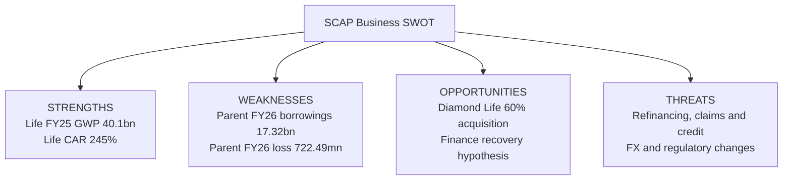

# 🧭 SCAP.N0000 — Business SWOT analysis

[← Business Analysis](README.md) · [16-view visual report](VISUAL-REPORT.md) · **English** · [தமிழ்](../../../ta/01-Fundamental-Analysis/01-Business-Analysis/SWOT-ANALYSIS.md) · [සිංහල](../../../si/01-Fundamental-Analysis/01-Business-Analysis/SWOT-ANALYSIS.md)

> **Research as at 30 September 2026.** Company: **Softlogic Capital PLC (SCAP.N0000)**. This evaluates the business structure, **not** the share price or an investment recommendation. The March 2026 SCAP figures below were published in a **27 May 2026 year-end interim** and are **subject to audit**. The insurer's metrics have a different **December 2025** year-end; the July 2026 Bangladesh acquisition is subsequent to SCAP's March balance-sheet date.

## SWOT visual

> **Scope boundary:** Insurer GWP, insurer capital and finance-company capital are subsidiary indicators; they are not SCAP consolidated sales or cash in the listed parent's bank account.

## 2×2 evidence matrix

| **Strengths** | **Weaknesses** |
|---|---|
| **Softlogic Life reported 2025 GWP LKR 40.1bn (+27% year on year), 18.4% domestic life-insurance GWP share and CAR 245%.**  **Softlogic Life's 2025 annual-report platform shows 159 operating locations; its release reports 1.3m lives covered. SCAP's corporate website lists multiple regulated financial-services activities.**  **Finance company issuer reported approximately 61% capital adequacy in its July 2026 review, alongside its ongoing transformation plan.** | **SCAP company-only 31 Mar 2026 interest-bearing borrowings LKR 17,324.26mn, bank overdraft LKR 323.13mn, and cash/bank LKR 32.07mn.**  **FY2026 interim parent-only interest expense LKR 1,810.84mn and standalone loss LKR 722.49mn.**  **FY2026 interim group PAT LKR 3,371.26mn, SCAP-owner profit LKR 973.77mn, and negative owner-attributable consolidated equity LKR 1,035.49mn.** |

| **Opportunities** | **Threats** |
|---|---|
| **Diamond Life's company overview and a 16 Sep 2026 Bangladesh investment-authority article state Softlogic Life completed a 60% acquisition for about USD 1.9m in July 2026.**  **Softlogic Finance described a continuing capital restoration and business expansion programme in its July 2026 company update.**  **Softlogic Life's 2025 release discusses AI-led underwriting/claims and additional protection distribution channels.** | **SCAP's reported parent-level borrowings and interest costs depend on repayment and refinancing arrangements after March 2026.**  **Softlogic Finance is a CBSL-regulated lender/deposit-taker; Softlogic Life has regulator-supervised insurance capital and restricted reserves.**  **Softlogic Life's Bangladesh acquisition introduces a different jurisdiction and currency; SCAP's brokerage exposure depends in part on Sri Lankan market activity.** |

> **SWOT classification:** Strengths/Weaknesses are internal, Opportunities/Threats are external. Each classification is an **analytical interpretation**, not an independently audited designation. No quadrant is scored, ranked or assigned a probability. The dated facts do not establish an investment outcome.

## Source-backed findings and tests

| Quadrant | Evidence / date | Reasoned business implication | What to verify next | Source |
|---|---|---|---|---|
| **Strengths** | Softlogic Life reported 2025 GWP LKR 40.1bn (+27% year on year), 18.4% domestic life-insurance GWP share and CAR 245%. | A sizeable, regulated insurance operation within the portfolio provides an identifiable recurring-policy business. The insurer's scale is not SCAP's profit. | Compare policy retention, new-business economics, solvency and real upstream dividends with life-insurance peers. | [Insurer 2025 release](https://softlogiclife.lk/news/softlogic-life-surpasses-rs-40-bn-gwp-in-fy25-doubles-key-financial-metrics-over-four-years/) |
| **Strengths** | Softlogic Life's 2025 annual-report platform shows 159 operating locations; its release reports 1.3m lives covered. SCAP's corporate website lists multiple regulated financial-services activities. | Established product lines and customer touchpoints provide potential reach; profitable cross-selling has not been demonstrated. | Obtain current channel-level customer acquisition cost, retention and group cross-sell evidence. | [Insurer 2025 platform + SCAP](https://annualreport.softlogiclife.lk/) |
| **Strengths** | Finance company issuer reported approximately 61% capital adequacy in its July 2026 review, alongside its ongoing transformation plan. | Capital restoration may offer greater operational flexibility, but issuer-reported regulatory ratios are finance-subsidiary measures. | Tie out the latest finance-company audited capital, loan-quality ratios and the regulator's current position. | [Finance issuer July 2026](https://softlogicfinance.lk/news/building-a-stronger-more-resilient-softlogic-finance/) |
| **Weaknesses** | SCAP company-only 31 Mar 2026 interest-bearing borrowings LKR 17,324.26mn, bank overdraft LKR 323.13mn, and cash/bank LKR 32.07mn. | Parent funding and refinancing costs may constrain what can be distributed to the listed company's owners. | Build a parent-only debt-maturity, security, covenant, cash and dividends-received schedule. | [SCAP interim p. 6](https://cdn.cse.lk/cmt/upload_report_file/1100_1779968696398.pdf) |
| **Weaknesses** | FY2026 interim parent-only interest expense LKR 1,810.84mn and standalone loss LKR 722.49mn. | Group operating performance does not automatically cover parent funding costs; sustainable cash must be tested. | Reconcile parent operating inflows, finance expense and interest actually paid. | [SCAP interim p. 3](https://cdn.cse.lk/cmt/upload_report_file/1100_1779968696398.pdf) |
| **Weaknesses** | FY2026 interim group PAT LKR 3,371.26mn, SCAP-owner profit LKR 973.77mn, and negative owner-attributable consolidated equity LKR 1,035.49mn. | Large non-controlling interests and differing consolidated/company-only metrics complicate simple valuation. | Reconcile minority stakes, segment dividends, parent NAV and any subsequent restatements. | [SCAP interim pp. 2, 6](https://cdn.cse.lk/cmt/upload_report_file/1100_1779968696398.pdf) |
| **Opportunities** | Diamond Life's company overview and a 16 Sep 2026 Bangladesh investment-authority article state Softlogic Life completed a 60% acquisition for about USD 1.9m in July 2026. | An additional geography and protection market is a possible growth channel; costs, integration and incremental earnings remain unverified at SCAP level. | Collect post-completion consolidated disclosures, Bangladesh regulatory capital, FX and financial contribution. | [Diamond Life + Bangladesh investment authority](https://diamondlifebd.com/overview/) |
| **Opportunities** | Softlogic Finance described a continuing capital restoration and business expansion programme in its July 2026 company update. | An improving capital position could support resumed asset-backed lending, but growth in loan volume is not automatically profitable. | Measure new origination yields, delinquencies, deposit costs, impairments and subsequent capital measures. | [Finance issuer July 2026](https://softlogicfinance.lk/news/building-a-stronger-more-resilient-softlogic-finance/) |
| **Opportunities** | Softlogic Life's 2025 release discusses AI-led underwriting/claims and additional protection distribution channels. | Digital service efficiency and new protection products could create operating gains if validated by retention and cost trends. | Track claims processing costs, new policy issuance cost, retention, customer complaints and net profitability. | [Insurer 2025 release](https://softlogiclife.lk/news/softlogic-life-surpasses-rs-40-bn-gwp-in-fy25-doubles-key-financial-metrics-over-four-years/) |
| **Threats** | SCAP's reported parent-level borrowings and interest costs depend on repayment and refinancing arrangements after March 2026. | Changes in finance rates or funding access **could** raise cash requirements; no refinancing failure is asserted. | Check debt tenor, pledges, refinancing announcements, actual covenant compliance and rates. | [SCAP interim pp. 3, 6](https://cdn.cse.lk/cmt/upload_report_file/1100_1779968696398.pdf) |
| **Threats** | Softlogic Finance is a CBSL-regulated lender/deposit-taker; Softlogic Life has regulator-supervised insurance capital and restricted reserves. | Credit impairment, deposit competition, claims shocks or regulatory limits **could** reduce distributable subsidiary cash. | Check latest CBSL/IRCSL notices, loss-stage migration, solvency and dividend permissions. | [SCAP interim + subsidiary issuer](https://cdn.cse.lk/cmt/upload_report_file/1100_1779968696398.pdf) |
| **Threats** | Softlogic Life's Bangladesh acquisition introduces a different jurisdiction and currency; SCAP's brokerage exposure depends in part on Sri Lankan market activity. | Foreign-exchange, regulatory/integration costs and trading-volume fluctuations are exposure mechanisms, **not predictions**. | Obtain actual Bangladesh contribution, FX treatment, solvency, local requirements and brokerage volume-sensitive earnings. | [Diamond Life + SCAP overview](https://diamondlifebd.com/overview/) |

### How to use the findings

The immediate financial-model question is **whether cash available to the SCAP parent can cover its funding obligations**. A separate operating question is whether the insurance business and restructured finance business can generate returns after capital and minority-owner requirements. This is a *research question*, not a conclusion that either outcome will occur.

## Next validation checklist

- [ ] Download and reconcile the **final SCAP FY2025/26 audited annual report** and June 2026 original quarterly filing before updating risk or valuation claims.
- [ ] Verify **SCAP's latest indirect/effective ownership** of Softlogic Life, Softlogic Finance and Diamond Life; distinguish direct vs indirect ownership.
- [ ] Test **parent-only interest and debt repayment** against dividends *actually received*, not consolidated profits.
- [ ] Confirm Finance's **current CBSL compliance and loan-quality series**; the finance-company 2026 capital figure is issuer reported.
- [ ] Evaluate the Bangladesh acquired operation's net results, integration costs and **currency/solvency exposure** separately.
- [ ] Do not compute a share-price target from this qualitative SWOT matrix.

## Source register

1. [SCAP CSE-filed 27 May 2026 year-end interim](https://cdn.cse.lk/cmt/upload_report_file/1100_1779968696398.pdf) — **FY2026 figures subject to audit**; previous research tied group and parent accounts to PDF pp. 2–3, 6 and subsidiary notes. Original PDF could not be reopened in the latest web check. Do **not** treat these figures as later audited data.
2. [SCAP business overview](https://softlogiccapital.lk/about-us-overview/) — issuer description of the holding company and businesses, website may not show a current legal ownership table.
3. [Softlogic Life issuer calendar-2025 release](https://softlogiclife.lk/news/softlogic-life-surpasses-rs-40-bn-gwp-in-fy25-doubles-key-financial-metrics-over-four-years/) — 40.1bn GWP, 18.4% market share, 245% insurer CAR, 1.3m lives and digital services.
4. [Softlogic Life 2025 reporting portal](https://annualreport.softlogiclife.lk/) — insurer-only year-end context.
5. [Softlogic Finance July 2026 issuer business update](https://softlogicfinance.lk/news/building-a-stronger-more-resilient-softlogic-finance/) — issuer-reported circa 61% capital ratio and ongoing transformation; compare to original regulatory returns.
6. [Diamond Life company overview](https://diamondlifebd.com/overview/) — 60% acquisition, approx USD1.9m; corroborate with [Bangladesh investment authority's dated September 2026 article](https://investbangladesh.gov.bd/publications-profile-items/from-colombo-to-dhaka-softlogic-lifebuys-into-bangladeshs-insurance-frontier).
7. [CSE company announcements](https://www.cse.lk/) — primary place to check more recent SCAP parent disclosures, shareholdings and audited annual report.

**Status:** Qualitative and dated; no SWOT score, target price, probability or investment action is given.
