# 📊 SCAP.N0000 — Business Analysis: 15 data-backed visuals

[← Business Analysis](README.md) · [தமிழ்](../../../ta/01-Fundamental-Analysis/01-Business-Analysis/VISUAL-REPORT.md) · [සිංහල](../../../si/01-Fundamental-Analysis/01-Business-Analysis/VISUAL-REPORT.md)

> **Scope:** 15 editable GitHub Markdown visualizations built from SCAP's March 2026 CSE **year-end interim**, Softlogic Life's **calendar-year 2025** disclosures, issuer web pages and clearly identified secondary observations. **Reviewed 30 Sep 2026.** Numbers have different reporting periods and legal-entity scopes; figures are **not** a live quote or an investment recommendation.

## 🧭 Visual index

| # | Visualization | Data basis |
|---|---|---|
| 01 | [Ownership tree — dated](#01-ownership-tree-dated) | FY2026 ownership |
| 02 | [Business ecosystem](#02-business-ecosystem) | Issuer business map |
| 03 | [Business-model canvas](#03-businessmodel-canvas) | Business mechanisms |
| 04 | [Segment revenue](#04-segment-revenue) | FY2026 interim + reconciled estimate |
| 05 | [Segment profit and loss](#05-segment-profit-and-loss) | FY2026 interim |
| 06 | [Who receives group profit?](#06-who-receives-group-profit) | FY2026 interim |
| 07 | [Profit-to-cash pathway](#07-profittocash-pathway) | FY2026 parent-only |
| 08 | [Company milestones](#08-company-milestones) | 2005–2026 events |
| 09 | [Insurance customers and reach](#09-insurance-customers-and-reach) | Insurer 2023–2025 |
| 10 | [Distribution-channel map](#10-distributionchannel-map) | Insurer FY25 / undated finance |
| 11 | [Industry market position](#11-industry-market-position) | Insurer calendar 2025 |
| 12 | [Competitive-advantage evidence](#12-competitiveadvantage-evidence) | Insurer 2025 / hypotheses |
| 13 | [Related-party flow of funds](#13-relatedparty-flow-of-funds) | FY2026 parent-only |
| 14 | [Regulatory dependency map](#14-regulatory-dependency-map) | Insurer 2025 / sector regulation |
| 15 | [Opportunities and constraints](#15-opportunities-and-constraints) | Mixed historical periods |

> **Source label key:** *CSE interim* = SCAP's 27 May 2026 company disclosure, FY2026 **subject to audit**; *Insurer 2025* = Softlogic Life, a different reporting entity with a **December** year-end; *issuer site, undated* = operating description, not a 2026 audited count; *secondary* = unverified news/data vendor. "Other segment" is a **derived rounded reconciliation**—see chart 04.

## 01 · Ownership tree — dated

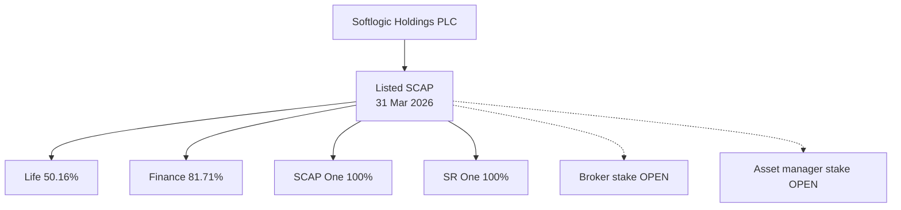

Softlogic Holdings' **69.35%** of SCAP and SCAP's **50.16%** of Softlogic Life, **81.71%** of Softlogic Finance, and **100%** each of SCAP One and SR One are reported **as at 31 Mar 2026**. **Stockbrokers and Asset Management exact current stakes are unverified**. The acquired life insurer is an *indirect* holding, not an extra 100%-owned SCAP asset.

**Provenance:** [Source 1](https://cdn.cse.lk/cmt/upload_report_file/1100_1779968696398.pdf) · [Source 2](https://softlogiccapital.lk/about-us-overview/).

## 02 · Business ecosystem

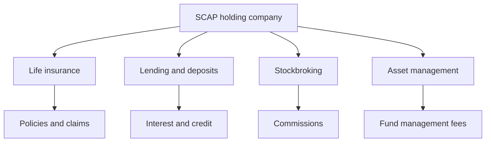

SCAP's operating exposures include insurance, lending and deposits, equity intermediation, and asset/unit-trust management. These are **categories of activity**, not revenue weights. The insurer reported **LKR 40.1bn GWP in calendar 2025**, which is **not** SCAP group revenue.

**Provenance:** [Source 1](https://softlogiccapital.lk/about-us-overview/) · [Source 2](https://softlogiccapital.lk/subsidiaries/) · [Source 3](https://softlogiclife.lk/news/softlogic-life-surpasses-rs-40-bn-gwp-in-fy25-doubles-key-financial-metrics-over-four-years/).

## 03 · Business-model canvas

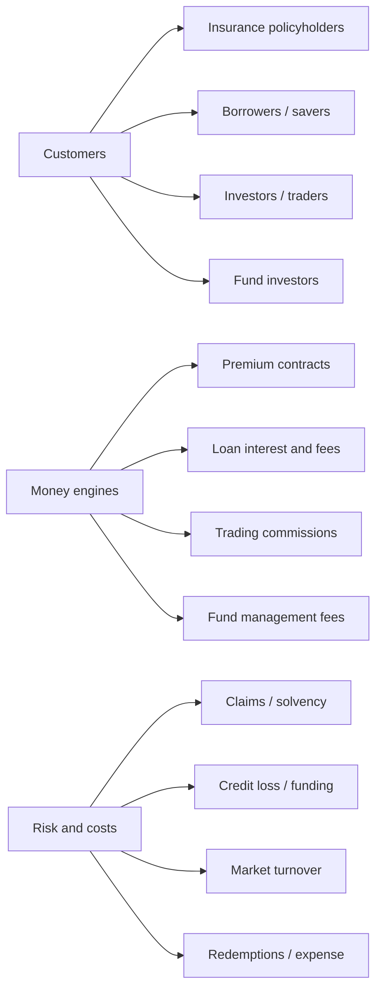

Customers, fee and interest receipts, costs and regulatory restrictions differ across the four activities. **Deposits are funding liabilities, not revenue; managed client assets are not SCAP's own assets.** The canvas documents economic mechanics, not actual segment margins.

**Provenance:** [Source 1](https://softlogiccapital.lk/about-us-overview/) · [Source 2](https://softlogiccapital.lk/subsidiaries/).

## 04 · Segment revenue

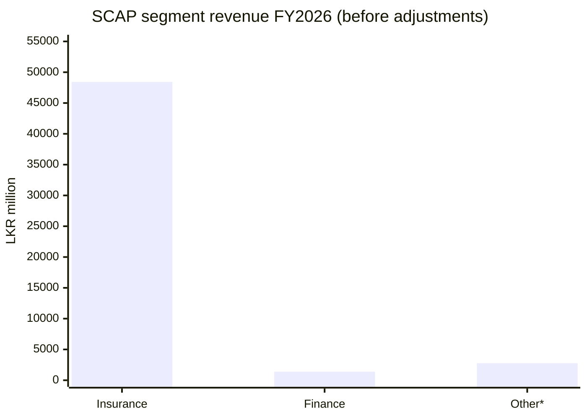

Segment gross revenues for the year ended **31 Mar 2026** in **LKR million**: Insurance **48,425.96**, Finance **1,384.78**, Other **approximately 2,759.84**, then adjustments/eliminations **−1,260.09**, giving group total **51,310.49**. **The Other value is derived algebraically** from previously reviewed CSE-line totals and aligns with a third-party segment figure rounded to 2,760; it has **not** been separately rechecked against the original segment PDF line in this pass. Never add a segment GWP series to this chart.

**Provenance:** [Source 1](https://cdn.cse.lk/cmt/upload_report_file/1100_1779968696398.pdf) · [Source 2](https://stockanalysis.com/quote/cose/SCAP.N0000/financials/) · Other segment is a **derived reconciliation**, not an independently reverified exact PDF line..

## 05 · Segment profit and loss

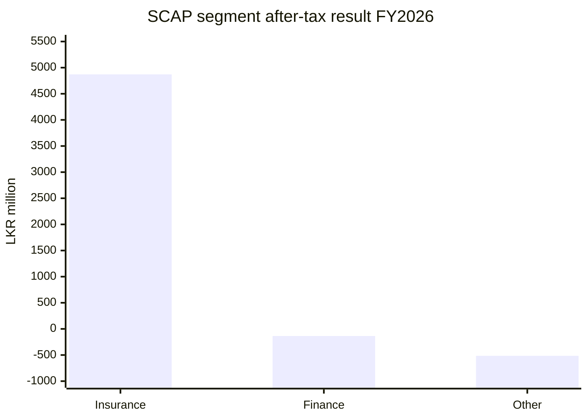

Segment **profit/(loss) after tax**, LKR million, from the previously reviewed FY2026 year-end interim: insurance **+4,870.86**, NBFI **−136.24**, Other **−515.40**; consolidation adjustments **−847.95**; group total **+3,371.26** (rounding may create 0.01 difference). Segment PAT cannot be valued without minority interests and parent debt.

**Provenance:** [Source 1](https://cdn.cse.lk/cmt/upload_report_file/1100_1779968696398.pdf).

## 06 · Who receives group profit?

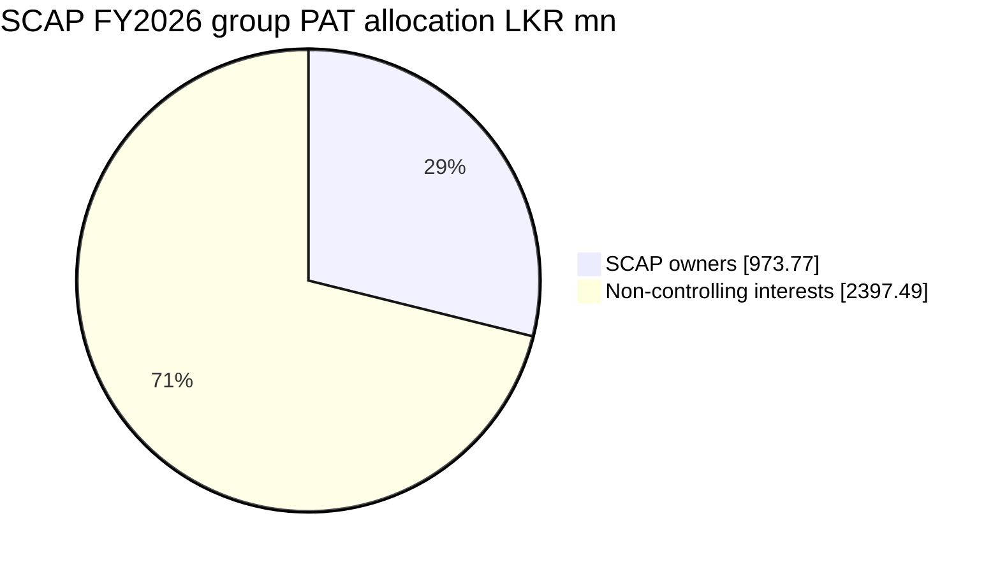

Of FY2026 interim **group PAT LKR 3,371.26mn**, **LKR 973.77mn (28.88%)** belongs to SCAP owners and **LKR 2,397.49mn (71.12%)** is attributable to non-controlling shareholders. This is **allocation of accounting profit, not cash distributed**.

**Provenance:** [Source 1](https://cdn.cse.lk/cmt/upload_report_file/1100_1779968696398.pdf).

## 07 · Profit-to-cash pathway

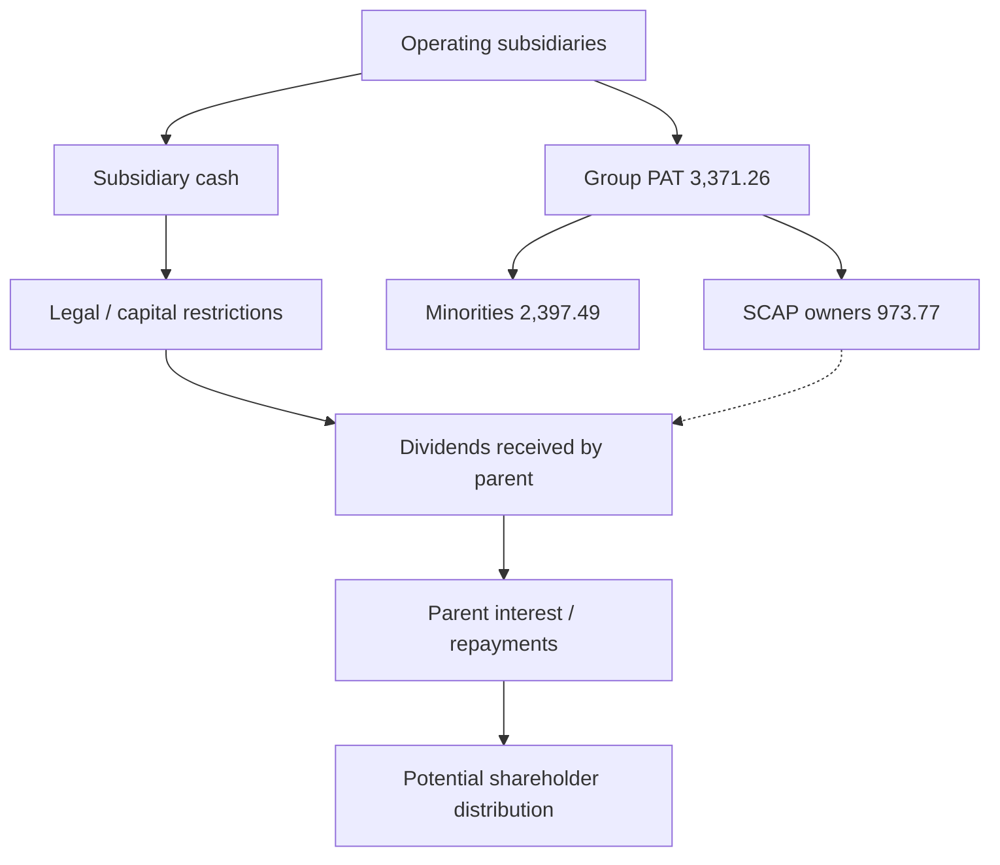

The **SCAP standalone** company reported **FY2026 dividend income LKR 635.18mn**, **interest expense LKR 1,810.84mn**, and **loss LKR 722.49mn**. At **31 Mar 2026**, parent interest-bearing borrowings were **LKR 17,324.26mn**, overdraft **323.13mn**, cash/bank **32.07mn**. The flowchart shows the *required logic*, not a numerical waterfall: dividend cash paid by subsidiaries, recorded accounting profit and available cash are not interchangeable.

**Provenance:** [Source 1](https://cdn.cse.lk/cmt/upload_report_file/1100_1779968696398.pdf).

## 08 · Company milestones

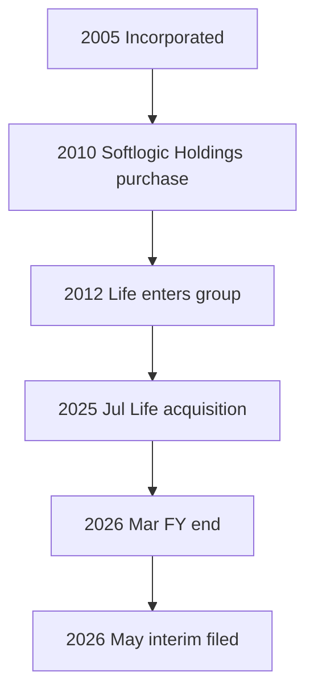

Dated events: **2005** incorporation, **2010** Softlogic Holdings acquisition, **2012** life insurance added to the group portfolio, **11 Jul 2025** acquisition of Softlogic Life Insurance Lanka by Softlogic Life (reported consideration **LKR 1,426mn**), and **31 Mar / 27 May 2026** financial year-end and interim disclosure. The 2025 acquisition is not a direct SCAP transaction.

**Provenance:** [Source 1](https://softlogiccapital.lk/about-us-overview/) · [Source 2](https://cdn.cse.lk/cmt/upload_report_file/1100_1779968696398.pdf).

## 09 · Insurance customers and reach

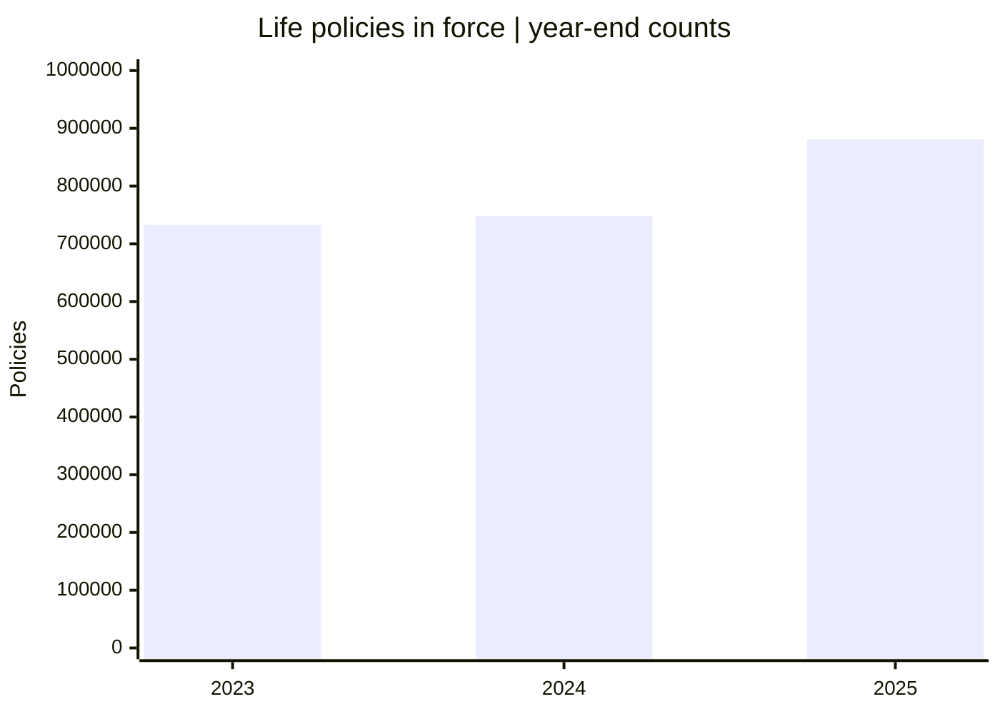

Softlogic Life's **2025 annual report** records **880,706 policies in force** (2024: **748,101**, 2023: **733,002**) and **88.7% customer retention** (2024: **85.4%**). Its separate 2025 company release describes **1.3 million lives covered** and **LKR 19.4bn claims and benefits paid**. The chart measures **policies**, not unique people or SCAP group customers.

**Provenance:** [Source 1](https://softlogiclife.lk/wp-content/uploads/sites/3/2026/04/Softlogic-Life-Integrated-Annual-Report-2025-3.pdf) · [Source 2](https://softlogiclife.lk/news/softlogic-life-surpasses-rs-40-bn-gwp-in-fy25-doubles-key-financial-metrics-over-four-years/).

## 10 · Distribution-channel map

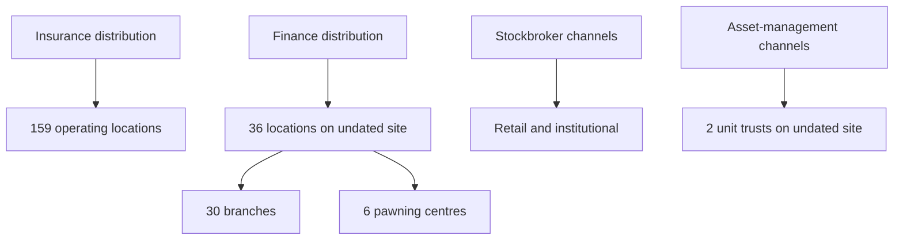

The insurer's **2025 integrated-report portal** lists **159 operating locations**; SCAP's **undated website** describes Softlogic Finance as **36 locations (30 branches + 6 dedicated pawning centres)**. These are **different entities and non-matched as-of dates**, not a comparable branch-efficiency ranking. Brokerage targets retail/institutional/high-net-worth clients; asset-management site mentions **two unit trusts**, but today's number is unverified.

**Provenance:** [Source 1](https://annualreport.softlogiclife.lk/) · [Source 2](https://softlogiccapital.lk/subsidiaries/).

## 11 · Industry market position

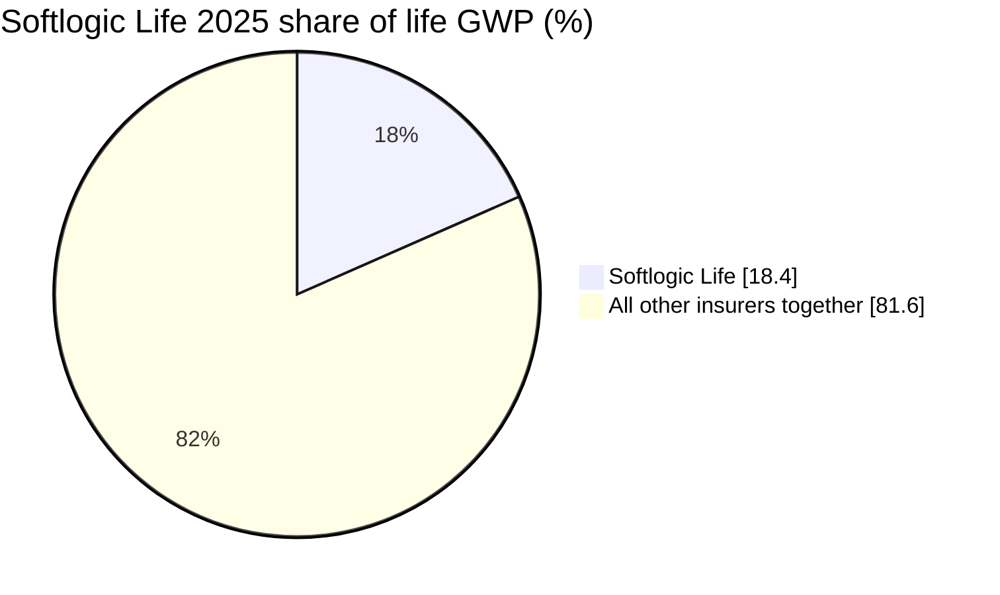

Softlogic Life reported **18.4% Sri Lanka life-insurance GWP market share for calendar 2025**; the remaining **81.6%** is a mathematical complement, **not one competitor**. A news report places insurer share at **20.3% at Q2 2026**, but this later **secondary** claim uses a different period and still needs direct insurer/regulator confirmation. SCAP itself does **not** have an equivalent market share across all financial services.

**Provenance:** [Source 1](https://softlogiclife.lk/news/softlogic-life-surpasses-rs-40-bn-gwp-in-fy25-doubles-key-financial-metrics-over-four-years/) · [Source 2](https://www.dailymirror.lk/business-news/Softlogic-Life-delivers-Rs-7-2bn-GWP/273-348142).

## 12 · Competitive-advantage evidence

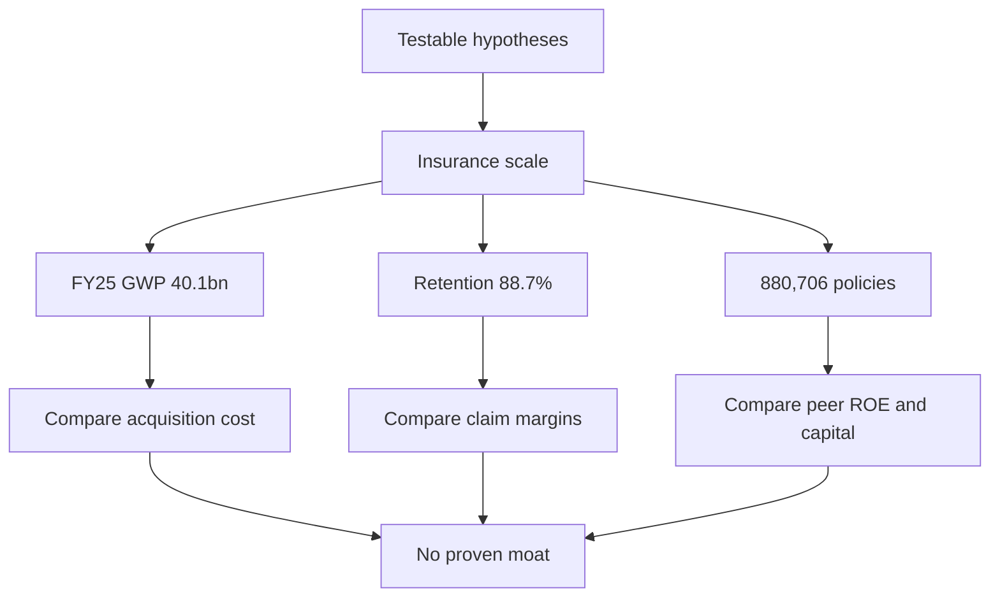

Potential advantages must be tested: 2025 Life **GWP LKR 40.1bn (+27%)**, **customer retention 88.7%**, **880,706 active policies**; all support questions about distribution and servicing but do **not** prove a moat. Compare profitable customer acquisition, renewal economics, claims and insurer solvency against true peers over matching periods.

**Provenance:** [Source 1](https://softlogiclife.lk/wp-content/uploads/sites/3/2026/04/Softlogic-Life-Integrated-Annual-Report-2025-3.pdf) · [Source 2](https://softlogiclife.lk/news/softlogic-life-surpasses-rs-40-bn-gwp-in-fy25-doubles-key-financial-metrics-over-four-years/).

## 13 · Related-party flow of funds

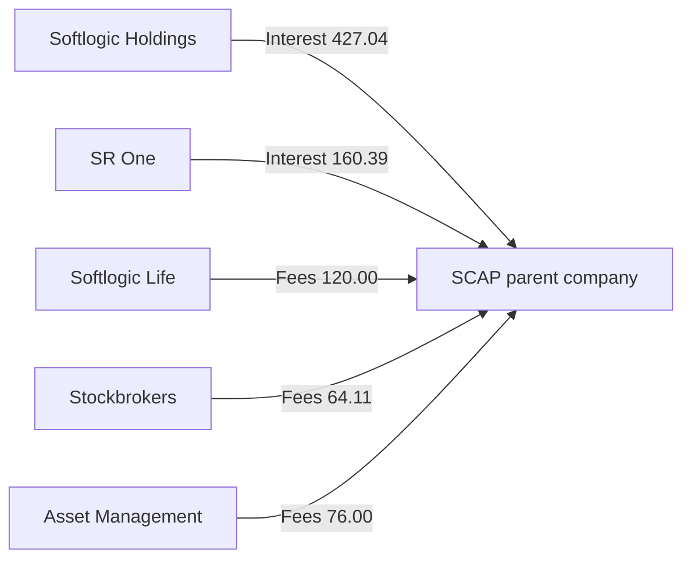

In the SCAP **company-only related-party FY2026 note**, reported amounts in **LKR million** include interest income from Softlogic Holdings **427.04** and SR One **160.39**, plus consultancy/professional fees from Life **120.00**, Stockbrokers **64.11**, and Asset Management **76.00**. These are **parent-account transactions; they must not be double-counted as external consolidated revenue or assumed to be cash collected**.

**Provenance:** [Source 1](https://cdn.cse.lk/cmt/upload_report_file/1100_1779968696398.pdf).

## 14 · Regulatory dependency map

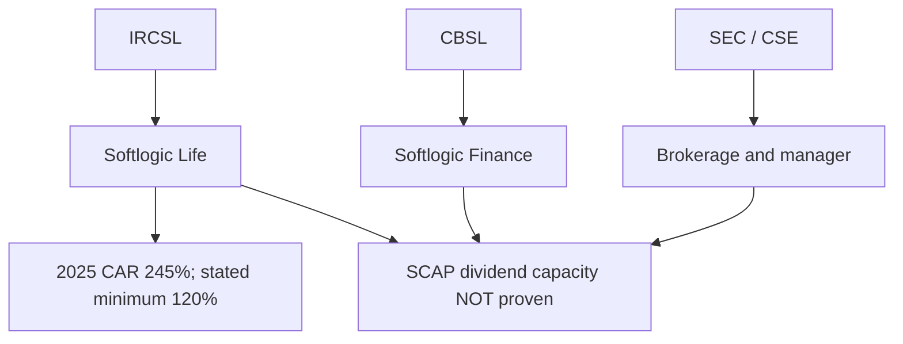

The insurance entity is supervised by **IRCSL**; the finance entity by **CBSL**; stockbroking/investment-management by **SEC/CSE** as applicable. Life reports **2025 capital adequacy ratio (CAR) 245%** against its stated **120% requirement**. Those figures are insurer-only and **do not establish parent dividend availability**. A reported **LKR 1,515.80mn restricted insurance reserve at Mar 2026** requires attention to conditions on release.

**Provenance:** [Source 1](https://cdn.cse.lk/cmt/upload_report_file/1100_1779968696398.pdf) · [Source 2](https://softlogiclife.lk/news/softlogic-life-surpasses-rs-40-bn-gwp-in-fy25-doubles-key-financial-metrics-over-four-years/) · [Source 3](https://ircsl.gov.lk/) · [Source 4](https://www.cbsl.gov.lk/) · [Source 5](https://www.sec.gov.lk/).

## 15 · Opportunities and constraints

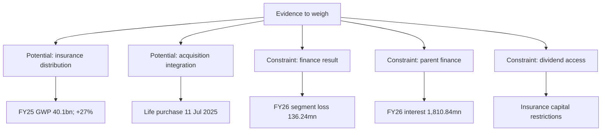

The documented **potential drivers** are FY2025 insurer GWP **LKR 40.1bn (+27%)**, its service footprint, and insurer acquisition integration. The documented **constraints** include FY2026 non-bank-finance segment loss **LKR 136.24mn**, parent interest expense **LKR 1,810.84mn**, parent borrowing **LKR 17,324.26mn**, and regulatory cash-upstream limits. These are different-period observations and **not a forecast or a ranking**.

**Provenance:** [Source 1](https://cdn.cse.lk/cmt/upload_report_file/1100_1779968696398.pdf) · [Source 2](https://softlogiclife.lk/news/softlogic-life-surpasses-rs-40-bn-gwp-in-fy25-doubles-key-financial-metrics-over-four-years/).

## 📚 Sources and limitations

[S1] [SCAP year-ended 31 Mar 2026, interim approved 27 May 2026](https://cdn.cse.lk/cmt/upload_report_file/1100_1779968696398.pdf) — PDF pp. 2–3, 6, 10–11, 13, 15–17, 19. FY2026 subject to audit.

[S2] [SCAP company overview](https://softlogiccapital.lk/about-us-overview/) and [business descriptions](https://softlogiccapital.lk/subsidiaries/) — undated issuer pages.

[S3] [Softlogic Life calendar-2025 issuer results release](https://softlogiclife.lk/news/softlogic-life-surpasses-rs-40-bn-gwp-in-fy25-doubles-key-financial-metrics-over-four-years/) — GWP, market share, lives, claims, CAR.

[S4] [Softlogic Life 2025 integrated annual report](https://softlogiclife.lk/wp-content/uploads/sites/3/2026/04/Softlogic-Life-Integrated-Annual-Report-2025-3.pdf) — policies in force and retention; 2025/2024/2023 values in report's sustainability metrics table.

[S5] [Life annual-report portal](https://annualreport.softlogiclife.lk/) — 159 locations; issuer portal snapshot (report-year context).

[S6] [SCAP financial aggregator segment table](https://stockanalysis.com/quote/cose/SCAP.N0000/financials/) — only a *secondary rounded cross-check* for Other segment approximately 2,760; verify the exact official row.

[S7] [August 2026 news on insurer market share](https://www.dailymirror.lk/business-news/Softlogic-Life-delivers-Rs-7-2bn-GWP/273-348142) — **secondary** Q2 2026 share 20.3%; not used as a FY2025 number.

[S8] Sector supervisors: [IRCSL](https://ircsl.gov.lk/), [CBSL](https://www.cbsl.gov.lk/), [SEC](https://www.sec.gov.lk/), [CSE](https://www.cse.lk/).

All LKR figures and stakes are historical. Compare with a later audited annual report and original subsequent interim before using them in any decision.
