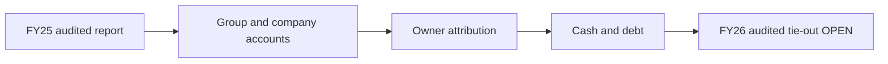

# 02 · Financial Statement Analysis

**[📊 Open 12 financial diagrams](VISUAL-REPORT.md)**

[← Fundamental Analysis](../README.md) · [English](README.md) · [தமிழ்](../../ta/01-Fundamental-Analysis/02-Financial-Statements/README.md) · [සිංහල](../../si/01-Fundamental-Analysis/02-Financial-Statements/README.md)

> **Softlogic Capital PLC · CSE SCAP.N0000.** **Research scope · 30 September 2026.** The report separates original **FY2025 audited** accounts from **FY2026 year-end interim** accounts. FY2024 is the audited comparison inside the FY2025 report. **LKR millions unless otherwise indicated.** SCAP is the listed holding company; the Group includes consolidated subsidiaries.
>
> **Latest-audit limitation:** SCAP's FY2026 final annual report is listed by a document catalogue, but I have **not** independently reconciled its original audited financial statements or signed opinion. Likewise the original 30 June 2026 SCAP quarter is still unverified. Do **not** treat the 27 May 2026 FY2026 interim figures as audited. FY2025 auditor opinion was signed 1 December 2025.

## 🎯 Research question

Does the audited 2025 financial position and the subsequent unaudited 2026 year-end picture support the business narrative, especially for SCAP's ordinary shareholders?

## 🔍 Evidence-based observations

- **Audited FY2025 group:** total operating income **42,383.72**, group PAT **+1,694.15**; yet **SCAP owners' attributable PAT was −280.42**. The remaining **+1,974.57** was attributable to non-controlling interests. **[A p.63]**
- **FY2026 year-end interim:** group operating income **51,310.49**, group PAT **+3,371.26**, owners' PAT **+973.77**, minorities **+2,397.49**. **[I p.2]**
- **Audited FY2025 parent cash flow:** **−4,605.10** from operations compared with **+427.54** group CFO. **[A p.70]** The previously documented FY2026 group CFO was **−851.24**; its original p.9 could not be reopened in this review, and a secondary provider matches it. **[I; B]**
- **Parent borrowings:** **14,797.33** at 31 Mar 2025 audited, and **17,324.26** at 31 Mar 2026 interim; parent cash/bank **27.89** and **32.07**, respectively. Overdraft is additional. **[A pp.65–66; I p.6]**
- **Negative consolidated shareholders' equity:** group owner-attributable equity **−2,440.85** in FY2025 and **−1,035.49** in FY2026 interim, while group total equity was **positive** because non-controlling equity is separately included. **[A p.65; I p.6]**

## 🧭 FY2025 audit opinion

Ernst & Young's report dated **1 December 2025** expresses an **unmodified true-and-fair-view opinion on FY2025** Group and Company statements. Its key audit matters concern (1) **insurance contract liabilities**, (2) **IT systems used in financial reporting**, (3) **expected credit-loss allowances**, and (4) **interest-bearing borrowings**. These are areas requiring significant audit work; **a key audit matter is not itself an audit qualification or proof of an error**. The report describes the going-concern accounting basis in its notes. The FY2025 opinion does **not** certify FY2026 figures.

## 📊 Income statement: Group vs shareholders vs parent

| Financial line (English names identify IFRS terms) | FY24 audited | FY25 audited | FY26 interim | Source |
|---|---:|---:|---:|---|
| Group total operating income | 36,729.68 | 42,383.72 | 51,310.49 | A63 / I2 |
| Group PAT | −4,183.45 | +1,694.15 | +3,371.26 | A63 / I2 |
| SCAP owners' PAT | −5,565.30 | −280.42 | +973.77 | A63 / I2 |
| Non-controlling interests' PAT | +1,381.85 | +1,974.57 | +2,397.49 | A63 / I2 |
| SCAP parent total operating income | 1,933.06 | 4,093.98 | 1,485.72 | A63 / I3 |
| SCAP parent PAT | −4,738.28 | +1,339.80 | −722.49 | A63 / I3 |
| SCAP parent dividend income | 618.20 | 3,273.55 | 635.18 | A63 / I3 |
| SCAP parent interest expense | 2,472.51 | 1,833.56 | 1,810.84 | A63 / I3 |

SCAP's subsidiaries—especially insurance—are consolidated at 100% of their accounting line items when controlled, even when the listed parent has less than 100% economic ownership. Profit and equity attributable to **non-controlling interests** must be separated before any per-share analysis. Insurer **GWP is not group total operating income**; deposits are liabilities rather than sales.

## 🏦 Balance sheet: who owns the equity?

| Financial line (English names identify IFRS terms) | FY24 audited | FY25 audited | FY26 interim | Source |
|---|---:|---:|---:|---|
| Group total assets | 65,782.36 | 68,619.73 | OPEN | A65; FY26 original final not checked |
| Total group equity | +3,776.63 | +2,856.63 | +6,269.84 | A65 / I6 |
| SCAP owners' group equity | −2,644.47 | −2,440.85 | −1,035.49 | A65 / I6 |
| Non-controlling group equity | +6,421.10 | +5,297.48 | +7,305.34 | A65 / I6 |
| Standalone parent equity | +5,577.91 | +5,373.24 | +4,848.03 | A65 / I6 |
| Standalone parent borrowings | 13,828.16 | 14,797.33 | 17,324.26 | A66 / I6 |
| Standalone parent cash/bank | 61.80 | 27.89 | 32.07 | A65 / I6 |
| Standalone parent overdraft | 328.60 | 323.78 | 323.13 | A66 / I6 |
| Group insurance liabilities | 27,759.13 | 33,671.06 | OPEN | A66; FY26 original final not checked |
| Group public deposits | 7,481.72 | 4,273.39 | OPEN | A66; FY26 original final not checked |

As at 31 March 2025, audited group **assets 68,619.73** = liabilities **65,763.10** + total equity **2,856.63** (rounded). Within total equity, ordinary-owner attributable equity **−2,440.85** plus non-controlling equity **+5,297.48** equals **+2,856.63**. Standalone SCAP equity **+5,373.24** belongs to a **different accounting scope**; it cannot be swapped into consolidated NAV. The same distinction remains in the FY2026 interim.

## 💸 Cash flow: accrual income is not cash

| Financial line (English names identify IFRS terms) | FY24 audited | FY25 audited | FY26 interim | Source |
|---|---:|---:|---:|---|
| Group operating cash flow | +4,006.00 | +427.54 | −851.24 | A70 / I9 and B |
| Parent-only operating cash flow | −1,533.19 | −4,605.10 | OPEN | A70; FY26 company CFO not verified |
| Parent investing-section cash dividend received | 618.20 | 3,273.55 | OPEN | A70; FY26 receipts not checked |
| Parent interest actually paid | −1,948.80 | −2,549.88 | OPEN | A70; FY26 interest paid not checked |

The FY2025 audited parent-only CFO **−4,605.10** differs from group CFO **+427.54**. Standalone parent **cash dividends under investing activities +3,273.55**, parent cash **interest paid −2,549.88**, whereas parent **interest expense +1,833.56** is an accrual expense. Do not merge paid-interest and interest-expense lines or label received dividends as dividends paid to SCAP ordinary shareholders. FY2026 parent-only CFO is **OPEN**.

## ⚠️ Accounting and data-quality issues

- **FY2026 audit status:** the previously stored 27 May 2026 original interim is **subject to audit**; its final 2026 annual publication has **not been read and reconciled**, despite being indexed online.
- **Accounting-definition mismatch:** original FY2025 total operating income **42,383.72** versus the normalized third-party revenue headline **39,794**. They may be different definitions; do not silently replace one with the other.
- **Regulatory obligations:** FY2025 insurance contract liabilities **33,671.06** and customer deposits **4,273.39** are **Group liabilities**, not parent operating income or additional ordinary debt to add to a net-equity figure twice.
- **Valuation and impairments:** FY2025 parent investment in subsidiaries **17,850.10** and the audit's ECL estimates require source-backed assumptions. A May 2026 interim fair-value note needs checking against FY2026 final audited disclosures.

## 📝 Filled evidence worksheet

| Checked claim | Assurance | Original source + page |
|---|---|---|
| FY2025 audit true-and-fair-view opinion | **AUDITED** | [SCAP original FY25 report pp.59–61](https://cdn.cse.lk/cmt/upload_report_file/1100_1764673838964.03.2025%20-%20Annual%20Report.pdf) |
| FY2025 group income and owner/minority PAT | **AUDITED** | [SCAP p.63](https://cdn.cse.lk/cmt/upload_report_file/1100_1764673838964.03.2025%20-%20Annual%20Report.pdf) |
| FY2025 Group / parent assets, liabilities, owner equity | **AUDITED** | [SCAP pp.65–66](https://cdn.cse.lk/cmt/upload_report_file/1100_1764673838964.03.2025%20-%20Annual%20Report.pdf) |
| FY2025 Group CFO and parent CFO | **AUDITED** | [SCAP pp.69–70](https://cdn.cse.lk/cmt/upload_report_file/1100_1764673838964.03.2025%20-%20Annual%20Report.pdf) |
| FY2026 PAT and owners' profit | **INTERIM, SUBJECT TO AUDIT** | [SCAP CSE FY26 interim p.2](https://cdn.cse.lk/cmt/upload_report_file/1100_1779968696398.pdf) |
| FY2026 parent interest-bearing debt and cash/bank | **INTERIM, SUBJECT TO AUDIT** | [SCAP CSE FY26 interim p.6](https://cdn.cse.lk/cmt/upload_report_file/1100_1779968696398.pdf) |
| FY2026 Group CFO −851.24 | **INTERIM + SECONDARY CROSS-CHECK** | [SCAP original p.9](https://cdn.cse.lk/cmt/upload_report_file/1100_1779968696398.pdf) · [secondary data](https://stockanalysis.com/quote/cose/SCAP.N0000/financials/cash-flow-statement/) |
| FY2026 final signed audit opinion and restatements | **OPEN** | [2026 report catalogue](https://nanayojana.com/company/SCAP.N0000?document_type=annual_report&year=2026); original audited content not independently tied out |
| 30 June 2026 SCAP original quarter | **OPEN** | [Secondary news](https://www.marketscreener.com/news/softlogic-capital-plc-reports-earnings-results-for-the-first-quarter-ended-june-30-2026-ce7859dfd88af521); original SCAP quarterly document not tied out |

## ✅ Next source checks

- [ ] Obtain SCAP's **FY2025/26 final audited annual report**; read the signed opinion and tie out every FY2026 table line, and adjust if restated.
- [ ] Obtain original **30 June 2026 SCAP interim** and reconcile any subsequent events and scope definitions.
- [ ] Verify FY2026 **parent-only** operating cash flow, cash dividends **received**, interest **paid**, debt schedule, collateral, maturity and guarantees.
- [ ] Reconcile finance-company deposit liabilities, insurer contract liabilities, credit-loss staging and subsidiary solvency to group totals.
- [ ] Validate share count and equity attributable to owners before doing P/B, EPS-based or sum-of-parts valuation.

## 📚 Primary references and limitations

- **A — FY2025 primary audited:** [Original 186-page SCAP 2024/25 Annual Report](https://cdn.cse.lk/cmt/upload_report_file/1100_1764673838964.03.2025%20-%20Annual%20Report.pdf), auditor pp.59–61, income p.63, balance pp.65–66, CFO pp.69–70. Signed **1 December 2025**; PDF source text inspected; PDF-page-image screenshot service failed in this session.
- **I — FY2026 year-end interim:** [SCAP 27 May 2026 original CSE filing](https://cdn.cse.lk/cmt/upload_report_file/1100_1779968696398.pdf), **subject to audit**; values carried from the prior repository research pass, original PDF was **not** re-opened successfully this time.
- **B — secondary FY26 CFO cross-check:** [StockAnalysis cash flow](https://stockanalysis.com/quote/cose/SCAP.N0000/financials/cash-flow-statement/); a different normalized income definition appears on that provider.
- **N/Q — report existence, not reconciled numbers:** [SCAP FY2026 annual-report catalogue](https://nanayojana.com/company/SCAP.N0000?document_type=annual_report&year=2026) · [June 2026 results secondary news](https://www.marketscreener.com/news/softlogic-capital-plc-reports-earnings-results-for-the-first-quarter-ended-june-30-2026-ce7859dfd88af521).

[Earlier financial snapshot](../../06-financial-snapshot.md) · [Source list](../../SOURCES.md) · [Open 12 financial diagrams](VISUAL-REPORT.md) · [CSE](https://www.cse.lk/)

**Method:** Data marked OPEN has deliberately not been filled with guessed values. An unmodified audit opinion is not a guarantee of future liquidity or earnings. This is a financial-statement study, not a current share-price recommendation.
