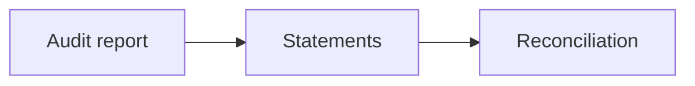

# 02 · Financial Statement Analysis

[← Fundamental analysis](../README.md) · [English](README.md) · [தமிழ்](../../ta/01-Fundamental-Analysis/02-Financial-Statements/README.md) · [සිංහල](../../si/01-Fundamental-Analysis/02-Financial-Statements/README.md)

> **SCAP.N0000 · Softlogic Capital PLC**  
> **Status:** Research framework only. SCAP-specific conclusions are not yet established. **Reference: 2026-09-30**.

## 🎯 Research question

Do audited earnings, assets, liabilities, and cash flows support the business narrative?

## 🔍 Evidence to collect

- [ ] Read the auditor’s opinion and consolidated income, financial-position and cash-flow statements.
- [ ] Compare the parent-only accounts with consolidated accounts; isolate non-controlling interests and subsidiary deposits.
- [ ] Reconcile earnings, impairment provisions, regulatory capital, cash flows, and any restatements over comparable periods.

## 🧭 Research process

## ⚠️ Interpretation trap

Deposits are funding liabilities, insurance revenue differs from gross written premium, and consolidated debt is not identical to parent borrowing.

## 🛠️ SCAP research task

Replace every provisional FY25/FY26 figure with an original CSE filing citation, page, unit and attributable-profit definition.

## 📝 Evidence worksheet (fill only after checking original documents)

| Measure or claim | Scope / reporting period | Original source + page | Verified finding |
|---|---|---|---|
| __________ | __________ | __________ | __________ |
| __________ | __________ | __________ | __________ |

**Earlier research:** [Existing SCAP research](../../06-financial-snapshot.md) · [Source register](../../SOURCES.md) · [CSE](https://www.cse.lk/).

**Method:** record the date, accounting scope, units, and the original document page. A chart or ratio is not a buy/sell recommendation.
