# 📊 SCAP Financial Statements — 12 source-labelled Mermaid visuals

**Evidence archive**: [Source register](../../sources/SOURCE-REGISTER.md) · [SCAP-AR-2025](../../sources/records/SCAP-AR-2025.md) · [SCAP-FY2026-YE-INTERIM](../../sources/records/SCAP-FY2026-YE-INTERIM.md) · [SCAP-STOCKANALYSIS](../../sources/records/SCAP-STOCKANALYSIS.md). The original PDFs are linked in the archive but not mirrored in GitHub.

[← Financial Statement Analysis](README.md) · [English](VISUAL-REPORT.md) · [தமிழ்](../../ta/01-Fundamental-Analysis/02-Financial-Statements/VISUAL-REPORT.md) · [සිංහල](../../si/01-Fundamental-Analysis/02-Financial-Statements/VISUAL-REPORT.md)

> **Evidence cut-off 30 September 2026.** FY2024 and FY2025 comparative figures are from the original SCAP **audited** FY2025 annual report; FY2026 values come from the SCAP **27 May 2026 year-end interim**, explicitly **subject to audit**. The original final FY2026 audited annual report and June 2026 interim have not been fully tied out. **LKR millions unless shown otherwise.** No current valuation or buy/sell advice.

## 01 · Source and assurance map

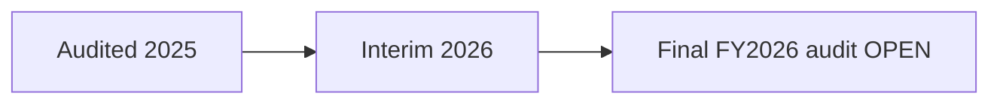

An **unmodified FY2025** Ernst & Young opinion is shown in the original 186-page issuer report, PDF p.59; the FY2026 interim says *subject to audit*. A catalogued final FY2026 report cannot be called verified without checking its signed auditor opinion.

**Source / status:** [SCAP FY2025 audited report pp. 59–61](https://cdn.cse.lk/cmt/upload_report_file/1100_1764673838964.03.2025%20-%20Annual%20Report.pdf). **FY26* means FY2026 27 May 2026 interim, subject to audit.**

## 02 · Group total operating income

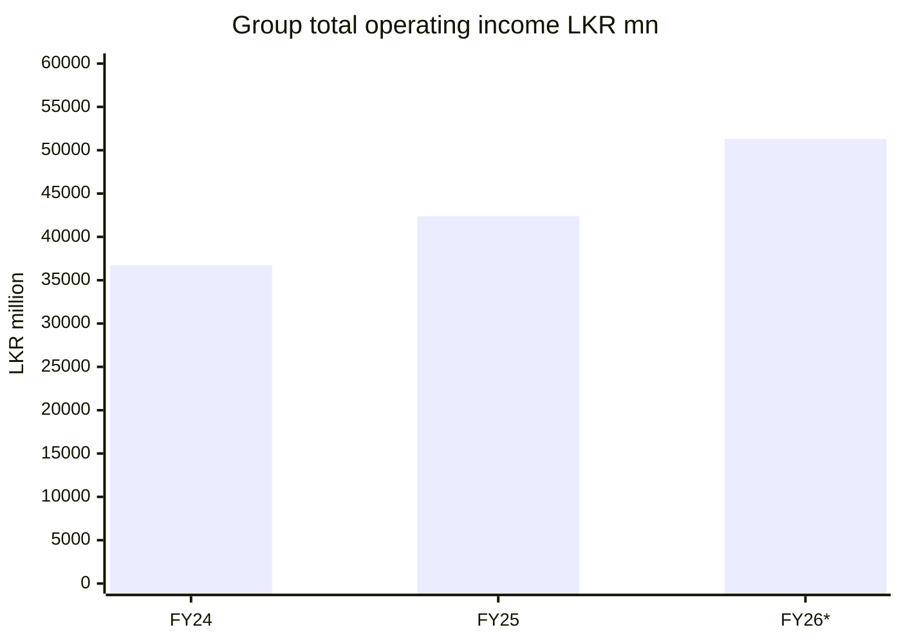

FY2024 and FY2025 audited group **total operating income** was **36,729.68m** and **42,383.72m** (FY2025 annual p.63). FY2026 **interim** was **51,310.49m** (earlier SCAP interim p.2). Provider normalized FY2025 headline revenue **39,794m** differs by definition; do not substitute it for issuer total operating income.

**Source / status:** [SCAP FY2025 audited report](https://cdn.cse.lk/cmt/upload_report_file/1100_1764673838964.03.2025%20-%20Annual%20Report.pdf) · [FY2026 year-end interim](https://cdn.cse.lk/cmt/upload_report_file/1100_1779968696398.pdf). **FY26* means FY2026 27 May 2026 interim, subject to audit.**

## 03 · Group profit after tax

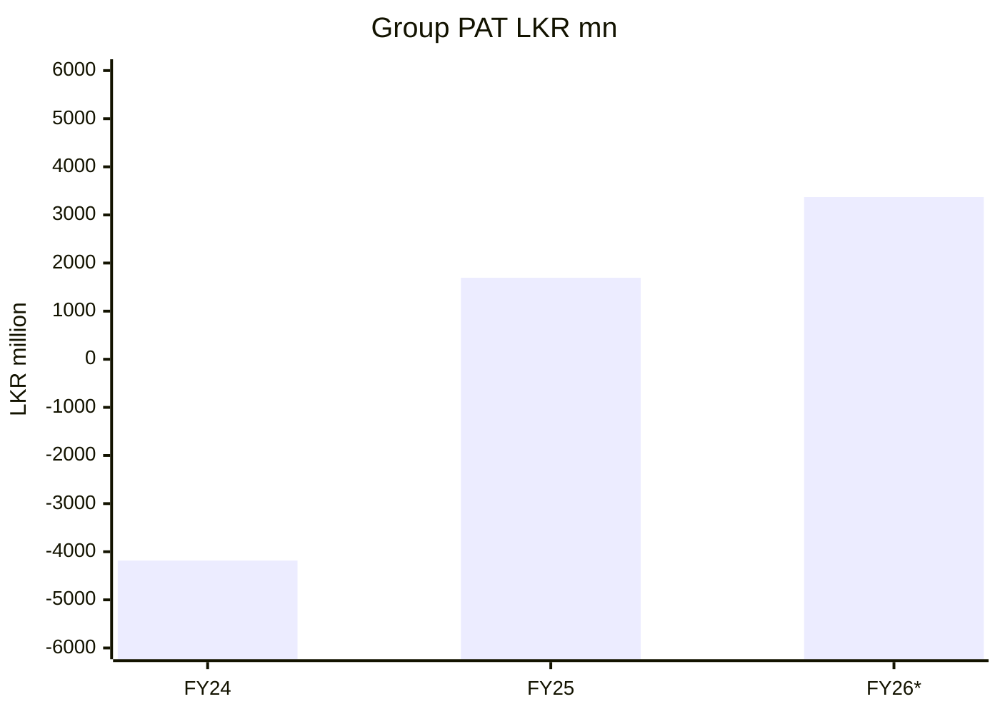

FY2024/25/26 group PAT: **−4,183.45m / +1,694.15m / +3,371.26m**. The third value is **not** audited in this research. This is group profit **before allocation to minority owners**.

**Source / status:** [SCAP FY2025 audited report](https://cdn.cse.lk/cmt/upload_report_file/1100_1764673838964.03.2025%20-%20Annual%20Report.pdf) · [FY2026 year-end interim](https://cdn.cse.lk/cmt/upload_report_file/1100_1779968696398.pdf). **FY26* means FY2026 27 May 2026 interim, subject to audit.**

## 04 · Profit attributable to SCAP owners

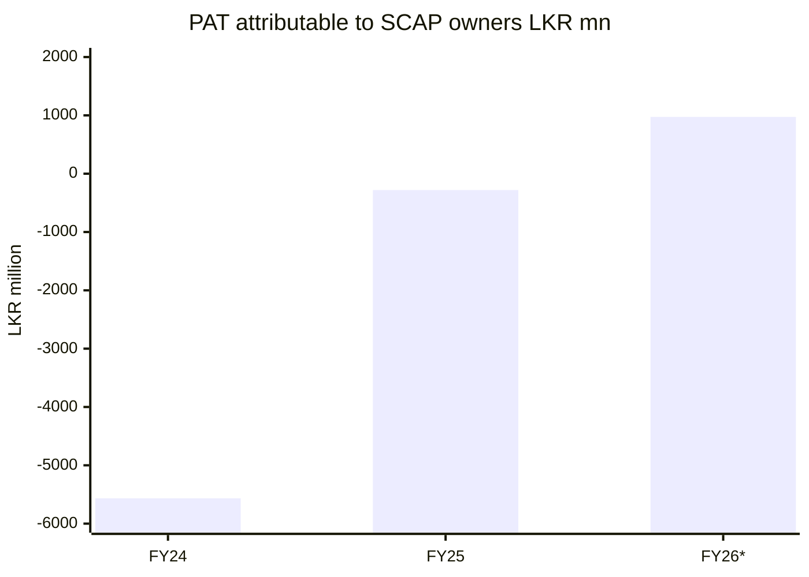

SCAP ordinary-owner attributable PAT: **−5,565.30m / −280.42m / +973.77m**, by the same FY2024/FY2025 audited and FY2026 interim scopes. Group PAT and ordinary-owner PAT are distinct.

**Source / status:** [SCAP FY2025 audited report](https://cdn.cse.lk/cmt/upload_report_file/1100_1764673838964.03.2025%20-%20Annual%20Report.pdf) · [FY2026 year-end interim](https://cdn.cse.lk/cmt/upload_report_file/1100_1779968696398.pdf). **FY26* means FY2026 27 May 2026 interim, subject to audit.**

## 05 · FY2026 group profit attribution

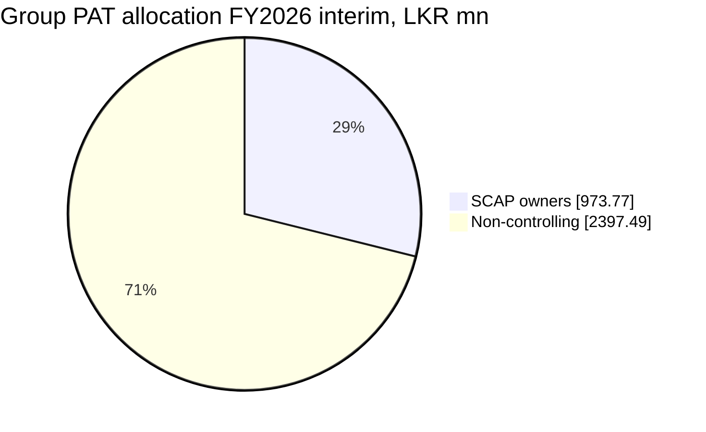

FY2026 interim group PAT **3,371.26m** allocated to **SCAP owners 973.77m** and **non-controlling interests 2,397.49m**. The distribution (~28.9%/71.1%) represents **accounting attribution, not cash dividends**.

**Source / status:** [SCAP FY2025 audited report](https://cdn.cse.lk/cmt/upload_report_file/1100_1764673838964.03.2025%20-%20Annual%20Report.pdf) · [SCAP FY2026 interim](https://cdn.cse.lk/cmt/upload_report_file/1100_1779968696398.pdf). **FY26* means FY2026 27 May 2026 interim, subject to audit.**

## 06 · FY2025 group equity reconciliation

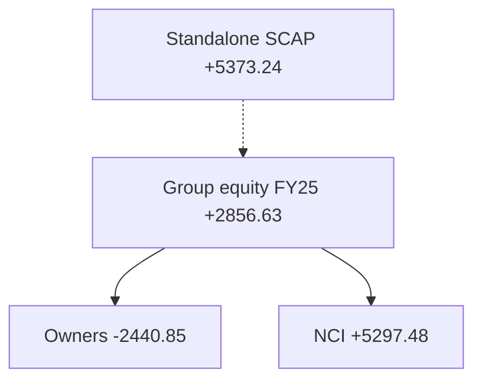

At **31 Mar 2025**, group total equity **+2,856.63m** = SCAP-owner equity **−2,440.85m** + non-controlling equity **+5,297.48m**. In that same period, standalone SCAP equity was **+5,373.24m**; a different reporting basis.

**Source / status:** [SCAP FY2025 audited report](https://cdn.cse.lk/cmt/upload_report_file/1100_1764673838964.03.2025%20-%20Annual%20Report.pdf) · [FY2026 year-end interim](https://cdn.cse.lk/cmt/upload_report_file/1100_1779968696398.pdf). **FY26* means FY2026 27 May 2026 interim, subject to audit.**

## 07 · FY2026 group equity reconciliation

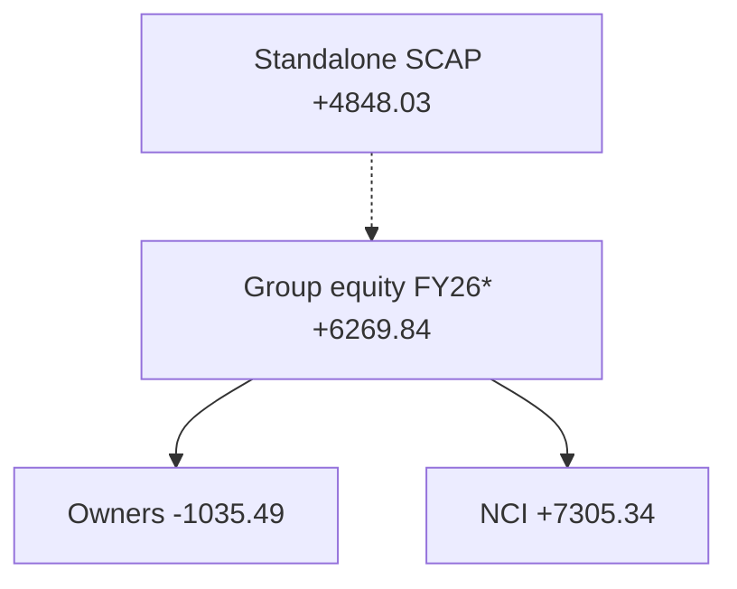

At **31 Mar 2026** according to the **interim**, group total equity **+6,269.84m** = SCAP-owner equity **−1,035.49m** + non-controlling equity **+7,305.34m** (0.01m rounding). Standalone SCAP equity **+4,848.03m** is a separate measure.

**Source / status:** [SCAP FY2025 audited report](https://cdn.cse.lk/cmt/upload_report_file/1100_1764673838964.03.2025%20-%20Annual%20Report.pdf) · [SCAP FY2026 interim](https://cdn.cse.lk/cmt/upload_report_file/1100_1779968696398.pdf). **FY26* means FY2026 27 May 2026 interim, subject to audit.**

## 08 · Standalone parent profit after tax

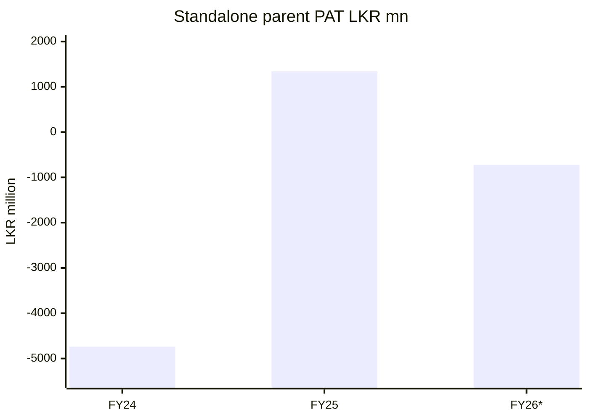

Standalone parent PAT (FY2024 audited / FY2025 audited / FY2026 interim): **−4,738.28m / +1,339.80m / −722.49m**. Subsidiary dividends and fair-value adjustments affect parent results.

**Source / status:** [SCAP FY2025 audited report](https://cdn.cse.lk/cmt/upload_report_file/1100_1764673838964.03.2025%20-%20Annual%20Report.pdf) · [SCAP FY2026 interim](https://cdn.cse.lk/cmt/upload_report_file/1100_1779968696398.pdf). **FY26* means FY2026 27 May 2026 interim, subject to audit.**

## 09 · Parent interest-bearing borrowings

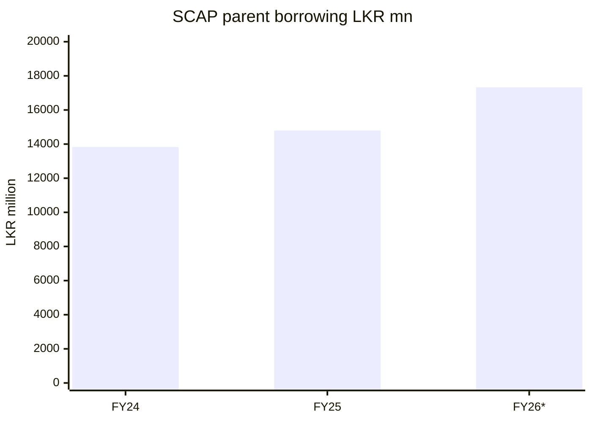

Parent-only interest-bearing borrowing was **13,828.16m / 14,797.33m / 17,324.26m** at **31 March 2024/2025/2026**, respectively. **Overdraft is separate:** FY2025 **323.78m**, FY2026 **323.13m**. Compare debt maturities and cash receipts before making a liquidity conclusion.

**Source / status:** [SCAP FY2025 audited report](https://cdn.cse.lk/cmt/upload_report_file/1100_1764673838964.03.2025%20-%20Annual%20Report.pdf) · [SCAP FY2026 interim](https://cdn.cse.lk/cmt/upload_report_file/1100_1779968696398.pdf). **FY26* means FY2026 27 May 2026 interim, subject to audit.**

## 10 · Group operating cash flow

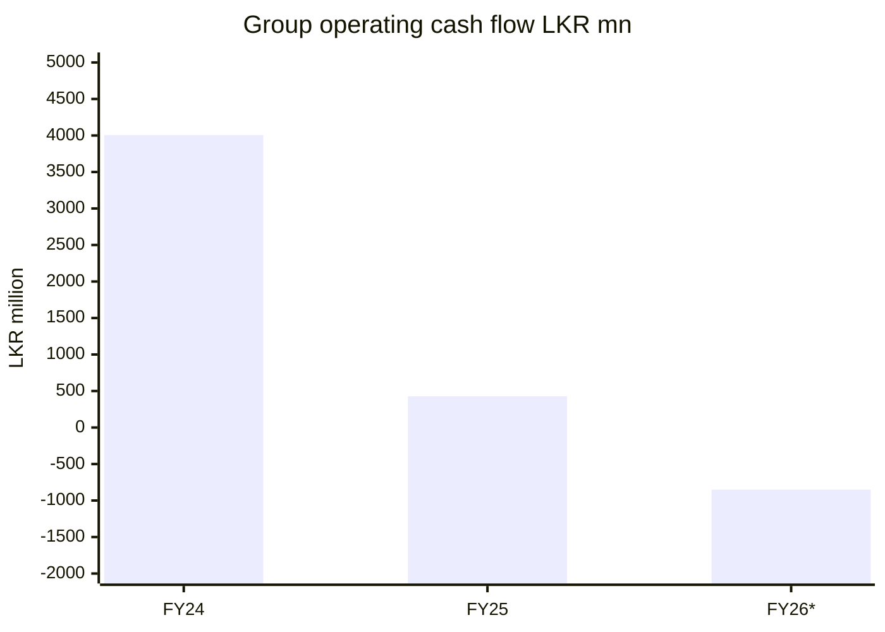

Group operating cash flow was **+4,006.00m / +427.54m / −851.24m** for FY2024/25/26; the FY2026 interim value is also reproduced by a **secondary cash-flow provider**. A financial group's operating cash flow is affected by deposits, loans and insurance assets/liabilities; it cannot be treated as free cash flow available to the parent.

**Source / status:** [SCAP FY2025 audited report](https://cdn.cse.lk/cmt/upload_report_file/1100_1764673838964.03.2025%20-%20Annual%20Report.pdf) · [FY2026 year-end interim](https://cdn.cse.lk/cmt/upload_report_file/1100_1779968696398.pdf) · [secondary CFO cross-check](https://stockanalysis.com/quote/cose/SCAP.N0000/financials/cash-flow-statement/). **FY26* means FY2026 27 May 2026 interim, subject to audit.**

## 11 · Parent operating cash flow

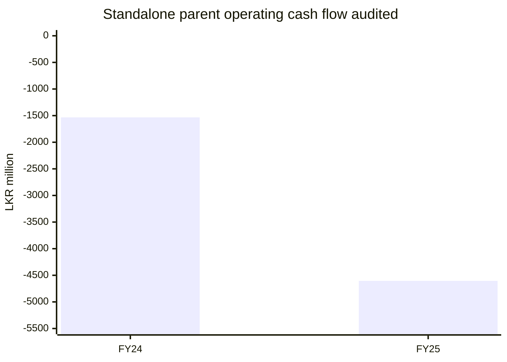

Standalone SCAP operating cash flow **−1,533.19m** in FY2024 and **−4,605.10m** in FY2025, both audited in the FY2025 annual report p.70. **FY2026 parent CFO is OPEN**, so no third bar is plotted. Audited FY2025 parent interest *paid* was **−2,549.88m**, different from **interest expense 1,833.56m**.

**Source / status:** [SCAP FY2025 audited report pp. 69–70](https://cdn.cse.lk/cmt/upload_report_file/1100_1764673838964.03.2025%20-%20Annual%20Report.pdf). **FY26* means FY2026 27 May 2026 interim, subject to audit.**

## 12 · FY2025 audited liability categories

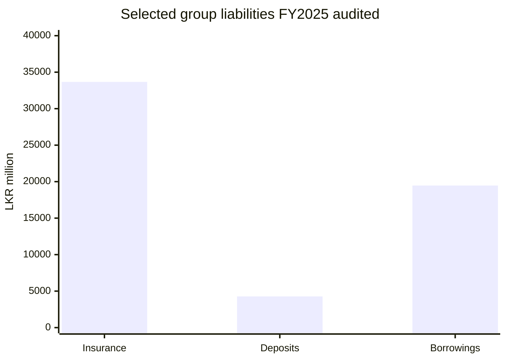

Selected **FY2025 audited group liabilities**, LKR millions: insurance contract liabilities **33,671.06**, public deposits **4,273.39**, and interest-bearing borrowings **19,467.97**. This **excludes other group liabilities** and is **not a full liability-composition pie**. The FY2025 auditor identified insurance liabilities, IT reporting controls, expected credit loss and borrowing as key audit areas.

**Source / status:** [SCAP FY2025 audited report pp. 65–66](https://cdn.cse.lk/cmt/upload_report_file/1100_1764673838964.03.2025%20-%20Annual%20Report.pdf). **FY26* means FY2026 27 May 2026 interim, subject to audit.**

## Limitations and verification

**Method:** All charts are historical, and each source has its own accounting scope. Negative SCAP-owner equity is not the same as negative total group equity. Cash, borrowings, deposits, insurance liabilities and share-price value must not be conflated.

- **A — audited:** [SCAP original FY2024/25 annual report, pp. 59–70](https://cdn.cse.lk/cmt/upload_report_file/1100_1764673838964.03.2025%20-%20Annual%20Report.pdf); EY opinion signed 1 December 2025.
- **I — interim:** [SCAP CSE year-ended 31 March 2026 interim filing](https://cdn.cse.lk/cmt/upload_report_file/1100_1779968696398.pdf); original link, research previously transcribed; FY2026 figures **subject to audit**. The PDF could not be reopened in this pass.
- **B — secondary cross-check only:** [StockAnalysis FY2026 cash flow](https://stockanalysis.com/quote/cose/SCAP.N0000/financials/cash-flow-statement/); does not replace SCAP original statement.
- **OPEN:** original SCAP FY2025/26 final audited statements, 30 June 2026 report, standalone FY2026 cash flow and any restatements must still be verified. **Softlogic Holdings PLC and Softlogic Finance PLC are different issuers.**
