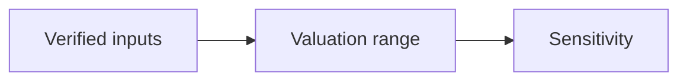

# 03 · Valuation Analysis

[← Fundamental analysis](../README.md) · [English](README.md) · [தமிழ்](../../ta/01-Fundamental-Analysis/03-Valuation/README.md) · [සිංහල](../../si/01-Fundamental-Analysis/03-Valuation/README.md)

> **SCAP.N0000 · Softlogic Capital PLC**  
> **Status:** Research framework only. SCAP-specific conclusions are not yet established. **Reference: 2026-09-30**.

## 🎯 Research question

What price range follows from verified owner-attributable earnings, cash, capital, and risk assumptions?

## 🔍 Evidence to collect

- [ ] Use a dated market price and correctly adjusted ordinary-share count; reconcile EPS to parent owners.
- [ ] Compare relevant peer P/E and P/B only after normalizing earnings quality, book value and business mix.
- [ ] Build scenario-based sum-of-the-parts or other appropriate models with explicit parent debt, minorities and holding-company costs.

## 🧭 Research process

## ⚠️ Interpretation trap

A low P/E or P/B does not independently prove undervaluation; invalid denominators make every ratio misleading.

## 🛠️ SCAP research task

Do not set a target share price until official attributable earnings, ownership, share count, parent-only debt and current quote are checked.

## 📝 Evidence worksheet (fill only after checking original documents)

| Measure or claim | Scope / reporting period | Original source + page | Verified finding |
|---|---|---|---|
| __________ | __________ | __________ | __________ |
| __________ | __________ | __________ | __________ |

**Earlier research:** [Existing SCAP research](../../06-financial-snapshot.md) · [Source register](../../SOURCES.md) · [CSE](https://www.cse.lk/).

**Method:** record the date, accounting scope, units, and the original document page. A chart or ratio is not a buy/sell recommendation.
