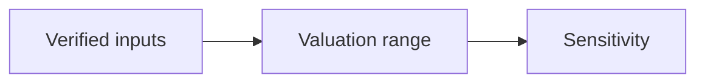

# 03 · Valuation Analysis

[← Fundamental analysis](../README.md) · [English](README.md) · [தமிழ்](../../ta/01-Fundamental-Analysis/03-Valuation/README.md) · [සිංහල](../../si/01-Fundamental-Analysis/03-Valuation/README.md)

> **SCAP.N0000 · Softlogic Capital PLC**  
> **Status:** Research framework only. SCAP-specific conclusions are not yet established. **Reference: 2026-09-30**.

## 🎯 Research question

What price range follows from verified owner-attributable earnings, cash, capital, and risk assumptions?

## 🔍 Evidence to collect

- [ ] Use a dated market price and correctly adjusted ordinary-share count; reconcile EPS to parent owners.
- [ ] Compare relevant peer P/E and P/B only after normalizing earnings quality, book value and business mix.
- [ ] Build scenario-based sum-of-the-parts or other appropriate models with explicit parent debt, minorities and holding-company costs.

## 🧭 Research process

## ⚠️ Interpretation trap

A low P/E or P/B does not independently prove undervaluation; invalid denominators make every ratio misleading.

## 🛠️ SCAP research task

Do not set a target share price until official attributable earnings, ownership, share count, parent-only debt and current quote are checked.

## 📝 Evidence worksheet (fill only after checking original documents)

| Measure or claim | Scope / reporting period | Original source + page | Verified finding |
|---|---|---|---|
| __________ | __________ | __________ | __________ |
| __________ | __________ | __________ | __________ |

**Earlier research:** [Existing SCAP research](../../06-financial-snapshot.md) · [Source register](../../SOURCES.md) · [CSE](https://www.cse.lk/).

**Method:** record the date, accounting scope, units, and the original document page. A chart or ratio is not a buy/sell recommendation.

## 30 September 2026 — SCAP owner-equity / NCI / parent-debt evidence bridge (PARTIAL)

**Accounting basis:** [SCAP FY2025 audited annual report, original pp. 63, 65, 70, 148–149](../../sources/records/SCAP-AR-2025.md) and [SCAP FY2026 year-end interim, original pp. 2–3, 6](../../sources/records/SCAP-FY2026-YE-INTERIM.md). **FY2026 is unaudited interim, NOT final audited FY2026.** The figures below are transcriptions retained in the linked provenance cards; the FY2026 original and the FY2026 audited replacement have not been newly reread in this pass. **LKR million.**

| Financial measure | FY ended 31 Mar 2025, audited | FY ended 31 Mar 2026, year-end interim | Entity / interpretation |
|---|---:|---:|---|
| Group profit after tax | +1,694.15 | +3,371.26 | Consolidated profit **before attribution** |
| Profit attributable to SCAP owners | −280.42 | +973.77 | Relevant profit numerator for SCAP ordinary shareholders; FY2026 provisional |
| Profit attributable to non-controlling interests | +1,974.57 | +2,397.49 | **Derived** group PAT less owners' PAT; subsidiary minority shareholders |
| Group owner-attributable equity | −2,440.85 | −1,035.49 | Consolidated equity attributable to SCAP shareholders, not total group equity |
| Group total equity | +2,856.63 | **OPEN** | FY2025 group equity includes NCI; FY2026 total not verified in this note |
| Group non-controlling equity | +5,297.48 | **OPEN** | **Derived FY2025:** 2,856.63 − (−2,440.85); not SCAP shareholders' NAV |
| SCAP standalone parent interest-bearing borrowings | 14,797.33 | 17,324.26 | Holding-company debt; 2026 interim, excludes any separately reported overdraft |
| SCAP standalone parent cash / bank | 27.89 | 32.07 | Holding-company cash; not consolidated subsidiary liquidity |
| Parent debt less parent cash (simple indicator) | 14,769.44 | 17,292.19 | **Derived**, not contractual net debt or full enterprise-value bridge |
| SCAP standalone parent profit after tax | **OPEN** | −722.49 | Company-only profit is not the consolidated owners' PAT |

**Checks:** FY2025 NCI profit = 1,694.15 − (−280.42) = **1,974.57**; FY2026 interim NCI profit = 3,371.26 − 973.77 = **2,397.49**. Parent borrowing change = 17,324.26 − 14,797.33 = **+2,526.93** (interim vs audited); the comparison does not establish current outstanding debt. The group owner's negative book equity does **not** mean all consolidated subsidiaries have negative equity. Nor does consolidated profit represent parent-distributable cash.

**Avoid double counting in sum-of-parts:** value each business on a consistent equity or enterprise-value basis, adjust for the **effective economic stake and minority interests**, then separately deduct **holding-company net obligations** only where not already included in the subsidiary equity valuations. Do not deduct group-level subsidiary debt again from already-equity-valued stakes. Check direct vs indirect ownership, insurer regulatory dividend restrictions, pledged shares and intra-group receivables before any numerical NAV. [Audited FY2025 collateral and parent-debt note](../../sources/records/SCAP-AR-2025.md); [FY2026 interim ownership / parent-only lines](../../sources/records/SCAP-FY2026-YE-INTERIM.md).

**No target price / P/E / P/B:** a dated ordinary-share count, live quote, final FY2026 audit, current parent debt and latest subsidiary stakes have not all been reconciled. This worksheet is **PARTIAL evidence**, not a completed valuation or investment recommendation.
