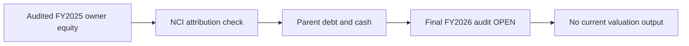

# SCAP valuation — verified inputs and blocked outputs

**Status: PARTIAL (30 September 2026).** This is an evidence audit, not a price target. FY2025 is audited; FY2026 is the 27 May 2026 **subject-to-audit interim**. All amounts below are **LKR millions**, not per-share values.

| Metric | FY2025 audited | FY2026 year-end interim | Accounting scope / original page |
|---|---:|---:|---|
| Consolidated equity attributable to SCAP owners | **−2,440.85** | **−1,035.49** | SCAP Group owners only; [FY2025 p.65](https://cdn.cse.lk/cmt/upload_report_file/1100_1764673838964.03.2025%20-%20Annual%20Report.pdf); [FY2026 p.6](https://cdn.cse.lk/cmt/upload_report_file/1100_1779968696398.pdf) |
| Consolidated total equity including NCI | +2,856.63 | +6,269.84 | SCAP Group including minority equity; same pages |
| Consolidated NCI equity | +5,297.48 | +7,305.34 | Minority claims; same pages |
| SCAP standalone equity | +5,373.24 | +4,848.03 | Listed parent-only, not group equity; same pages |
| SCAP standalone interest-bearing borrowings | 14,797.33 | 17,324.26 | Parent-only; [FY2025 p.66](https://cdn.cse.lk/cmt/upload_report_file/1100_1764673838964.03.2025%20-%20Annual%20Report.pdf); [FY2026 p.6](https://cdn.cse.lk/cmt/upload_report_file/1100_1779968696398.pdf) |
| SCAP standalone cash and bank | 27.89 | 32.07 | Parent-only, excludes overdraft; [FY2025 p.65](https://cdn.cse.lk/cmt/upload_report_file/1100_1764673838964.03.2025%20-%20Annual%20Report.pdf); [FY2026 p.6](https://cdn.cse.lk/cmt/upload_report_file/1100_1779968696398.pdf) |
| SCAP standalone overdraft | 323.78 | 323.13 | Parent-only additional obligation; [FY2025 p.66](https://cdn.cse.lk/cmt/upload_report_file/1100_1764673838964.03.2025%20-%20Annual%20Report.pdf); [FY2026 p.6](https://cdn.cse.lk/cmt/upload_report_file/1100_1779968696398.pdf) |
| Group profit attributable to SCAP owners | −280.42 | +973.77 | Owner-attributable PAT; [FY2025 p.63](https://cdn.cse.lk/cmt/upload_report_file/1100_1764673838964.03.2025%20-%20Annual%20Report.pdf); [FY2026 p.2](https://cdn.cse.lk/cmt/upload_report_file/1100_1779968696398.pdf) |
| Group PAT including NCI | +1,694.15 | +3,371.26 | Not all distributable to SCAP shareholders; same income pages |
| Parent-only operating cash flow | −4,605.10 | **OPEN** | [FY2025 p.70](https://cdn.cse.lk/cmt/upload_report_file/1100_1764673838964.03.2025%20-%20Annual%20Report.pdf); FY2026 original parent CFO not reconciled |

**Arithmetic control:** FY2025 owner equity −2,440.85 + NCI 5,297.48 = total equity 2,856.63. FY2026 interim −1,035.49 + 7,305.34 = 6,269.85, versus reported total 6,269.84: **0.01m rounding difference**, not a restatement claim.

**Interpretation:** A consolidated P/B denominator using total equity would incorrectly include NCI. A negative owner-equity denominator also makes an ordinary positive P/B interpretation unsuitable. Parent-only book equity is a different legal/accounting scope and must not be substituted for owner-attributable consolidated equity. Group PAT cannot be used as SCAP shareholder earnings without NCI attribution. Subsidiary cash, deposits and insurance reserves are not automatically available to the listed parent.

**No numerical target or intrinsic value:** The signed SCAP FY2026 audit, June 2026 original interim, verified contemporary share count and market quote, pledged-share release, parent debt maturities, subsidiary distributable capital, and tax/holding-company adjustments remain **OPEN**. Do not calculate a current P/E, SOTP, P/B or share-price target from incomplete inputs.

**Source archive:** [FY2025 audit record](../../sources/records/SCAP-AR-2025.md) · [FY2026 interim record](../../sources/records/SCAP-FY2026-YE-INTERIM.md) · [source register](../../sources/SOURCE-REGISTER.md). **External originals, not stored locally**; no PDF binary or redistribution permission verified.

