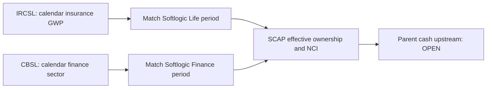

# Industry evidence — SCAP.N0000

## Primary-source industry evidence · 30 September 2026

**Status: PARTIAL — sourced industry baseline, not a current company-wide market-share comparison.**

| Business | Regulator/sector evidence | SCAP-specific interpretation / missing proof |
|---|---|---|
| Life insurance | IRCSL 2024 **provisional** industry life GWP **LKR 183,875m**; general GWP **138,162m**, total **322,037m**. Q1 2025 life GWP **51,056m**, general **41,172m** (their rounded sum differs from published total 92,229m by 1m). [IRCSL Chart 1 and Q1 text](https://ircsl.gov.lk/wp-content/uploads/2025/08/PRESS-RELEASE-_-Reviewing-Sri-Lankas-Insurance-Sector-Performance-2020-to-2024-and-Q1-2025.pdf). | SCAP's insurance subsidiary must be compared using the **same calendar period**, entity-level GWP, policy count, claims, retention and solvency. GWP is not SCAP Group operating income or parent cash. |
| Licensed finance companies | CBSL reports **2025 calendar-year** expansion in bank and finance-company credit and cautions about an increased positive credit-to-GDP gap. [CBSL, Full Text](https://www.cbsl.gov.lk/en/node/20110). | This is sector commentary, **not Softlogic Finance performance**. Compare dated finance-company Stage 3, capital, deposits and funding cost against entity-specific filings. |
| Stockbroking | SCAP's FY2025 audited report describes brokerage exposure; **no dated regulator-wide broker turnover, fee-rate or exact current ownership series verified in this pass**. [SCAP annual report](https://cdn.cse.lk/cmt/upload_report_file/1100_1764673838964.03.2025%20-%20Annual%20Report.pdf). | Verify SEC licence, CSE turnover/market share, legal entity and parent dividends before claiming profit contribution. |
| Asset management | SCAP FY2025 describes asset-management exposure; **no verified comparable AUM series or fee margins**. [SCAP annual report](https://cdn.cse.lk/cmt/upload_report_file/1100_1764673838964.03.2025%20-%20Annual%20Report.pdf). | Check SEC licence, management entity, assets under management, recurring fees and effective SCAP stake. |

**Calendar/FY control:** IRCSL 2024 is **calendar 2024**, IRCSL Q1 2025 ends **31 March 2025**, CBSL 2025 covers **calendar 2025**, whereas SCAP FY2025 ends **31 March 2025** and SCAP FY2026 ends **31 March 2026**. They are not directly interchangeable.

**Industry evidence ≠ subsidiary or parent evidence.** Consolidated insurer operating lines, finance deposits, insurer liabilities, minority ownership and dividends received by the parent must remain separate. Neither the sector GWP figures nor the CBSL commentary proves SCAP shareholder returns.

**Open:** Obtain IRCSL 2025 handbook and Q2 2026 sector original, CBSL same-period finance-company series, SEC/CSE broker data, SCAP FY2026 signed audited report and SCAP June 2026 original. Until then, no current industry-share claim.

**Durable source records:** [IRCSL industry release](../../sources/records/IRCSL-INSURANCE-SECTOR-2024-Q1-2025.md) · [CBSL 2025 sector](../../sources/records/CBSL-FINANCIAL-SECTOR-PERFORMANCE-2025.md) · [SCAP audited FY2025](../../sources/records/SCAP-AR-2025.md). **External originals, not stored locally.**

