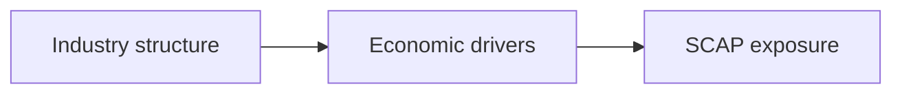

# 04 · Industry Analysis

[← Fundamental analysis](../README.md) · [English](README.md) · [தமிழ்](../../ta/01-Fundamental-Analysis/04-Industry/README.md) · [සිංහල](../../si/01-Fundamental-Analysis/04-Industry/README.md)

> **SCAP.N0000 · Softlogic Capital PLC**  
> **Status:** Research framework only. SCAP-specific conclusions are not yet established. **Reference: 2026-09-30**.

## 🎯 Research question

Which structural forces determine profits for insurance, finance, brokerage, and investment management?

## 🔍 Evidence to collect

- [ ] Identify licensed market participants, segment size, customer needs, distribution models and barriers to entry.
- [ ] Study industry-level claims, credit growth, rates, capital standards and cyclical demand.
- [ ] Separate sector-wide growth from competitive share gains using equivalent period and scope.

## 🧭 Research process

## ⚠️ Interpretation trap

A growing industry does not guarantee that every participant generates shareholder returns.

## 🛠️ SCAP research task

Build separate insurance, finance and capital-markets industry pages with dated regulator series from IRCSL, CBSL and CSE.

## 📝 Evidence worksheet (fill only after checking original documents)

| Measure or claim | Scope / reporting period | Original source + page | Verified finding |
|---|---|---|---|
| __________ | __________ | __________ | __________ |
| __________ | __________ | __________ | __________ |

**Earlier research:** [Existing SCAP research](../../03-competition.md) · [Source register](../../SOURCES.md) · [CSE](https://www.cse.lk/).

**Method:** record the date, accounting scope, units, and the original document page. A chart or ratio is not a buy/sell recommendation.
