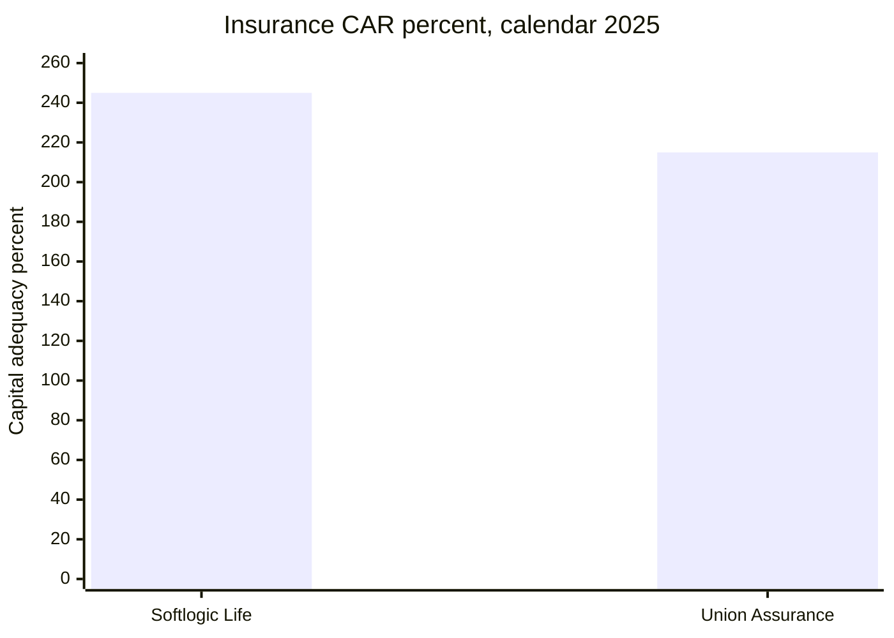

# 05 · Dated insurer and finance-company comparables

[← Fundamental analysis](../README.md) · [English](README.md) · [தமிழ்](../../ta/01-Fundamental-Analysis/05-Competitors/README.md) · [සිංහල](../../si/01-Fundamental-Analysis/05-Competitors/README.md)

> **SCAP.N0000 · Original research · as of 30 Sep 2026 · LKR million unless explicitly stated.** **OPEN: SCAP final FY2025/26 audited and June 2026 original filings not reconciled. Current changes and covenants must not be inferred from FY2025.**

## 🎯 Research question

Which peer metrics are genuinely comparable by reporting year, legal entity and ratio definition?

**No holding-company composite ranking:** insurer CAR is not finance-company CAR; gross premium is not consolidated SCAP income. The tables compare **specific operating companies and same-labelled periods**, not the listed parent to a peer using an arbitrary stock-market ratio. [SLIFE-AR-2025](../../sources/records/SLIFE-AR-2025.md) · [UA-AR-2025-CAR](../../sources/records/UA-AR-2025-CAR.md) · [CBSL-FC-Q1-2026](../../sources/records/CBSL-FC-Q1-2026.md).

## 🔎 Dated evidence

| Peer and exact ratio | Reported result | Period, evidence class | Boundary |
|---|---|---|
| Softlogic Life risk-based CAR | 245% | 31 Dec 2025; issuer annual report | Insurer-specific RBC |
| Union Assurance risk-based CAR | 215% | 31 Dec 2025; issuer audited annual | Insurance peer RBC |
| Insurance regulatory minimum cited | 120% | Union and Life 2025 reports | Regulatory floor, not earnings |
| Softlogic Life customer retention | 89% | Calendar FY2025 issuer report dashboard | Customer retention; not necessarily 13-month persistency |
| Union Assurance matching customer retention | OPEN | FY2025 primary source not mapped | Do not infer peer persistency |
| Softlogic Finance total capital adequacy | ~61% | 31 Mar 2026 issuer management update | Finance-company CAR; audit-line tie-out pending |
| CBSL FC sector total CAR | 18.4% | End Q1 2026 CBSL original | Sector, not individual company |
| Softlogic Finance gross NPL | 37.6% provisional | FY2026 secondary republication | Needs original finance-company gross-NPL note |
| Comparable FC sector *gross NPL* | OPEN | Same date & numerator needed | No unsupported credit-quality comparison |

### Insurers: like-for-like solvency, unlike-for-unlike retention

Softlogic Life's annual-report 2025 investor dashboard reports **245% risk-based CAR**, and its customer dashboard reports **89% customer retention**. Union Assurance's original 2025 annual report (31 Dec 2025) reports **215% CAR**. These two CAR measures are **both insurer** risk-based capital disclosures with the same calendar year-end; they are not SCAP consolidated capital. A directly comparable **Union retention/policy persistency** figure was not independently matched by denominator and cohort, and remains OPEN. [SLIFE-AR-2025](../../sources/records/SLIFE-AR-2025.md) · [UA-AR-2025-CAR](../../sources/records/UA-AR-2025-CAR.md).

### Finance: regulatory capital vs loss quality

Softlogic Finance's **28 July 2026 issuer update** describes approx **61%** capital adequacy as at the financial year ending 31 March 2026; CBSL's **FC-sector** release gives total CAR **18.4%** at end March 2026. The company number comes from **issuer management commentary**, the sector number from **regulator statistics**. The lender's **37.6% gross NPL** appears in a secondary account of the FY26 update, but the first-hand *finance annual-report gross-NPL row* and a same-definition sector gross-NPL number are still unverified. Do **not** compare that gross figure to banks' Stage 3 ratio or a finance company's *net* NPL. [SFIN-UPDATE-JUL2026](../../sources/records/SFIN-UPDATE-JUL2026.md) · [CBSL-FC-Q1-2026](../../sources/records/CBSL-FC-Q1-2026.md).

### Finance funding / competitors missing

Softlogic Finance issuer management describes **assets ~LKR7.3bn**, **lending ~6.5bn** and **customer deposits >3.7bn** for FY26. Funding-cost, deposit tenor and short-term liquidity comparisons with named licensed-finance peers need original audited KPI tables and a matching year-end. Life **2025 retention (89%)** is not automatically equivalent to **policy persistency**, and sector-peer values should not be fabricated. [SFIN-UPDATE-JUL2026](../../sources/records/SFIN-UPDATE-JUL2026.md).

## Evidence map

## ⚠️ Missing evidence

- [ ] Find matching 2025 cohort-defined **insurance persistency** for both insurers; document month duration, denominator and reporting calendar.
- [ ] Tie out FY26 Softlogic Finance **gross NPL, Stage 3 coverage, deposit mix and maturity** against its original 2025/26 annual report.
- [ ] Find an original CBSL **finance-company sector gross-NPL** series and specific peer data for the same 31 March 2026 date.
- [ ] Expand stockbroker and asset-manager segment peers when original SEC/CSE revenue and book/turnover statements are available.

**Source IDs:** [SLIFE-AR-2025](../../sources/records/SLIFE-AR-2025.md) · [UA-AR-2025-CAR](../../sources/records/UA-AR-2025-CAR.md) · [SFIN-UPDATE-JUL2026](../../sources/records/SFIN-UPDATE-JUL2026.md) · [CBSL-FC-Q1-2026](../../sources/records/CBSL-FC-Q1-2026.md).

[Life 2025 original PDF](https://softlogiclife.lk/wp-content/uploads/sites/3/2026/03/Softlogic-Life-Integrated-Annual-Report-2025.pdf) · [Union 2025 original PDF](https://unionassurance.com/DigitalAnnualReport2025/Union-Assurance-AR-2025.pdf) · [CBSL FC sector Q1 2026](https://www.cbsl.gov.lk/en/node/20440) · [Finance issuer update](https://softlogicfinance.lk/news/building-a-stronger-more-resilient-softlogic-finance/).

[Primary sources](../../sources/SOURCE-REGISTER.md) · [Research queue](../../RESEARCH-QUEUE.md)

This is evidence-based financial research, not a buy/sell recommendation.