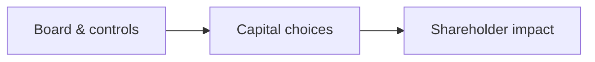

# 07 · Management and Governance Analysis

[← Fundamental analysis](../README.md) · [English](README.md) · [தமிழ்](../../ta/01-Fundamental-Analysis/07-Management-Governance/README.md) · [සිංහල](../../si/01-Fundamental-Analysis/07-Management-Governance/README.md)

> **SCAP.N0000 · Softlogic Capital PLC**  
> **Status:** Research framework only. SCAP-specific conclusions are not yet established. **Reference: 2026-09-30**.

## 🎯 Research question

How do governance, capital allocation and related-party arrangements affect minority shareholders?

## 🔍 Evidence to collect

- [ ] Record board composition and changes, independence statements, audit committee and auditor observations from dated filings.
- [ ] Examine related-party transactions, guarantees, remuneration, capital raising and previous uses of shareholder funds.
- [ ] Compare management commitments against documented outcomes without inferring motives.

## 🧭 Research process

## ⚠️ Interpretation trap

Founder reputation, group branding or a single profitable year is not proof of sound governance or future execution.

## 🛠️ SCAP research task

Extract governance, related-party and contingent-liability notes from the latest SCAP annual report; cite the exact pages.

## 📝 Evidence worksheet (fill only after checking original documents)

| Measure or claim | Scope / reporting period | Original source + page | Verified finding |
|---|---|---|---|
| __________ | __________ | __________ | __________ |
| __________ | __________ | __________ | __________ |

**Earlier research:** [Existing SCAP research](../../01-business-and-ownership.md) · [Source register](../../SOURCES.md) · [CSE](https://www.cse.lk/).

**Method:** record the date, accounting scope, units, and the original document page. A chart or ratio is not a buy/sell recommendation.
