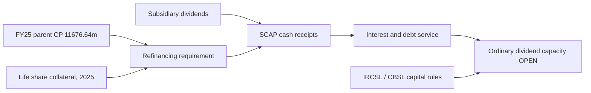

# 08 · Financing, collateral, regulatory and credit risks

[← Fundamental analysis](../README.md) · [English](README.md) · [தமிழ்](../../ta/01-Fundamental-Analysis/08-Risk/README.md) · [සිංහල](../../si/01-Fundamental-Analysis/08-Risk/README.md)

> **SCAP.N0000 · Original research · as of 30 Sep 2026 · LKR million unless explicitly stated.** **OPEN: SCAP final FY2025/26 audited and June 2026 original filings not reconciled. Current changes and covenants must not be inferred from FY2025.**

## 🎯 Research question

What did audited financial statements actually expose at the listed SCAP parent level, and which risks remain conditional?

**Entity discipline:** at 31 March 2025 the SCAP **standalone parent** reported interest-bearing borrowing **14,797.33** (audited note 39, PDF p.148) versus the **consolidated group's 19,467.97**. The two are not interchangeable. The later 31 March 2026 **year-end interim** parent borrowing **17,324.26** and cash/bank **32.07** are **subject to audit**. [SCAP-AR-2025](../../sources/records/SCAP-AR-2025.md) · [SCAP-FY2026-YE-INTERIM](../../sources/records/SCAP-FY2026-YE-INTERIM.md).

## 🔎 Dated evidence

| Audited FY2025 parent item | LKR mn | Source and exact limitation |
|---|---|---|
| Bank loans | 1,950.22 | Note 39 p.148; **426.02 due within one year**, **1,524.20 after one year** (p.149) |
| Commercial paper | 11,676.64 | Note 39 p.148; **instrument maturity-by-date OPEN** |
| Securitisation | 1,154.54 | Note 39 p.148; cash flow/collateral, contractual schedule need separate verification |
| Lease creditors | 15.93 | Note 39 p.148; ~3.07 within one year, 12.86 after |
| Debentures & subordinated debt (parent) | 0.00 | As at 31 March 2025 only; may have changed later |
| Total parent interest-bearing borrowing | 14,797.33 | Sum of parent-only note 39 columns |
| Parent contingent guarantees | 75.00 | Note 44 p.161; RPT note 47.4 p.168 names Softlogic Stockbrokers; FY2024 amount 150.00 |
| Life shares securing parent bank facilities | 48,559,000 NDB / 32,490,704 DFCC shares | Note 39.1.2 p.149; numbers are **shares, not LKR millions** |
| Parent operating cash flow | −4,605.10 | FY25 audited p.70; cash flow ≠ profit |
| Parent cash dividend received / interest paid | +3,273.55 / −2,549.88 | FY25 audited p.70; receipts/payments not future capacity |

### Refinancing and pledged equity

At FY2025 SCAP directors described interest servicing as depending partly on dividends from subsidiaries and new commercial-paper issuance, reporting approximately **82% commercial-paper renewal experience** in going-concern note 2.1.2 (PDF p.71). That **82% was management's historical observation**, not a contractual roll guarantee or a forecast. FY2025 collateral note 39.1.2 listed NDB/DFCC Life share pledges. An issuer's later Life-share register cannot determine whether bank security has been released. [SCAP-AR-2025](../../sources/records/SCAP-AR-2025.md).

### Separate insurer and finance company constraints

Softlogic Life's **2025 calendar-year risk-based CAR was 245%** (Life original issuer report); this is **insurer capital**, not SCAP parent available cash. FY2025 SCAP note 41.7, p.157 discloses a **798.004 restricted one-off surplus** with IRCSL distribution conditions. Softlogic Finance's **July 2026 issuer business update** reports an approximately **61% finance-company CAR** and roughly 3.7bn deposits; those are **NBFI** figures subject to financial-statement tie-out. The Life and Finance capital ratios must **never be added** or interpreted as parent-level cash resources. [SLIFE-AR-2025](../../sources/records/SLIFE-AR-2025.md) · [SFIN-UPDATE-JUL2026](../../sources/records/SFIN-UPDATE-JUL2026.md).

### Ownership, collateral and dividend transmission

SCAP FY2025 note 44 (p.161) reports **75.00m parent guarantees**, with related-party note 47.4 (p.168) specifying Softlogic Stockbrokers. The same related-party note shows SCAP's dividend income **3,273.546m from Softlogic Life**. SCAP ordinary shareholder dividends require **separate** solvency, bank-covenant and board checks. New 2026 Life dividend announcements are not proof of parent receipt. [SLIFE-JUN2026-DIVIDEND](../../sources/records/SLIFE-JUN2026-DIVIDEND.md).

## Evidence map

## ⚠️ Missing evidence

- [ ] Reconcile FY26 final audited **commercial-paper tranches, settlement dates, rates, covenants and debt maturity** with June 2026 issuer original.
- [ ] Check 2026 bank filings for collateral release/new Life share pledges and parent guarantees.
- [ ] Source FY26 standalone cash flow, deposit-funding duration at Finance and regulatory solvency/distributable reserves at Life.
- [ ] Do not mislabel consolidated group maturity schedule as SCAP standalone borrowing.

**Source IDs:** [SCAP-AR-2025](../../sources/records/SCAP-AR-2025.md) · [SCAP-FY2026-YE-INTERIM](../../sources/records/SCAP-FY2026-YE-INTERIM.md) · [SLIFE-AR-2025](../../sources/records/SLIFE-AR-2025.md) · [SFIN-UPDATE-JUL2026](../../sources/records/SFIN-UPDATE-JUL2026.md) · [SLIFE-JUN2026-DIVIDEND](../../sources/records/SLIFE-JUN2026-DIVIDEND.md) · [SCAP-AR-2026-CATALOGUE](../../sources/records/SCAP-AR-2026-CATALOGUE.md) · [SCAP-JUN2026-CATALOGUE](../../sources/records/SCAP-JUN2026-CATALOGUE.md).

[SCAP FY2025 audited original](https://cdn.cse.lk/cmt/upload_report_file/1100_1764673838964.03.2025%20-%20Annual%20Report.pdf) · [SCAP FY2026 interim](https://cdn.cse.lk/cmt/upload_report_file/1100_1779968696398.pdf) · [Finance issuer](https://softlogicfinance.lk/news/building-a-stronger-more-resilient-softlogic-finance/).

[Primary sources](../../sources/SOURCE-REGISTER.md) · [Research queue](../../RESEARCH-QUEUE.md)

This is evidence-based financial research, not a buy/sell recommendation.

## FY2025 → FY2026 parent liquidity bridge (1 Oct 2026)

This bridge deliberately compares the **SCAP standalone parent**, not the consolidated Group. FY2025 is audited; FY2026 remains the 27 May 2026 year-end interim and is **subject to audit**.

| Parent metric | FY2025 audited | FY2026 interim | Change / interpretation |
|---|---:|---:|---|
| Interest-bearing borrowings (LKR mn) | 14,797.33 | 17,324.26 | **+2,526.93 / +17.08%** |
| Cash and bank (LKR mn) | 27.89 | 32.07 | +4.18 |
| Borrowings less cash (mechanical, LKR mn) | 14,769.44 | 17,292.19 | **+2,522.75 / +17.08%** |
| Gross debt / cash | 530.56× | 540.20× | liquidity-warning indicator only; **not** a covenant ratio |

The calculation does **not** establish insolvency, default or covenant breach. It shows that the parent entered the FY2026 year-end interim with materially more interest-bearing borrowing while reported cash remained small relative to borrowing. The FY2026 signed audit, debt maturity schedule and covenant definitions remain OPEN. [SCAP-AR-2025](../../sources/records/SCAP-AR-2025.md) · [SCAP-FY2026-YE-INTERIM](../../sources/records/SCAP-FY2026-YE-INTERIM.md).

### Cash evidence must not be mixed with accrual income

Audited FY2025 parent cash flow records **3,273.55m dividends received** and **2,549.88m interest paid**, a historical cash-receipt/interest-paid ratio of **1.28×**. The FY2026 interim instead reports **635.18m dividend income** and **1,810.84m interest expense**, mechanically **0.35×**. These ratios are **not like-for-like**: the first uses cash-flow lines, the second income-statement accrual lines. Therefore 0.35× must **not** be described as FY2026 cash debt-service coverage. A FY2026 standalone cash-flow statement is required before making that claim.

**Diligence conclusion:** refinancing and subsidiary cash-upstream capacity remain material parent-level risks because FY2025 audited operating cash flow was **−4,605.10m**, FY2025 going-concern disclosure referenced subsidiary dividends and new commercial paper for servicing, and FY2026 interim parent borrowing increased 17.08%. This is a risk flag, not proof of payment failure. Next evidence required: signed FY2026 audit; parent CP tranche maturities/rates/covenants; FY2026 standalone cash flow; and current NDB/DFCC Life-share collateral-release status.
