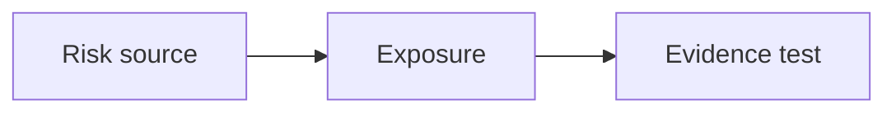

# 08 · Risk Analysis

[← Fundamental analysis](../README.md) · [English](README.md) · [தமிழ்](../../ta/01-Fundamental-Analysis/08-Risk/README.md) · [සිංහල](../../si/01-Fundamental-Analysis/08-Risk/README.md)

> **SCAP.N0000 · Softlogic Capital PLC** · **Status:** Research methodology only; no fresh SCAP conclusion is implied. **Reference date: 2026-09-30**.

## 🎯 Research question

Which financial, operating, regulatory, governance and equity-market exposures could permanently impair owner value?

## 🔎 What to verify

- [ ] Separate probability from possible severity; record observed exposure rather than assigning made-up scores.
- [ ] Review parent borrowing and guarantees, insurer claims/solvency, finance credit/funding, liquidity and related-party risks.
- [ ] Build a scenario, mitigation, early-warning metric, filing reference and reassessment trigger for each mechanism.

## 🧭 Research logic

## ⚠️ What not to assume

A risk register describes possible channels; it does not prove an incident has occurred or a particular outcome will happen.

## 🛠️ SCAP application

Reconcile SCAP's risk notes, actual parent debt and current regulator disclosures before estimating the size of exposure.

## 📝 Evidence register

| Metric or event | Period / scope | Primary citation | Observed result |
|---|---|---|---|
| ______ | ______ | ______ | ______ |
| ______ | ______ | ______ | ______ |

[Earlier SCAP note](../../05-risks-and-questions.md) · [Source register](../../SOURCES.md) · [CSE](https://www.cse.lk/)

**Method:** Record publication date, accounting scope, units and exact page. No market quotation or investment recommendation is implied.
