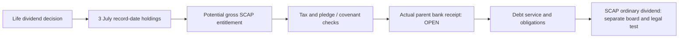

# 09 · Dividends and upstream cash availability

[← Fundamental analysis](../README.md) · [English](README.md) · [தமிழ்](../../ta/01-Fundamental-Analysis/09-Dividends/README.md) · [සිංහල](../../si/01-Fundamental-Analysis/09-Dividends/README.md)

> **SCAP.N0000 · Softlogic Capital PLC · Source status · checked 30 Sep 2026.** FY2025 audited — confirmed historical; FY2026 year-end interim — subject to audit. **OPEN — original FY2026 final annual report and SCAP June 2026 quarter not independently reconciled.**

## 🎯 Research question

What cash was recorded as received by the listed parent, and what might an insurer dividend permit?

## Source-backed analysis

### Historical parent cash receipts

The **FY2025 audited SCAP standalone cash flow**, PDF p.70, records **LKR 3,273.55m cash dividends received** in investing activities, not a distribution paid by SCAP to its own listed shareholders. The FY2025 SCAP related-party note 47.4 (p.168) attributes **LKR 3,273.546m dividend income from Softlogic Life**. Standalone operating CFO was **−4,605.10m**, with **LKR 2,549.88m interest paid** (cash), compared with **LKR 1,833.56m interest expense** (accrual). The dividend receipt, operating cash deficit and financing activity are distinct lines. [SCAP-AR-2025](../../sources/records/SCAP-AR-2025.md).

### 2026 subsidiary dividend: announced vs bank receipt

Softlogic Life's **22 June 2026 CSE letter** declares **Rs 5.30 per voting share**, ex-date **2 July**, record **3 July** and intended dispatch **21 July 2026**, subject to withholding tax. The Life share register on **30 June 2026** lists SCAP **158,714,972 shares**. **Only if those holdings continued on the 3 July record date**, the indicative **gross entitlement** would be about **LKR 841.19m** (158,714,972 × 5.30 ÷ 1m), **not independently confirmed received**; withholding tax, pledge terms and the parent bank statement remain open. The **Life payout is not a SCAP ordinary-share dividend.** [SLIFE-JUN2026-DIVIDEND](../../sources/records/SLIFE-JUN2026-DIVIDEND.md) · [SLIFE-Q2-2026-REGISTER](../../sources/records/SLIFE-Q2-2026-REGISTER.md).

### Capital and financing restrictions

FY2025 SCAP annual report's insurance note 41.7 (p.157) identifies **LKR 798.004m restricted regulatory one-off surplus**. Distribution of that *specific surplus* remained conditional on IRCSL requirements; **this does not mean every Life dividend is prohibited**. The report's directors expected parent interest servicing from subsidiary dividends and issuance/renewal of commercial paper (going-concern note 2.1.2, p.71). FY2026 interim parent cash **32.07m** and parent borrowing **17,324.26m** require audited/source-date reconciliation; neither balance alone determines dividend legality. [SCAP-AR-2025](../../sources/records/SCAP-AR-2025.md) · [SCAP-FY2026-YE-INTERIM](../../sources/records/SCAP-FY2026-YE-INTERIM.md).

## Dated evidence table

| Cash/distribution item | LKR million / status | Basis | Interpretation |
|---|---|---|---|
| SCAP standalone cash dividend received | 3,273.55 | FY25 audited; cash flow p.70 | Life upstream; NOT SCAP shareholder payout |
| SCAP cash interest paid | −2,549.88 | FY25 audited; cash flow p.70 | Cash payment, not accrual expense |
| SCAP standalone operating CFO | −4,605.10 | FY25 audited; cash flow p.70 | Do not equalize dividend inflow with operating CFO |
| Life 2026 dividend announcement | Rs 5.30 per voting share | 22 Jun 2026 issuer CSE notice | Life pays; tax applies |
| Illustrative SCAP gross Life entitlement | ~841.19, conditional | 30 Jun holdings × 3 Jul record-date assumption | NOT proven 2026 parent receipt |
| Life restricted one-off surplus | 798.004 | FY25 audited, note 41.7 | Only restricted reserve; current update OPEN |

## Evidence and cash-flow structure

**Source records:** [SCAP-AR-2025](../../sources/records/SCAP-AR-2025.md) · [SLIFE-JUN2026-DIVIDEND](../../sources/records/SLIFE-JUN2026-DIVIDEND.md) · [SLIFE-Q2-2026-REGISTER](../../sources/records/SLIFE-Q2-2026-REGISTER.md) · [SCAP-AR-2026-CATALOGUE](../../sources/records/SCAP-AR-2026-CATALOGUE.md).

[SCAP FY2025 audited original pp.70–71, 157, 168](https://cdn.cse.lk/cmt/upload_report_file/1100_1764673838964.03.2025%20-%20Annual%20Report.pdf) · [Life 2026 original dividend notice](https://cdn.cse.lk/cmt/announcement_portal_prod/INTERIM%20DIVIDEND%20ANNOUNCEMENT_4994263359860578.pdf) · [Life June 2026 register]([object Object]).

## ⚠️ What remains open

- [ ] Verify **actual** July 2026 Life cash remittance and SCAP record-date holdings.
- [ ] Retrieve FY2026 audited parent cash receipts, bank balances, maturity ladder, covenants and guarantees.
- [ ] Check latest IRCSL approvals, Life available distribution capital and any finance subsidiary dividend restrictions.
- [ ] Build a five-year SCAP ordinary shareholder dividend timeline from original notices, excluding subsidiary-to-parent payments.

[Central source register](../../sources/SOURCE-REGISTER.md) · [Research queue](../../RESEARCH-QUEUE.md)

**Scope:** Research documents distinct dated entities and accounting sources, not an investment recommendation.