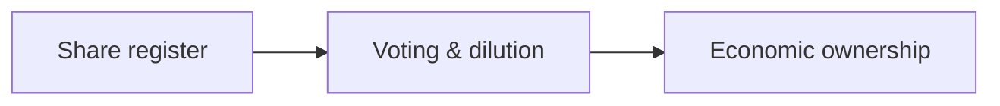

# 10 · Shareholding Analysis

[← Fundamental analysis](../README.md) · [English](README.md) · [தமிழ்](../../ta/01-Fundamental-Analysis/10-Shareholding/README.md) · [සිංහල](../../si/01-Fundamental-Analysis/10-Shareholding/README.md)

> **SCAP.N0000 · Softlogic Capital PLC** · **Status:** Research methodology only; no fresh SCAP conclusion is implied. **Reference date: 2026-09-30**.

## 🎯 Research question

Who owns and controls SCAP, and how might changes affect ordinary shareholders?

## 🔎 What to verify

- [ ] Reconstruct dated major shareholders, public float, voting rights and reported insider share transactions.
- [ ] Map direct versus effective indirect ownership of subsidiaries, rights of minority investors and any pledged holdings.
- [ ] Trace ordinary shares, warrants, conversions, rights issues and other potential dilution where disclosed.

## 🧭 Research logic

## ⚠️ What not to assume

A large named shareholder or dated insurer stake does not mean today's economic ownership is unchanged.

## 🛠️ SCAP application

Use SCAP's original shareholding schedules and subsequent disclosures; document the as-of date of every percentage.

## 📝 Evidence register

| Metric or event | Period / scope | Primary citation | Observed result |
|---|---|---|---|
| ______ | ______ | ______ | ______ |
| ______ | ______ | ______ | ______ |

[Earlier SCAP note](../../01-business-and-ownership.md) · [Source register](../../SOURCES.md) · [CSE](https://www.cse.lk/)

**Method:** Record publication date, accounting scope, units and exact page. No market quotation or investment recommendation is implied.
