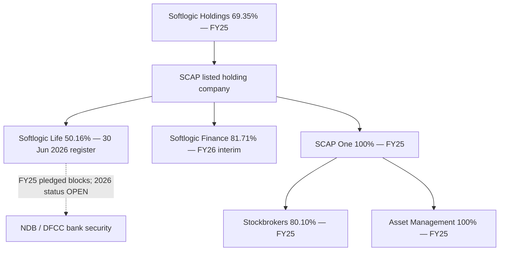

# 10 · Shareholding, subsidiary control and pledged shares

[← Fundamental analysis](../README.md) · [English](README.md) · [தமிழ்](../../ta/01-Fundamental-Analysis/10-Shareholding/README.md) · [සිංහල](../../si/01-Fundamental-Analysis/10-Shareholding/README.md)

> **SCAP.N0000 · Softlogic Capital PLC · Source status · checked 30 Sep 2026.** FY2025 audited — confirmed historical; FY2026 year-end interim — subject to audit. **OPEN — original FY2026 final annual report and SCAP June 2026 quarter not independently reconciled.**

## 🎯 Research question

Which stakes are direct, which flow through SCAP One, and which Life shares secure parent borrowing?

## Source-backed analysis

### Dated control chain

The **31 March 2025 audited SCAP group chart** (PDF p.4, printed p.3) shows Softlogic Holdings PLC **69.35% → SCAP**; SCAP **100% → SCAP One (Pvt) Ltd** and **100% → SR One (Pvt) Ltd**; SCAP One **80.10% → Softlogic Stockbrokers (Pvt) Ltd** and **100% → Softlogic Asset Management (Pvt) Ltd**. These are the **2025 structural disclosures**, not certified 2026 broker/asset-manager percentages. [SCAP-AR-2025](../../sources/records/SCAP-AR-2025.md).

### Subsequent subsidiary ownership

At **31 December 2025**, Softlogic Life reported **158,714,972 SCAP-held voting shares / 50.16%**; Life's **30 June 2026** interim shareholder register repeats **158,714,972 / 50.16%** (note 19, p.19/20). These are the **Life issuer's register**, not evidence about encumbrances. The earlier **31 March 2026 SCAP year-end interim** reported Life **50.16%**, Finance **81.71%** and SCAP One/SR One **100%**, with FY2026 figures subject to audit. [SLIFE-Q2-2026-REGISTER](../../sources/records/SLIFE-Q2-2026-REGISTER.md) · [SCAP-FY2026-YE-INTERIM](../../sources/records/SCAP-FY2026-YE-INTERIM.md).

### Share collateral, not free float

FY2025 SCAP audited **loan note 39.1.2, PDF p.149** discloses **48,559,000 Softlogic Life shares pledged for NDB financing** and **32,490,704 Life shares pledged for DFCC financing**. A dated charge disclosure is **not** confirmation of the 2026 amount, continued charge or release. The 30 June 2026 Life register shows ownership, not collateral. The existence and nature of pledges require current lender/issuer disclosures. [SCAP-AR-2025](../../sources/records/SCAP-AR-2025.md).

## Dated evidence table

| Entity / relationship | Percentage / quantity | As-of / assurance | Original |
|---|---|---|---|
| Softlogic Holdings → SCAP | 69.35% | 31 Mar 2025 · audited | SCAP AR PDF p.4 |
| SCAP → SCAP One → Stockbrokers | 100% → 80.10% | 31 Mar 2025 · audited | SCAP AR PDF p.4 |
| SCAP → SCAP One → Asset Management | 100% → 100% | 31 Mar 2025 · audited | SCAP AR PDF p.4 |
| SCAP → Life | 158,714,972 / 50.16% | 30 Jun 2026 · Life interim | Life issuer note 19 p.19 |
| SCAP → Finance | 81.71% | 31 Mar 2026 · SCAP interim | SCAP interim p.19, earlier transcription |
| NDB Life-share pledge | 48,559,000 shares | 31 Mar 2025 · audited | SCAP AR note 39.1.2 p.149 |
| DFCC Life-share pledge | 32,490,704 shares | 31 Mar 2025 · audited | SCAP AR note 39.1.2 p.149 |

## Evidence and cash-flow structure

**Source records:** [SCAP-AR-2025](../../sources/records/SCAP-AR-2025.md) · [SCAP-FY2026-YE-INTERIM](../../sources/records/SCAP-FY2026-YE-INTERIM.md) · [SLIFE-Q2-2026-REGISTER](../../sources/records/SLIFE-Q2-2026-REGISTER.md) · [SCAP-AR-2026-CATALOGUE](../../sources/records/SCAP-AR-2026-CATALOGUE.md).

[Original SCAP 2025 audited group structure p.4](https://cdn.cse.lk/cmt/upload_report_file/1100_1764673838964.03.2025%20-%20Annual%20Report.pdf) · [SCAP 2025 collateral note p.149](https://cdn.cse.lk/cmt/upload_report_file/1100_1764673838964.03.2025%20-%20Annual%20Report.pdf) · [Life 30 Jun 2026 shareholder note p.19]([object Object]) · [SCAP 2026 interim](https://cdn.cse.lk/cmt/upload_report_file/1100_1779968696398.pdf).

## ⚠️ What remains open

- [ ] Get SCAP original **final FY2025/26 audited** note on subsidiary holdings and legal entities.
- [ ] Get **30 Jun 2026 SCAP original interim**, broker/asset manager registers and any intervening share-sale announcements.
- [ ] Verify whether the FY2025 NDB/DFCC Life-share pledges were discharged, varied, or extended, with share-count and beneficiary documents.

[Central source register](../../sources/SOURCE-REGISTER.md) · [Research queue](../../RESEARCH-QUEUE.md)

**Scope:** Research documents distinct dated entities and accounting sources, not an investment recommendation.