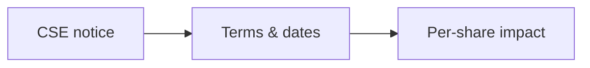

# 11 · Corporate Action Analysis

[← Fundamental analysis](../README.md) · [English](README.md) · [தமிழ்](../../ta/01-Fundamental-Analysis/11-Corporate-Actions/README.md) · [සිංහල](../../si/01-Fundamental-Analysis/11-Corporate-Actions/README.md)

> **SCAP.N0000 · Softlogic Capital PLC** · **Status: PARTIAL** · **Reference date: 2026-10-02**.

## 🎯 Research question

Which announced capital events can change the number of shares, cash flows, ownership, or security value?

## 🔎 What to verify

- [ ] Maintain a dated register of dividends, rights issues, splits, warrants, mergers, asset sales and recapitalisations.
- [ ] Calculate theoretical dilution and per-share impacts using actual entitlement terms and effective dates.
- [ ] Record whether an event is proposed, approved, effective, completed or cancelled; use exchange announcements.

## 🧭 Research logic

## ⚠️ What not to assume

A headline rights-issue price does not tell the full effect without entitlement ratios, funding need and post-issue shares.

## 🛠️ SCAP application

Build a chronological SCAP corporate-action ledger with announcement, ex-date, record date, effective date and financial consequence.

## 📝 Evidence register

| Metric or event | Period / scope | Primary citation | Observed result |
|---|---|---|---|
| ______ | ______ | ______ | ______ |
| ______ | ______ | ______ | ______ |

[Earlier SCAP note](../../RESEARCH-LOG.md) · [Source register](../../SOURCES.md) · [CSE](https://www.cse.lk/)

**Method:** Record publication date, accounting scope, units and exact page. No market quotation or investment recommendation is implied.
