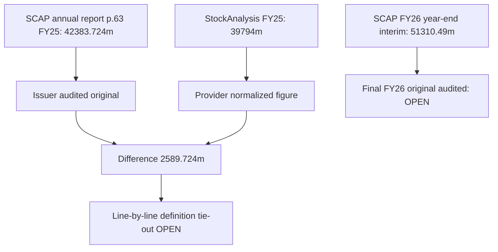

# 12 · Accounting tie-outs and third-party revenue reconciliation

[← Fundamental analysis](../README.md) · [English](README.md) · [தமிழ்](../../ta/01-Fundamental-Analysis/12-Forensic-Accounting/README.md) · [සිංහල](../../si/01-Fundamental-Analysis/12-Forensic-Accounting/README.md)

> **SCAP.N0000 · Original research · as of 30 Sep 2026 · LKR million unless explicitly stated.** **OPEN: SCAP final FY2025/26 audited and June 2026 original filings not reconciled. Current changes and covenants must not be inferred from FY2025.**

## 🎯 Research question

Does the issuer's audited income statement agree with third-party 'revenue', and what is a verified SCAP FY2026 number?

The issuer's **original audited FY2025 statement of profit or loss** reports **SCAP GROUP total operating income LKR 42,383.724m**; the same document's FY2024 comparative reports **36,729.682m**. This is **NOT** the SCAP standalone parent's FY2025 total operating income (**4,093.984m**). The third-party StockAnalysis standardized 'Revenue' headline instead shows FY2025 **39,794m** and FY2024 **35,927m** on its current financial overview snapshot. These different figures are **different source definitions or transformations until reconciled line by line**, not proof the audited issuer amount is wrong. [SCAP-AR-2025](../../sources/records/SCAP-AR-2025.md) · [SCAP-STOCKANALYSIS](../../sources/records/SCAP-STOCKANALYSIS.md).

## 🔎 Dated evidence

| Line / source | FY2024 LKR mn | FY2025 LKR mn | Status / period |
|---|---|---|---|
| SCAP original GROUP total operating income | 36,729.682 | 42,383.724 | Audited annual report PDF p.63 |
| Third-party normalized GROUP 'revenue' | 35,927 | 39,794 | StockAnalysis historical snapshot; secondary |
| Difference: issuer minus provider | 802.682 | 2,589.724 | Arithmetic; **explanation OPEN** |
| SCAP original COMPANY operating income | 1,933.064 | 4,093.984 | Audited p.63, different accounting scope |
| SCAP FY2026 GROUP income (27 May interim) | — | 51,310.49 (FY26; not FY25) | Interim, subject to audit; not a comparable audited 2025 entry |

### Issuer's accounting line is reproducible

FY2025 SCAP original p.63 line titled **'Total operating income'** reads **LKR 42,383,724,027**. The FY2024 issuer comparator on that same line is **36,729,682,098**. Original FY2025 components include insurance net earned premium **30,842.349m**, interest income, realized and fair-value gains and other lines; **gross written premiums are not this income line**. These amounts should be tracked to the financial statement, not combined with standalone parent revenue. [SCAP-AR-2025](../../sources/records/SCAP-AR-2025.md).

### Provenance mismatch remains a research problem

The StockAnalysis provider headline [financial overview](https://stockanalysis.com/quote/cose/SCAP.N0000/financials/) displays **FY2025 39,794m**, **FY2024 35,927m**. The source differences are **FY2025 2,589.724m**, **FY2024 802.682m** (original minus rounded provider). A precise provider-definition adjustment table, recognition-of-fees policy and any restatement were not supplied; **do not manufacture a plug explaining the gap**. The existing `reports/financial-pulse.md`, FY25 snapshots and trilingual financial visuals already use the original **42,383.72m FY25**; the old 39,794 only persists in appropriately labelled *correction discussions*, not as the preferred original chart point. [SCAP-STOCKANALYSIS](../../sources/records/SCAP-STOCKANALYSIS.md).

### FY2026 audit and June quarter not tied out

A third-party catalogue lists a SCAP annual report 'as at 31 March 2026' and SCAP interim for 30 June 2026. The **original signed FY2026 SCAP audited PDF, revised cash-flow/segment figures, and 30 June SCAP original quarter were not retrieved and verified here**. The previously recorded **27 May 2026 SCAP group total operating income 51,310.49m** is still a **year-end interim** number, subject to audit. Do not silently relabel it 'audited 2026'. [SCAP-AR-2026-CATALOGUE](../../sources/records/SCAP-AR-2026-CATALOGUE.md) · [SCAP-JUN2026-CATALOGUE](../../sources/records/SCAP-JUN2026-CATALOGUE.md) · [SCAP-FY2026-YE-INTERIM](../../sources/records/SCAP-FY2026-YE-INTERIM.md).

## Evidence map

## ⚠️ Missing evidence

- [ ] Retrieve signed **FY2025/26 SCAP annual report**, extract notes and test reclassification/restatement relative to 27 May year-end interim.
- [ ] Retrieve original **SCAP quarter ended 30 June 2026**, compare updated owner/NCI profit, assets and subsequent events.
- [ ] Request provider **revenue definition bridge** by financial statement line; determine why FY25 39,794 vs issuer 42,383.724 and FY24 35,927 vs issuer 36,729.682.
- [ ] Audit all charts each time a source definition or audited comparator changes; never silently make up a reconciler.

**Source IDs:** [SCAP-AR-2025](../../sources/records/SCAP-AR-2025.md) · [SCAP-STOCKANALYSIS](../../sources/records/SCAP-STOCKANALYSIS.md) · [SCAP-FY2026-YE-INTERIM](../../sources/records/SCAP-FY2026-YE-INTERIM.md) · [SCAP-AR-2026-CATALOGUE](../../sources/records/SCAP-AR-2026-CATALOGUE.md) · [SCAP-JUN2026-CATALOGUE](../../sources/records/SCAP-JUN2026-CATALOGUE.md).

[SCAP FY2025 original p.63](https://cdn.cse.lk/cmt/upload_report_file/1100_1764673838964.03.2025%20-%20Annual%20Report.pdf) · [StockAnalysis normalized revenue](https://stockanalysis.com/quote/cose/SCAP.N0000/financials/) · [SCAP FY2026 interim](https://cdn.cse.lk/cmt/upload_report_file/1100_1779968696398.pdf).

[Primary sources](../../sources/SOURCE-REGISTER.md) · [Research queue](../../RESEARCH-QUEUE.md)

This is evidence-based financial research, not a buy/sell recommendation.