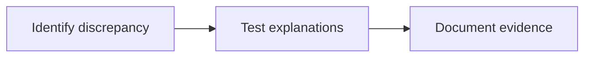

# 12 · Forensic Accounting Analysis

[← Fundamental analysis](../README.md) · [English](README.md) · [தமிழ்](../../ta/01-Fundamental-Analysis/12-Forensic-Accounting/README.md) · [සිංහල](../../si/01-Fundamental-Analysis/12-Forensic-Accounting/README.md)

> **SCAP.N0000 · Softlogic Capital PLC** · **Status:** Research methodology only; no fresh SCAP conclusion is implied. **Reference date: 2026-09-30**.

## 🎯 Research question

Do disclosures contain inconsistencies that warrant investigation, without assuming wrongdoing?

## 🔎 What to verify

- [ ] Compare reported earnings with cash flow, segment reconciliations, credit-loss allowances and extraordinary items.
- [ ] Investigate restatements, audit qualifications, related-party balances, receivable ageing and accounting-policy changes.
- [ ] Use multi-year trend tests and write competing benign explanations before drawing conclusions.

## 🧭 Research logic

## ⚠️ What not to assume

A discrepancy is an investigation trigger, not evidence of fraud or misconduct by itself.

## 🛠️ SCAP application

Trace any difference between aggregator figures and official SCAP financials to original statement line, scope and fiscal period.

## 📝 Evidence register

| Metric or event | Period / scope | Primary citation | Observed result |
|---|---|---|---|
| ______ | ______ | ______ | ______ |
| ______ | ______ | ______ | ______ |

[Earlier SCAP note](../../06-financial-snapshot.md) · [Source register](../../SOURCES.md) · [CSE](https://www.cse.lk/)

**Method:** Record publication date, accounting scope, units and exact page. No market quotation or investment recommendation is implied.
