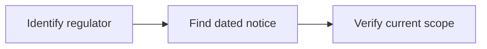

# 13 · Regulatory Analysis

[← Fundamental analysis](../README.md) · [English](README.md) · [தமிழ்](../../ta/01-Fundamental-Analysis/13-Regulatory/README.md) · [සිංහල](../../si/01-Fundamental-Analysis/13-Regulatory/README.md)

> **SCAP.N0000 · Softlogic Capital PLC** · **Status:** Research methodology only; no fresh SCAP conclusion is implied. **Reference date: 2026-09-30**.

## 🎯 Research question

Which current licensing, solvency, capital, disclosure and conduct requirements affect SCAP's businesses?

## 🔎 What to verify

- [ ] Review applicable dated publications of CBSL for finance, IRCSL for insurance, and SEC/CSE for securities activities.
- [ ] Identify issuer-specific orders and restrictions by effective and end date; distinguish subsidiaries and licensed entity names.
- [ ] Trace regulatory capital or dividend constraints into parent-company funding and valuation assumptions.

## 🧭 Research logic

## ⚠️ What not to assume

A reported lifting of a restriction in 2025 does not establish the subsidiary's current 2026 status.

## 🛠️ SCAP application

Create a dated regulatory-events table for each legal entity and cross-check original notices against the latest SCAP disclosures.

## 📝 Evidence register

| Metric or event | Period / scope | Primary citation | Observed result |
|---|---|---|---|
| ______ | ______ | ______ | ______ |
| ______ | ______ | ______ | ______ |

[Earlier SCAP note](../../05-risks-and-questions.md) · [Source register](../../SOURCES.md) · [CSE](https://www.cse.lk/)

**Method:** Record publication date, accounting scope, units and exact page. No market quotation or investment recommendation is implied.
