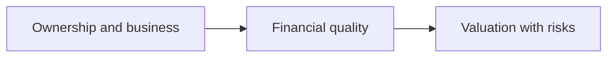

# 01 — Fundamental Analysis

[← Repository](../README.md) · [English](README.md) · [தமிழ்](../ta/01-Fundamental-Analysis/README.md) · [සිංහල](../si/01-Fundamental-Analysis/README.md)

> **SCAP.N0000 · Softlogic Capital PLC**  
> **Reference date: 2026-09-30 · Research framework, not a completed investment assessment.**

**Business-first research:** investigate what SCAP's operating companies do, what belongs to the listed parent, how reported earnings relate to distributable cash, and how assumptions affect estimated value.

## 🧭 Research approach

## 📁 All research topics

| # | Topic | Question to answer |
|---|---|---|
| 01 | [Business analysis](01-Business-Analysis/README.md) | How does it earn money? |
| 02 | [Financial statements](02-Financial-Statements/README.md) | What do the statements say? |
| 03 | [Valuation](03-Valuation/README.md) | What is a defensible valuation range? |
| 04 | [Industry analysis](04-Industry/README.md) | What determines industry profits? |
| 05 | [Competitor analysis](05-Competitors/README.md) | How do like-for-like operators compare? |
| 06 | [Macroeconomics](06-Macroeconomics/README.md) | How does Sri Lanka's macro environment affect each segment? |
| 07 | [Management and governance](07-Management-Governance/README.md) | What do governance and allocation decisions show? |
| 08 | [Risk analysis](08-Risk/README.md) | What could impair owner value? |
| 09 | [Dividend analysis](09-Dividends/README.md) | Can cash be distributed to ordinary shareholders? |
| 10 | [Shareholding analysis](10-Shareholding/README.md) | Who owns, votes and may dilute the shares? |
| 11 | [Corporate actions](11-Corporate-Actions/README.md) | How do rights/dividends/acquisitions change terms? |
| 12 | [Forensic accounting](12-Forensic-Accounting/README.md) | Which accounting differences merit investigation? |
| 13 | [Regulatory analysis](13-Regulatory/README.md) | What currently applies to each regulated subsidiary? |
| 14 | [Scenario and sensitivity](14-Scenario-Analysis/README.md) | How sensitive are assumptions and outcomes? |
| 15 | [Fundamental quantitative](15-Quantitative/README.md) | Do measured company ratios survive data-quality tests? |

## 📚 Related materials

[Previous English business note](../01-business-and-ownership.md) · [English visual dashboard](../reports/README.md) · [Source register](../SOURCES.md) · [Technical analysis](../02-Technical-Analysis/README.md) · [CSE](https://www.cse.lk/).

> ⚠️ **Methodological boundary:** these are organizing topics, not independent investment strategies or completed analyses. Industry, governance and risk overlap with fundamental work; portfolio-level risk is a separate cross-cutting consideration. SCAP's preliminary third-party financial numbers are not audited-reconciled.
>
> Do not treat old insurer shareholding percentages or secondary FY25/FY26 figures as updated SCAP equity valuation inputs.

**Public-repository caution:** Keep brokerage-account identifiers, portfolio holdings and trade receipts out of this public repository.
