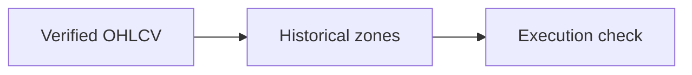

# 01 · Price Action Analysis

[← Technical analysis](../README.md) · [English](README.md) · [தமிழ்](../../ta/02-Technical-Analysis/01-Price-Action/README.md) · [සිංහල](../../si/02-Technical-Analysis/01-Price-Action/README.md)

> **SCAP.N0000 — Softlogic Capital PLC.** **Status: methodology, not a current chart-based trading signal.** Verify data and CSE trading calendars first. **Reference: 2026-09-30.**

## 🎯 Research question

What do dated SCAP trades show about price ranges, gaps, support/resistance areas and actual execution?

## 🔍 Data and methods to verify

- [ ] Collect CSE-derived daily OHLCV (open, high, low, close, volume) with the correct share class, time zone and source.
- [ ] Check corporate-action adjustments, missing/no-trade days and the difference between last-traded price and executable bid/ask.
- [ ] Identify historically tested price zones as descriptive observations, recording the sample period and count of tests.

## 🧭 Method flow

## ⚠️ Common interpretation error

A past reaction at a price level does not guarantee future support, resistance or profitable entry.

## 🛠️ SCAP application

Create an annotated, date-stamped SCAP daily and weekly price chart from licensed or official market data; no live price is assumed here.

## 📝 Reproducible observation register

| Metric / event | Period / interval | Source / adjustment | Observed value |
|---|---|---|---|
| ______ | ______ | ______ | ______ |
| ______ | ______ | ______ | ______ |

[Existing research](../../07-reading-checklist.md) · [Source register](../../SOURCES.md) · [CSE](https://www.cse.lk/).

**Method note:** Chart patterns, indicators and sentiment are descriptive unless predictive usefulness is independently demonstrated. Do not treat backtests or past returns as guarantees.
