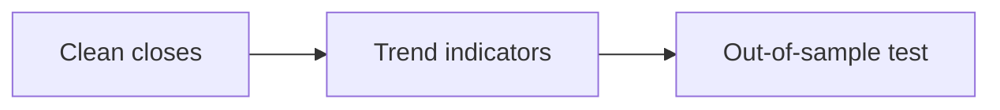

# 02 · Trend and Momentum Analysis

[← Technical analysis](../README.md) · [English](README.md) · [தமிழ்](../../ta/02-Technical-Analysis/02-Trend-Momentum/README.md) · [සිංහල](../../si/02-Technical-Analysis/02-Trend-Momentum/README.md)

> **SCAP.N0000 — Softlogic Capital PLC.** **Status: methodology, not a current chart-based trading signal.** Verify data and CSE trading calendars first. **Reference: 2026-09-30.**

## 🎯 Research question

Does historical SCAP price behaviour exhibit a measurable trend or momentum pattern over a stated look-back period?

## 🔍 Data and methods to verify

- [ ] Compute clearly specified moving averages (for example 50- and 200-session) and a momentum measure such as RSI(14).
- [ ] Check how short trading histories, no-trade sessions, stale closing prices and corporate actions affect each calculation.
- [ ] Compare daily and weekly observations without selecting parameters solely because they fit past price moves.

## 🧭 Method flow

## ⚠️ Common interpretation error

An RSI threshold, crossover or apparent uptrend is a descriptive indicator, not a proven predictive rule.

## 🛠️ SCAP application

Document every input, date range and parameter; back-test against a sensible baseline only after collecting clean data.

## 📝 Reproducible observation register

| Metric / event | Period / interval | Source / adjustment | Observed value |
|---|---|---|---|
| ______ | ______ | ______ | ______ |
| ______ | ______ | ______ | ______ |

[Existing research](../../07-reading-checklist.md) · [Source register](../../SOURCES.md) · [CSE](https://www.cse.lk/).

**Method note:** Chart patterns, indicators and sentiment are descriptive unless predictive usefulness is independently demonstrated. Do not treat backtests or past returns as guarantees.
