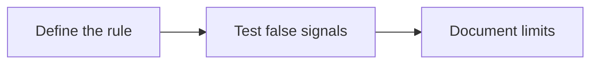

# 04 · Chart Patterns and Indicators Analysis

[← Technical analysis](../README.md) · [English](README.md) · [தமிழ்](../../ta/02-Technical-Analysis/04-Patterns-Indicators/README.md) · [සිංහල](../../si/02-Technical-Analysis/04-Patterns-Indicators/README.md)

> **SCAP.N0000 — Softlogic Capital PLC.** **Status: methodology, not a current chart-based trading signal.** Verify data and CSE trading calendars first. **Reference: 2026-09-30.**

## 🎯 Research question

Are chart patterns and indicators defined objectively enough to reproduce and test, instead of being drawn retrospectively?

## 🔍 Data and methods to verify

- [ ] State explicit detection rules for formations, breakout thresholds and confirmation windows before looking at outcomes.
- [ ] Compare indicators (for example moving averages, RSI, MACD and ATR) using adjusted price data and consistent trading-day definitions.
- [ ] Include false breakouts, transaction costs, look-ahead bias and periods where an indicator produces no useful information.

## 🧭 Method flow

## ⚠️ Common interpretation error

A recognizable pattern on one chart is not statistical evidence that it forecasts SCAP returns.

## 🛠️ SCAP application

Archive the exact dataset, indicator settings, failed signals and any out-of-sample test before writing an interpretation.

## 📝 Reproducible observation register

| Metric / event | Period / interval | Source / adjustment | Observed value |
|---|---|---|---|
| ______ | ______ | ______ | ______ |
| ______ | ______ | ______ | ______ |

[Existing research](../../07-reading-checklist.md) · [Source register](../../SOURCES.md) · [CSE](https://www.cse.lk/).

**Method note:** Chart patterns, indicators and sentiment are descriptive unless predictive usefulness is independently demonstrated. Do not treat backtests or past returns as guarantees.
