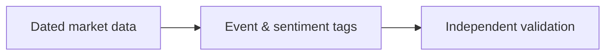

# 05 · Technical Quantitative and Sentiment Analysis

[← Technical analysis](../README.md) · [English](README.md) · [தமிழ்](../../ta/02-Technical-Analysis/05-Quantitative-Sentiment/README.md) · [සිංහල](../../si/02-Technical-Analysis/05-Quantitative-Sentiment/README.md)

> **SCAP.N0000 — Softlogic Capital PLC.** **Status: methodology, not a current chart-based trading signal.** Verify data and CSE trading calendars first. **Reference: 2026-09-30.**

## 🎯 Research question

How can market behaviour and publicly observable sentiment be measured without confusing noise with prediction?

## 🔍 Data and methods to verify

- [ ] Define price/volume factors and rolling volatility; specify sampling, missing-data handling and transaction-cost assumptions.
- [ ] Use timestamped public news and corporate announcements only when licensing and provenance permit; distinguish sentiment from factual events.
- [ ] Test whether any proposed signal adds information beyond simple benchmarks on data not used to choose it.

## 🧭 Method flow

## ⚠️ Common interpretation error

Sentiment is cross-cutting and not inherently technical; news attention, price movement and correlation do not prove a trading edge.

## 🛠️ SCAP application

Create a reproducible data dictionary and event log for SCAP; flag no-trade periods, potential look-ahead bias and conflicting reports.

## 📝 Reproducible observation register

| Metric / event | Period / interval | Source / adjustment | Observed value |
|---|---|---|---|
| ______ | ______ | ______ | ______ |
| ______ | ______ | ______ | ______ |

[Existing research](../../RESEARCH-LOG.md) · [Source register](../../SOURCES.md) · [CSE](https://www.cse.lk/).

**Method note:** Chart patterns, indicators and sentiment are descriptive unless predictive usefulness is independently demonstrated. Do not treat backtests or past returns as guarantees.
