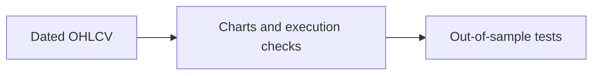

# 02 — Technical Analysis

[← Repository](../README.md) · [English](README.md) · [தமிழ்](../ta/02-Technical-Analysis/README.md) · [සිංහල](../si/02-Technical-Analysis/README.md)

> **SCAP.N0000 · Softlogic Capital PLC**  
> **Reference date: 2026-09-30 · Research framework, not a completed investment assessment.**

**Market-data-first research:** describe historical SCAP price, trading volume, execution conditions, indicators and sentiment using reproducible definitions. None of these documents supplies a current SCAP quote or a buy/sell signal.

## 🧭 Research approach

## 📁 All research topics

| # | Topic | Question to answer |
|---|---|---|
| 01 | [Price action](01-Price-Action/README.md) | What prices actually traded and where were prior ranges? |
| 02 | [Trend and momentum](02-Trend-Momentum/README.md) | What historical trend and momentum can be measured? |
| 03 | [Volume and liquidity](03-Volume-Liquidity/README.md) | Could a realistic order execute without large slippage? |
| 04 | [Patterns and indicators](04-Patterns-Indicators/README.md) | Can a chart rule be defined and tested before seeing the result? |
| 05 | [Quantitative and sentiment](05-Quantitative-Sentiment/README.md) | Do price, volume and public news add evidence beyond noise? |

## 📚 Related materials

[Existing trading checklist](../07-reading-checklist.md) · [English visual dashboard](../reports/README.md) · [Source register](../SOURCES.md) · [Fundamental analysis](../01-Fundamental-Analysis/README.md) · [CSE](https://www.cse.lk/).

> ⚠️ **Methodological boundary:** technical indicators summarize past market activity; they do not guarantee future returns. Sentiment and quantitative methods also sit across analysis types. Use adjusted, date-stamped data and assess brokerage costs, market liquidity and data quality.
>
> This branch contains no live SCAP OHLCV history, current market quote, or verified trading indicator. Metrics are tasks to calculate after source-data collection.

**Public-repository caution:** Keep brokerage-account identifiers, portfolio holdings and trade receipts out of this public repository.
