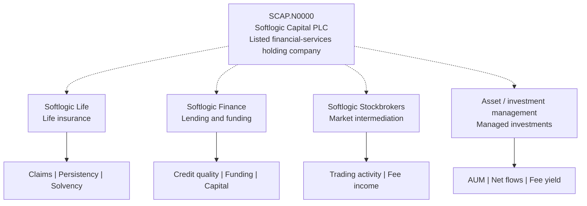
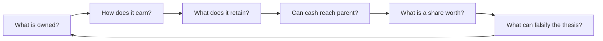

# 📊 SCAP.N0000 — Visual research dashboard

[← Repository](../README.md) · [English hub](README.md) · [தமிழ்](../ta/reports/README.md) · [සිංහල](../si/reports/README.md)

> **SOFTLOGIC CAPITAL PLC** · **CSE: SCAP.N0000** · **Visual research notebook**
>
> **Status: preliminary** · **Last research pass: 2026-09-30** · **Not a buy/sell signal**

### At a glance

| 🔎 Lens | What this dashboard establishes | Status |
|:---|:---|:---|
| 🏢 Business | Four described operating exposures across financial services | **Issuer-described**; current ownership needs verification |
| 🧩 Ownership | One listed holding company with regulated and other business interests | **Incomplete**; latest effective subsidiary stakes are open |
| 💵 Financials | FY25 and FY26 *secondary-provider* comparison is recorded | **Not reconciled to audited CSE filings** |
| ⚖️ Valuation | Parent-attributable earnings, share count and current price | **Not assessed** |
| 🛡️ Risk | Credit, capital, leverage, governance and liquidity areas are mapped | **Qualitative, not ranked** |

### 🗺️ Business exposure map

**Reading this visual:** dotted lines indicate *issuer-described exposure*, **not confirmed current ownership percentages**. The only dated ownership example documented in this repository is the insurer stake in [the company note](../01-business-and-ownership.md), quoted as of **31 Dec 2025**, not today's stake.

### 📑 Open the reports

| Report | Visualization | Main research question |
|---|---|---|
| [🏢 Business model](business-model.md) | Group map, operating drivers and value-capture flow | *What do shareholders own and how could earnings reach them?* |
| [📈 Financial pulse](financial-pulse.md) | Four editable Mermaid bar charts + source table | *What did a secondary provider report for FY25 and FY26?* |
| [🛡️ Risk map](risk-map.md) | Dependency/risk tree and evidence checklist | *Which risks require primary-source validation?* |
| [🔬 Research roadmap](research-roadmap.md) | Evidence-gated workflow, progress checklist | *What must be verified before a valuation is meaningful?* |

### 🔁 The research logic

> **Do not read chart colors or diagram sizes as exposure weights, risk probabilities or investment scores.** Figures on the financial page reproduce [an existing preliminary source table](../06-financial-snapshot.md); no live market data is shown.

**Research reference date: 30 September 2026.** This is an *editable research presentation*, not a live quote or investment recommendation. Assertions and numeric figures carry their own evidence labels; see [source register](../SOURCES.md).

<strong>Original documents and disclosure sources</strong>

- [SCAP company overview](https://softlogiccapital.lk/about-us-overview/)
- [SCAP subsidiary descriptions](https://softlogiccapital.lk/subsidiaries/)
- [CSE disclosure portal](https://www.cse.lk/)
- [SCAP source register](../SOURCES.md)
- [Dated research log](../RESEARCH-LOG.md)

