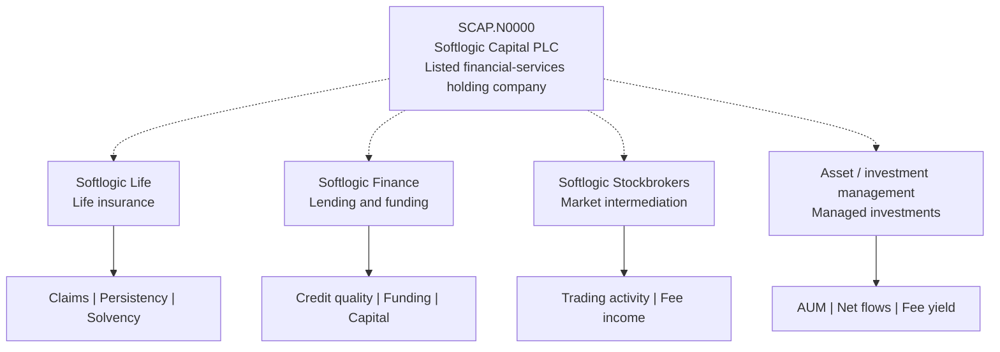
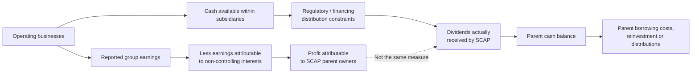
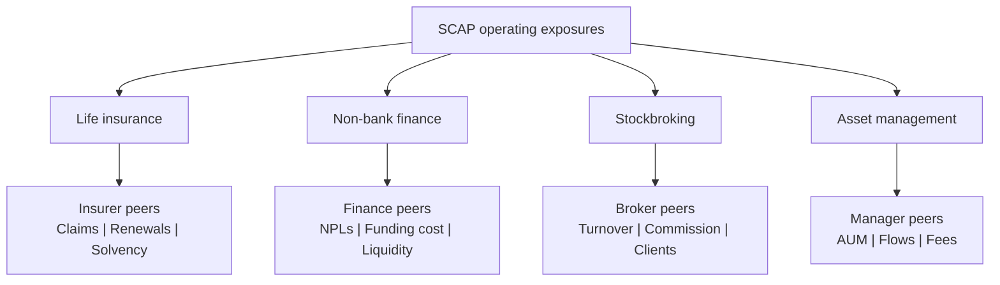

# 🏢 SCAP.N0000 — Business model map

[← Repository](../README.md) · [English hub](README.md) · [தமிழ்](../ta/reports/README.md) · [සිංහල](../si/reports/README.md) · [Visual dashboard](README.md)

> **Scope:** Listed holding company and issuer-described business lines. **Not a current equity-ownership chart.** Last review: 2026-09-30.

## 01 / What businesses does the group describe?

### Revenue engine cards

| Exposure | Customer payment / economic driver | Cost or constraint to study | Primary evidence to collect |
|:---|:---|:---|:---|
| ☂️ Life insurance | Contract premiums and insurer investment economics | Claims, commissions, insurance liabilities, solvency capital | [Insurance disclosures](https://annualreport.softlogiclife.lk/), insurer note in SCAP accounts |
| 🏦 Non-bank finance | Lending interest and fees | Funding cost, impairments, deposit outflows, capital | [Finance reporting](https://softlogicfinance.lk/kpis/), SCAP segment note |
| 📊 Brokerage | Commission and other disclosed brokerage fees | CSE trading volume, client concentration, fee compression | [Group description](https://www.softlogic.lk/financial-sector/company-details/16), SCAP segment note |
| 🌱 Asset management | Managed-asset and related fees | Redemptions, net flows, costs, fee rates | [SCAP subsidiary directory](https://softlogiccapital.lk/subsidiaries/), audited notes |

*The table describes potential operating mechanics, not verified current profit contributions or specific fee mix.*

## 02 / Where the money must travel

**Critical distinction:** Consolidated earnings, profit attributable to SCAP shareholders, and cash that can be distributed to SCAP are **three different concepts**. Do not add unadjusted subsidiary income or AUM to an equity valuation.

## 03 / Owner-attribution register

| Item | What is actually known here | What remains open |
|:---|:---|:---|
| SCAP is a financial-services holding company | [Issuer description](https://softlogiccapital.lk/about-us-overview/) | Exact reporting-date scope |
| Softlogic Life shareholding | **50.16% as at 31 Dec 2025** in [its 2025 annual report](https://softlogiclife.lk/wp-content/uploads/sites/3/2026/03/Softlogic-Life-Integrated-Annual-Report-2025.pdf) | More recent stake and effective control |
| Other subsidiary economic interests | Businesses listed on [issuer subsidiary page](https://softlogiccapital.lk/subsidiaries/) | Current percentages, pledges and minority claims |
| Parent distributable cash | **Not calculated** | Parent-only debt, dividends received, restrictions |

## 04 / Industry peers by *operating line*

[Go deeper: competitor methodology](../03-competition.md) · [Competitive-advantage hypotheses](../04-competitive-advantage.md).

## 05 / Source discipline

- **Issuer-described** tells us the company says an activity exists; it is **not independent proof of market share or moat**.
- The dated insurance stake must **not** be silently updated to a 2026 current figure.
- No box width, color, or edge thickness in the diagram is intended to represent revenue, assets, ownership or risk weighting.

**Research reference date: 30 September 2026.** This is an *editable research presentation*, not a live quote or investment recommendation. Assertions and numeric figures carry their own evidence labels; see [source register](../SOURCES.md).
