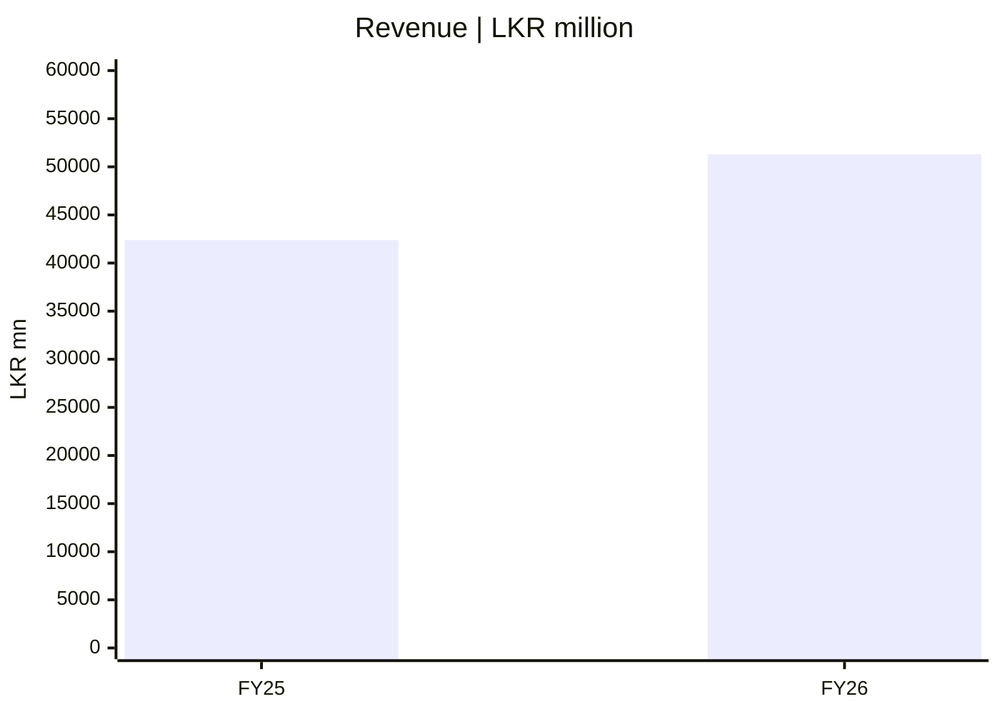
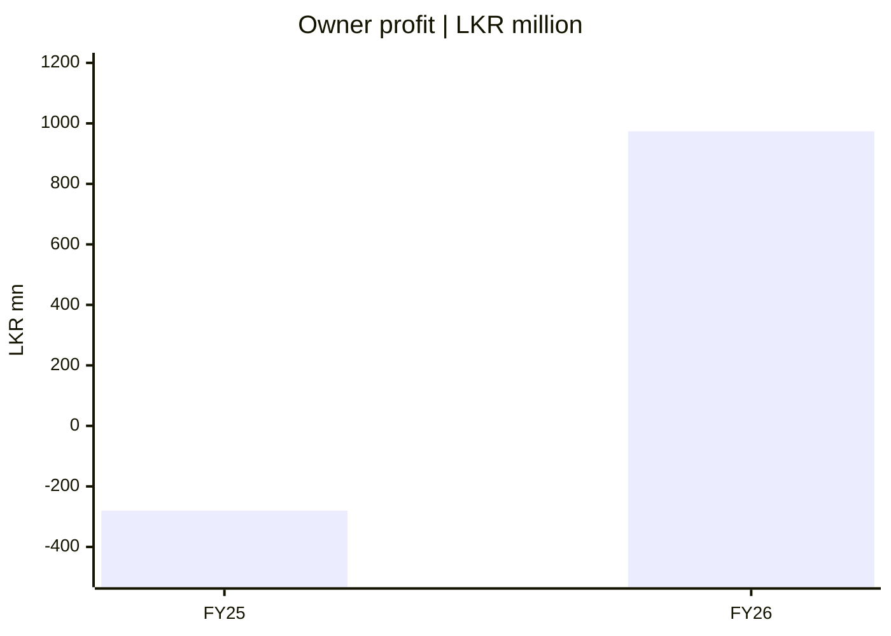
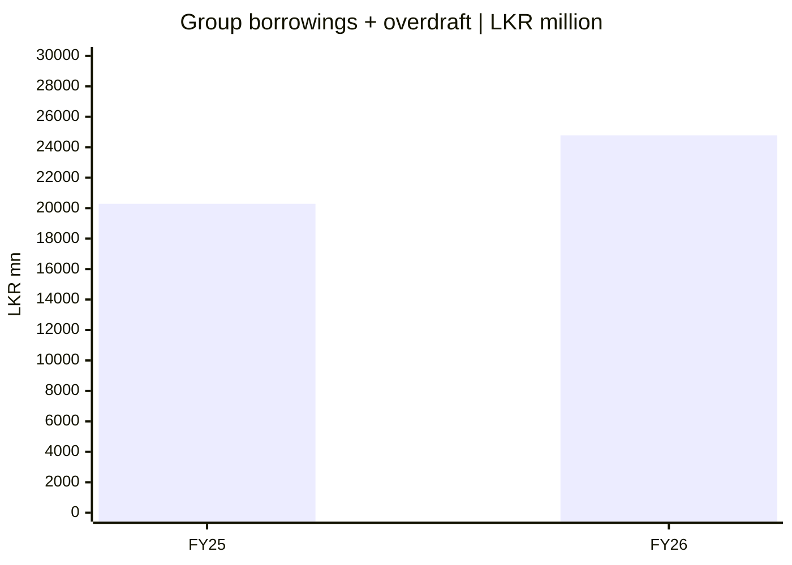

# 📈 Financial pulse — issuer source / interim

[← Repository](../README.md) · [Dashboard](README.md) · [தமிழ்](../ta/reports/financial-pulse.md) · [සිංහල](../si/reports/financial-pulse.md)

> **SOURCE:** Original [SCAP CSE 27 May 2026 interim financial statements](https://cdn.cse.lk/cmt/upload_report_file/1100_1779968696398.pdf). Historical figures, in **LKR millions**. The FY2025 comparative is labelled **audited**; the FY2026 year-end figures are **subject to audit**. This replaces the prior unreconciled FY2025 revenue bar of 39,794 with the issuer-reported 42,383.72. No later audited restatements or current share price have been incorporated.

Financial snapshot · FY25 audited comparator / FY26 year-end interim. **Four independently scaled charts: bar heights between charts cannot be compared.**

## 1 · Consolidated revenue

*Group income statement: total revenue, PDF p. 2.*

## 2 · Profit attributable to SCAP owners

*Group income statement: profit attributable to owners of parent, PDF p. 2; **not total consolidated profit**.*

## 3 · Consolidated net operating cash flow

*Group statement of cash flow: cash from operating activities, PDF p. 9; **not available parent cash**.*

## 4 · Borrowings + bank overdraft (group)

*Group financial position: interest-bearing borrowings plus overdrafts, PDF p. 6; **not the same as parent-only debt**.*

## Underlying source data

| Indicator | FY25 audited comparison | FY26 year-end interim | Source and scope |
|---|---:|---:|---|
| Consolidated revenue | 42,383.72 | 51,310.49 | Group revenue, p. 2 |
| Profit attributable to SCAP owners | −280.42 | 973.77 | Owner-attributable portion of group PAT, p. 2 |
| Consolidated net operating cash flow | 427.54 | −851.24 | Group cash-flow statement, p. 9 |
| Borrowings + bank overdraft (group) | 20,285.82 | 24,781.48 | Group financial-position statement, p. 6; includes bank overdraft, excludes deposits/insurance liabilities |

## Group ≠ owners ≠ company-only

FY2026 group profit after tax was **LKR 3,371.26mn**. Of it **LKR 973.77mn** was attributed to SCAP owners and **LKR 2,397.49mn** to non-controlling interests. The listed SCAP standalone company had a **FY2026 loss of LKR 722.49mn**. Company-only cash was **LKR 32.07mn** and company-only interest-bearing borrowings **LKR 17,324.26mn** at 31 March 2026. See the [Business Analysis](../01-Fundamental-Analysis/01-Business-Analysis/README.md) and [original CSE filing](https://cdn.cse.lk/cmt/upload_report_file/1100_1779968696398.pdf).

**Previous-data correction:** the older third-party chart listed FY25 group revenue as **LKR 39,794mn**. The original issuer's **audited FY25 comparative is LKR 42,383.72mn**. The two source definitions have not been fully reconciled. This page and its charts now use the original CSE number. FY2026 audited annual accounts and the June 2026 original interim still require a separate read-through.

[Financial snapshot](../06-financial-snapshot.md) · [Source register](../SOURCES.md) · [CSE](https://www.cse.lk/)

Insurance and finance cash-flow classification differs from that of a manufacturing company. No share-price target, trading signal or recommendation is implied.
