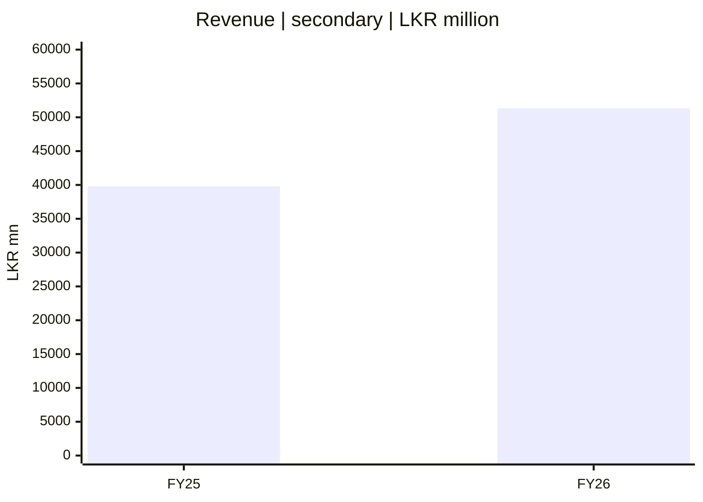
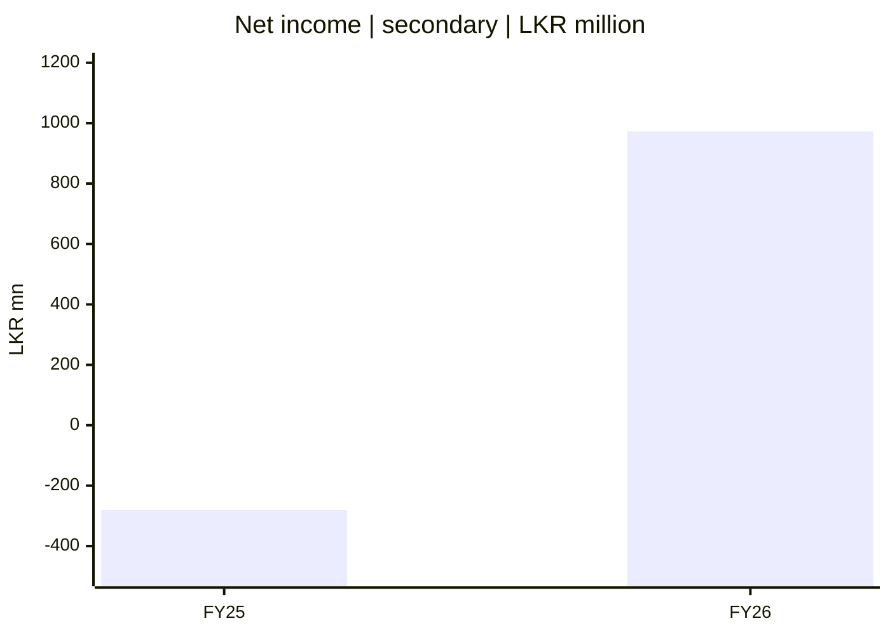
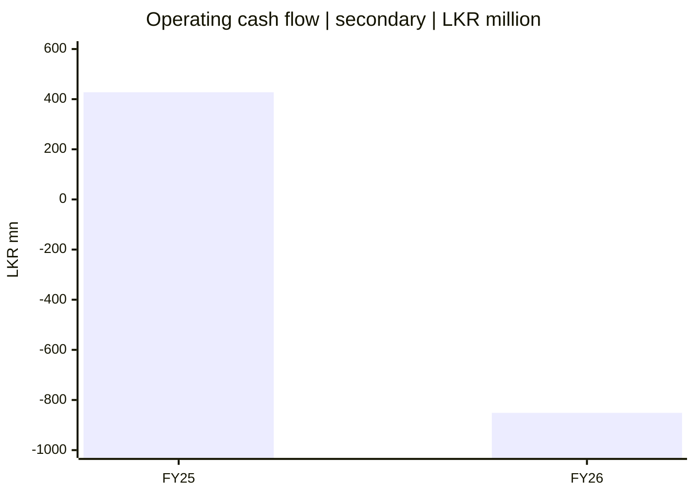
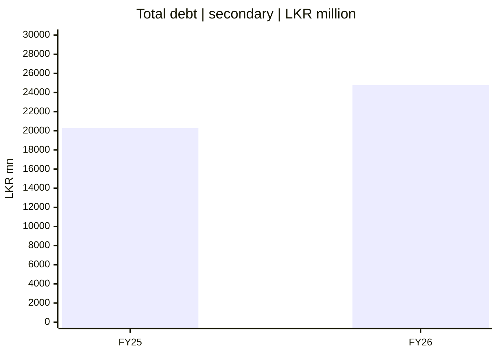

# 📈 SCAP.N0000 — Financial pulse

[← Repository](../README.md) · [English hub](README.md) · [தமிழ்](../ta/reports/README.md) · [සිංහල](../si/reports/README.md) · [Visual dashboard](README.md)

> **SECONDARY DATA — NOT AUDIT-RECONCILED.** The charts below are a visual transcription of the existing [preliminary research table](../06-financial-snapshot.md), attributed there to [StockAnalysis](https://stockanalysis.com/quote/cose/SCAP.N0000/financials/). These numbers were **not independently checked against the FY2025/26 SCAP annual report or the June 2026 interim report**. Do not use them as decision-grade valuation inputs.

**Comparison:** Financial years ended **31 March 2025** (FY25) and **31 March 2026** (FY26). **All chart values: LKR millions.** These are **four separately scaled charts**; bar heights across different charts are not comparable.

## 01 / Revenue — secondary provider

## 02 / Net income — secondary provider

*The net-income line's definition and attribution to SCAP ordinary shareholders remain to be verified. A negative bar is a reported loss in this secondary dataset, not a trading signal.*

## 03 / Operating cash flow — secondary provider

*Insurance and finance entities' operating cash flows require industry-specific interpretation. This measure is not synonymous with holding-company cash availability.*

## 04 / Total debt — secondary provider

*Consolidated debt may include financing liabilities at regulated subsidiaries. It is not the same thing as SCAP parent-only borrowings.*

## Underlying figures — accessible text fallback

| Indicator | FY25 | FY26 | Units | Reliability |
|---|---:|---:|---|---|
| Revenue | 39,794 | 51,310 | LKR mn | ⚠️ Secondary, unreconciled |
| Net income | -280.42 | 973.77 | LKR mn | ⚠️ Scope/attribution open |
| Operating cash flow | 427.54 | -851.24 | LKR mn | ⚠️ Sector definition open |
| Total debt | 20,286 | 24,781 | LKR mn | ⚠️ Parent vs group open |

**What these diagrams do *not* establish:** intrinsic share value, sustainable earnings, regulatory headroom, available dividends, projected performance, earnings attributable to SCAP ordinary shareholders, or an up-to-date market quote.

## Evidence gate: required before conclusions

- [ ] Obtain original SCAP FY2025/26 audited statements from [CSE](https://www.cse.lk/).
- [ ] Reconcile each value to exact accounting line, period, units and note/page.
- [ ] Separate consolidated, **company-only** and subsidiary figures.
- [ ] Verify restatements, minority interests and one-off profits.
- [ ] Audit share count, parent net debt, regulatory restrictions and subsequent events.
- [ ] Add a date-stamped current stock price **only after a price-source check**.

[Source register](../SOURCES.md) · [Original text snapshot](../06-financial-snapshot.md)

**Research reference date: 30 September 2026.** This is an *editable research presentation*, not a live quote or investment recommendation. Assertions and numeric figures carry their own evidence labels; see [source register](../SOURCES.md).
