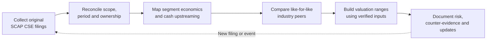
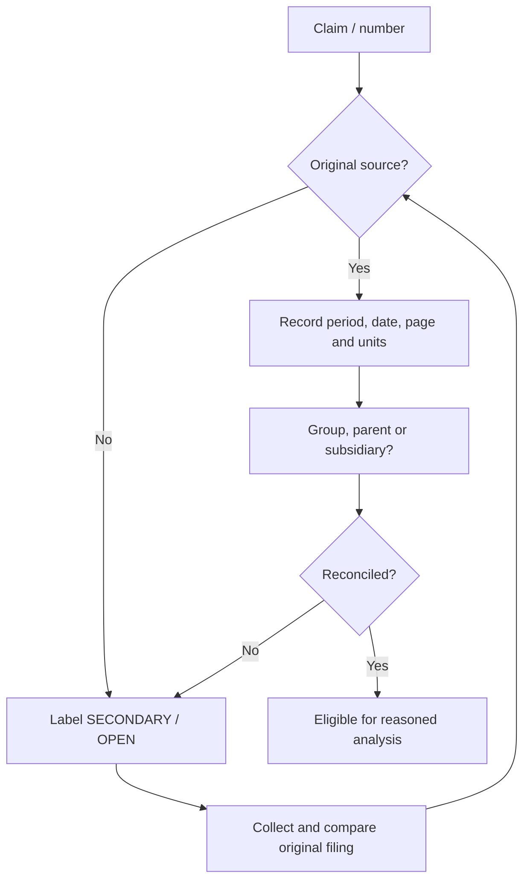

# 🔬 SCAP.N0000 — Research roadmap

[← Repository](../README.md) · [English hub](README.md) · [தமிழ்](../ta/reports/README.md) · [සිංහල](../si/reports/README.md) · [Visual dashboard](README.md)

> **Workflow chart, not a statement that tasks have been completed.** The date records this edition, not future deadlines.

## 01 / Evidence-gated workflow

## 02 / What is done vs open

| Workstream | Already in repository | Evidence still needed | Status |
|---|---|---|---|
| Business description | Issuer overview and subsidiaries | Effective current shareholdings, segment economics | 🟡 Preliminary |
| Competitive landscape | Peer-category framework | Dated, like-for-like peer metrics | 🟡 Framework only |
| Financial record | Secondary FY25/FY26 reference figures | Official audited and interim reconciliations | 🔴 Open |
| Ownership and capital | Dated Softlogic Life stake reference | Current subsidiary stakes and parent-only debt | 🔴 Open |
| Valuation | Scenario questions and templates | Verified EPS, fully diluted share count, current price | 🔴 Not assessed |
| Risk register | Qualitative mechanism mapping | Current regulator/issuer evidence and exposures | 🟡 Framework only |
| Trading/technical | Future scope defined | Date-stamped price/volume series and methodology | 🔴 Open |

**Legend:** 🟡 framework or secondary evidence available; 🔴 a material original-source check is missing. These are **research workflow states**, not company risk ratings.

## 03 / Reproducibility standard

## 04 / Working checklist

- [ ] Retrieve FY2025/26 SCAP auditor report and group/company statements.
- [ ] Retrieve the June 2026 interim and every material subsequent disclosure.
- [ ] Record subsidiary equity percentages and minority rights by **as-of date**.
- [ ] Construct comparable segment financial tables.
- [ ] Keep narrative, data, source, and derived metrics in separate columns.
- [ ] Add price charts only with time zone, venue, adjustment method and original price source.
- [ ] Publish a versioned thesis with assumptions and contradictory evidence.

<strong>Research log entry template</strong>

| Date checked | Statement | Filing / page | Scope and period | Evidence status | Revision needed? |
|---|---|---|---|---|---|
| YYYY-MM-DD | Example | URL, p. ___ | SCAP parent / FY___ | OPEN | Yes / No |

No GitHub Actions or automated workflows are introduced. [Research log](../RESEARCH-LOG.md) · [Original reading checklist](../07-reading-checklist.md).

**Research reference date: 30 September 2026.** This is an *editable research presentation*, not a live quote or investment recommendation. Assertions and numeric figures carry their own evidence labels; see [source register](../SOURCES.md).
