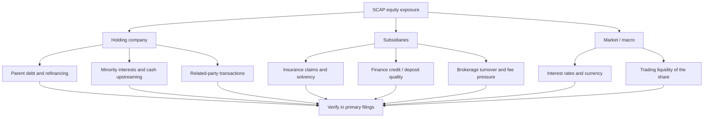

# 🛡️ SCAP.N0000 — Risk and evidence map

[← Repository](../README.md) · [English hub](README.md) · [தமிழ்](../ta/reports/README.md) · [සිංහල](../si/reports/README.md) · [Visual dashboard](README.md)

> **Qualitative risk inventory only** · Not a statistical probability map, risk ranking, or forecast · Research reference: 2026-09-30.

## 01 / Risk dependency tree

**How to read:** arrows represent possible *channels of risk*, not known incidents or proven causation. Chart placement, box size and color have **no quantitative meaning**.

## 02 / Mechanism → financial consequence → primary check

| Channel | Mechanism to investigate | What could be affected? | Primary test |
|:---|:---|:---|:---|
| 🏦 Parent leverage | Borrowing cost or refinancing needs | Distributable cash, dilution risk | SCAP company-only liabilities and maturity notes |
| 🔗 Minority interests | Subsidiary value not wholly owned | EPS and owner-attributable profit | Group ownership and non-controlling-interest notes |
| ☂️ Insurance | Claims experience, contract retention, investments | Insurance service result, solvency and payouts | Insurer report and capital disclosures |
| 💳 Finance | Credit impairment and deposits/funding | Earnings, capital, funding stability | Loan-stage, impairment, liquidity and capital notes |
| 🔄 Related parties | Guarantees and intercompany transfers | Liquidity, contingent liabilities | Related-party and commitment notes |
| 📉 Trading conditions | Thin order book or spread | Executability and trading cost | Dated CSE volume and bid/ask depth |

## 03 / Test claims against evidence

| Statement to avoid assuming | What establishes it? | Current status |
|---|---|---|
| “All subsidiary profits belong to SCAP shareholders” | Ownership schedule + profit attribution | **Unverified / likely structurally incomplete** |
| “A large insurance premium figure equals parent profit” | SLFRS 17 reconciliation + minority interests | **Not demonstrated** |
| “Higher group net income means more distributable cash” | Parent-only cash inflows and debt restrictions | **Not demonstrated** |
| “A previously lifted restriction means no regulatory risk today” | Current regulator and issuer disclosures | **Current status not checked** |
| “A low P/E must mean cheap shares” | Correct attributable EPS + quality and risk-adjusted scenarios | **Valuation not assessed** |

### Historical regulatory note

A [September 2025 press account](https://economynext.com/sri-lankas-softlogic-finance-to-resume-business-after-central-bank-lifts-restrictions-241534/) reported that restrictions on Softlogic Finance were lifted effective **19 Sep 2025**. This is **secondary, historical** context, **not** verification of the current regulatory position. Review dated [CBSL](https://www.cbsl.gov.lk/) and [CSE](https://www.cse.lk/) records.

## 04 / Checklist for the next review

- [ ] Check latest auditor opinion, going-concern notes and subsequent events.
- [ ] Reconcile parent financing, subsidiary funding and actual dividend flow.
- [ ] Check insurer solvency and finance-company capital separately.
- [ ] Check shares issued, pledged assets, guarantees and related-party notes.
- [ ] Add dated liquidity data, not an estimated market-depth score.

[Detailed risk chapter](../05-risks-and-questions.md) · [Evidence standards](../guides/03-research-standards.md)

**Research reference date: 30 September 2026.** This is an *editable research presentation*, not a live quote or investment recommendation. Assertions and numeric figures carry their own evidence labels; see [source register](../SOURCES.md).
