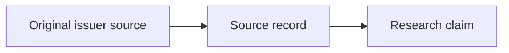
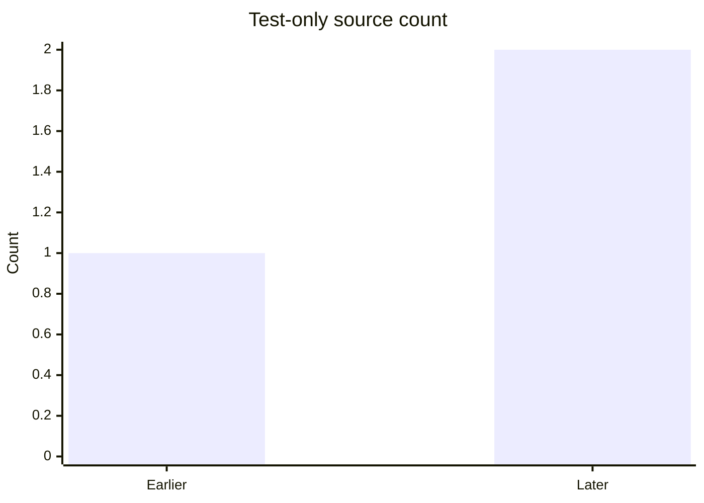

# Mermaid parser smoke test

This is a CI fixture; not an SCAP financial claim.

```mermaid
flowchart LR
  A["Original issuer source"] --> B["Source record"] --> C["Research claim"]
```

```mermaid
xychart-beta
  title "Test-only source count"
  x-axis ["Earlier", "Later"]
  y-axis "Count" 0 --> 2
  bar [1, 2]
```
