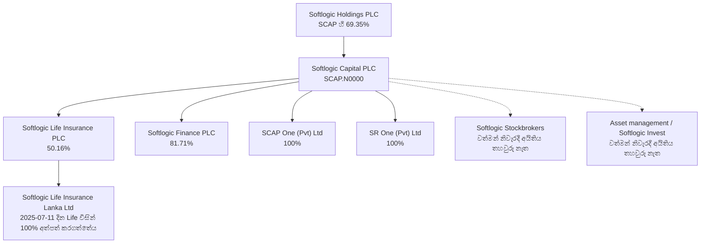
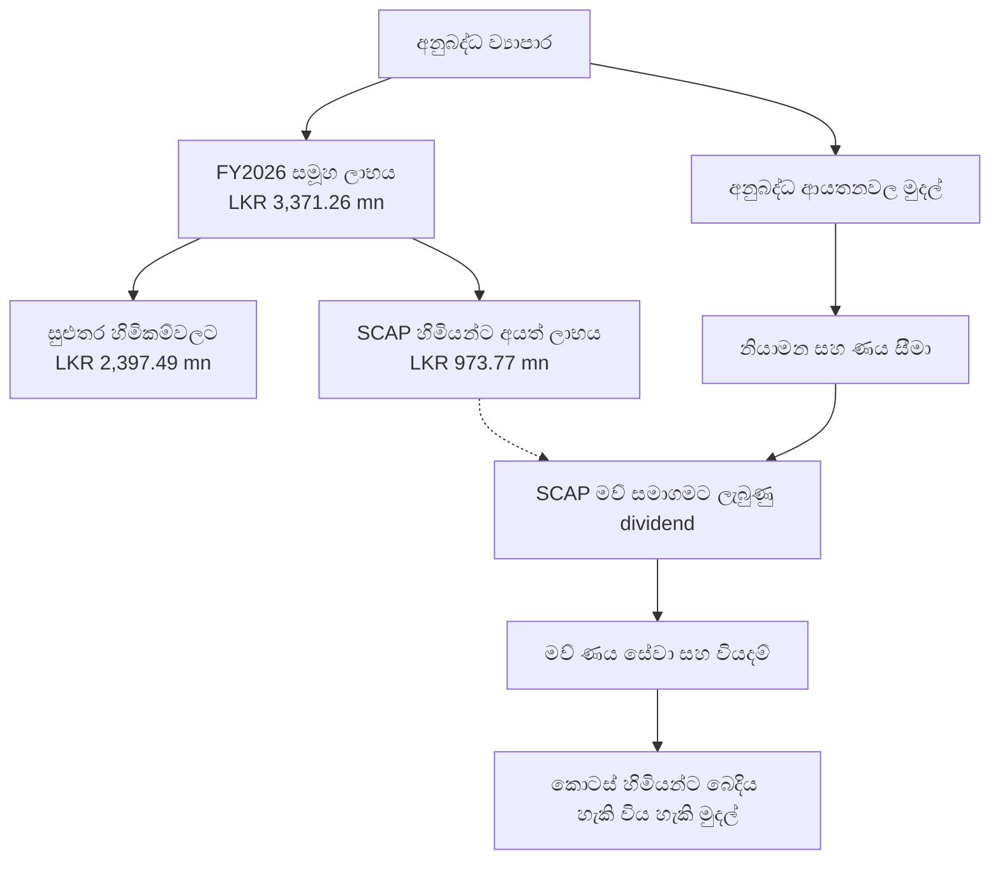

# 01 · ව්‍යාපාර විශ්ලේෂණය — Softlogic Capital PLC

**[🧭 SWOT — සාක්ෂි සහිත ශක්තීන්, දුර්වලතා, අවස්ථා සහ අවදානම්](SWOT-ANALYSIS.md)**

**[📊 දත්ත සහිත දෘශ්‍ය වාර්තා 15 බලන්න — හිමිකාරීත්වය, ආදායම, ලාභය, අවදානම් සහ වෙළෙඳපොළ](VISUAL-REPORT.md)**

[← මූලික විශ්ලේෂණය](../README.md) · [English](../../../01-Fundamental-Analysis/01-Business-Analysis/README.md) · [தமிழ்](../../../ta/01-Fundamental-Analysis/01-Business-Analysis/README.md) · **සිංහල**

> **CSE: SCAP.N0000** · **පර්යේෂණ දිනය: 2026 සැප්තැම්බර් 30**  
> **මූලාශ්‍ර: SCAP විසින් 2026 මැයි 27 දින අනුමත කර CSE වෙත නිකුත් කළ මූලික මූල්‍ය ප්‍රකාශන [S1] සහ සමාගම් ප්‍රකාශන.**
>
> **තත්ත්වය: අර්ධ වශයෙන් තහවුරු කර ඇත.** හිමිකාරීත්ව ප්‍රතිශත මෙහි අදාළ වන්නේ **2026 මාර්තු 31** දිනටය; වර්තමාන හිමිකාරීත්වය ලෙස නොසලකන්න. SCAP FY2025/26 අවසන් විගණිත වාර්තාව සහ 2026 ජූනි අතුරු වාර්තාව මුල් ලේඛන සමඟ මෙහි සම්පූර්ණයෙන් සසඳා නැත. මෙය කොටස් මිලදී ගැනීමේ හෝ විකිණීමේ නිර්දේශයක් නොවේ.

## 🔎 SCAP සමාගම සැබැවින් කරන්නේ කුමක්ද?

**Softlogic Capital PLC යනු ජීවිත රක්ෂණ සමාගමක් හෝ මූල්‍ය ආයතනයක් පමණක් නොව, Softlogic සමූහයේ කොළඹ කොටස් වෙළෙඳපොළේ ලැයිස්තුගත මූල්‍ය සේවා මව් සමාගමයි.** එය 2005 අප්‍රේල් මාසයේ Capital Reach Holdings Limited ලෙස ආරම්භ වී 2010 අගෝස්තුවේ Softlogic Holdings විසින් අත්පත් කරගත් බව සමාගම ප්‍රකාශ කරයි. ජීවිත රක්ෂණය, බැංකු නොවන මූල්‍ය සේවා, කොටස් තැරැව් හා ආයෝජන කළමනාකරණ ක්‍රියාකාරකම් සම්බන්ධ වේ. SCAP තමාට SEC ආයෝජන කළමනාකරු බලපත්‍රයක් ඇති බව ද සඳහන් කරයි. **[S2, S3]**

**SCAP හි ප්‍රධාන කොටස් හිමියා:** 2026 මාර්තු 31 දින **Softlogic Holdings PLC — කොටස් 677,652,893 (69.35%)**. SCAP නිකුත් කළ සාමාන්‍ය කොටස් **977,187,200** සහ මහජන හිමිකාරීත්වය **30.36%** ලෙස වාර්තා විය. **[S1, PDF පිටු 15–16]**

## 🗺️ දින සහිත හිමිකාරීත්ව සිතියම

**කියවන ආකාරය:** සෘජු සම්බන්ධතාවල ප්‍රතිශත SCAP හි **2026-03-31** ගොනුවේ සඳහන් අගයන්ය. තිත් රේඛා සමාගම සඳහන් කරන ව්‍යාපාරික සම්බන්ධතා පමණක් පෙන්වයි; අද දින හිමිකාරීත්වය තවමත් තහවුරු කළ යුතුය.

| සමාගම | 2026-03-31 SCAP හි කොටස | මූලාශ්‍රය / සීමාව |
|---|---:|---|
| Softlogic Life Insurance PLC | **50.16%** | **[S1, PDF පි. 19]**; පසුකාලීන වෙනස්කම් තවමත් පරීක්ෂා කළ යුතුයි |
| Softlogic Finance PLC | **81.71%** | **[S1, පි. 19]**; මූල්‍ය ආයතනයේ කොටස් හිමිකම් ගොනුව **[S4]** ද අදාළයි |
| SCAP One (Pvt) Ltd | **100%** | **[S1, පි. 19]**; වත්කම්/වගකීම් සොයා බලන්න |
| SR One (Pvt) Ltd | **100%** | **[S1, පි. 19]**; මාරු කළ වත්කම්, recoveries සහ funding තහවුරු කරන්න |
| Softlogic Stockbrokers (Pvt) Ltd | **නිශ්චිත නවතම ප්‍රතිශතය විවෘතයි** | ව්‍යාපාරය සමාගමේ වෙබ් අඩවියේ දක්වයි **[S2, S3]** |
| Softlogic Asset Management / Softlogic Invest | **වත්මන් ප්‍රතිශතය තහවුරු කර නැත** | වෙබ් අඩවිය Softlogic Invest 100% අනුබද්ධ බව කියයි; එයට අදාල දිනය පැහැදිලි නැත **[S3]** |

**වක්‍ර හිමිකාරීත්වය:** SCAP හි මුල් වාර්තාවට අනුව **2025 ජූලි 11** දින Softlogic Life විසින් Allianz SE වෙතින් **Softlogic Life Insurance Lanka Limited හි 100%** කොටස් **LKR මිලියන 1,426** ක මුදලකට අත්පත් කරගත්තේය. එය **Softlogic Life සතු** අනුබද්ධ ආයතනයකි; SCAP සතුව සෘජුව තවත් 100% ආයතනයක් ලෙස ගණන් නොකරන්න. **[S1, PDF පි. 11]**

## 💼 ගනුදෙනුකරුවන් ගෙවන්නේ කුමකටද?

| ව්‍යාපාරය | මුදල් ගෙවන / සපයන පාර්ශ්ව | ආදායමේ මූලාශ්‍ර | අවධානයට ගත යුතු වියදම්/සීමා |
|---|---|---|---|
| **ජීවිත රක්ෂණය** | පුද්ගලයන්, පවුල් සහ ආයතන | රක්ෂණ ගිවිසුම්, අලුත්කිරීම්, ආයෝජන ප්‍රතිඵල; claims සහ පිරිවැය පසු ඉතිරිවන අගය | Claims, acquisition commissions, insurance liabilities, solvency |
| **බැංකු නොවන මූල්‍යය** | ණය/ලීසිං ගනුදෙනුකරුවන්; තැන්පතු තබන පුද්ගලයන් අරමුදල් සපයයි | ණය පොලී සහ ගාස්තු − funding cost − ණය පාඩු − මෙහෙයුම් පිරිවැය | NPLs, deposit withdrawals, capital requirements |
| **කොටස් තැරැව් සේවා** | Retail, institutional සහ අනෙකුත් ආයෝජකයන් | ක්‍රියාත්මක කළ ගනුදෙනු කොමිස් හා ප්‍රකාශිත වෙනත් ගාස්තු | CSE turnover, ගනුදෙනුකරු රඳවාගැනීම |
| **වත්කම් කළමනාකරණය** | Unit trust ආයෝජකයන් සහ සම්බන්ධ සේවා ගනුදෙනුකරුවන් | AUM මත පදනම් වන කළමනාකරණ ගාස්තු සහ අනුමත සේවා | Redemptions, fee compression සහ පිරිවැය |
| **SCAP මව් සමාගම** | අනුබද්ධ/සමූහ ආයතන සහ ආයෝජන | ලැබුණු dividends, interest සහ consultancy/management fees | මව් සමාගමේ පොලී වියදම්, related parties සහ බෙදාහැරීම් සීමා |

මෙය **ව්‍යාපාරික ආදායම් රටාව** පමණි; සෑම අංශයක්ම ලාභ උපයන බවට තහවුරුවක් නොවේ. රක්ෂණ **gross written premium** යනු SCAP සමූහ ලාභය නොවේ; Unit Trust පාරිභෝගික වත්කම් යනු SCAP හිමියන්ගේම මුදල් නොවේ. **[S1, පිටු 2–3, 10; S2, S3]**

## 📊 FY2026 මෙහෙයුම් අංශ සංඛ්‍යා

**2026 මාර්තු 31 අවසන් මුදල් වර්ෂය. ඒකකය: LKR මිලියන. මූලාශ්‍රය [S1, PDF පි. 10]; 2026 මැයි 27 අතුරු වාර්තාවේ ඇති අගයන්ය, අවසන් විගණිත FY2026 සංඛ්‍යා ලෙස නොසලකන්න.**

| අංශය | සමූහ අභ්‍යන්තර ඉවත්කිරීම් පෙර දක්වා ඇති ආදායම | බදු පසු අංශ ලාභය/(පාඩුව) |
|---|---:|---:|
| ජීවිත රක්ෂණය | **48,425.96** | **+4,870.86** |
| බැංකු නොවන මූල්‍ය ආයතන | **1,384.78** | **−136.24** |
| අනෙකුත් අංශ | **2,759.84** | **−515.40** |
| Consolidation adjustments / eliminations | **−1,260.09** | **−847.95** |
| **සමූහ එකතුව** | **51,310.49** | **+3,371.26** |

**ව්‍යාපාරික කියවීම:** එම වාර්තාවේ segment revenue අනුව රක්ෂණ අංශය විශාල කොටසක් දක්වයි. එහෙත් රක්ෂණ ආයතනයේ මුළු ලාභය SCAP සාමාන්‍ය කොටස් හිමියන්ට අයත් නොවේ. සුළුතර අයිතිය, ණය සහ dividend සීමා ගණනයට ඇතුළත් විය යුතුය.

**අංශ ආදායම් නිවැරදි කිරීම (2026-09-30):** පෙර සඳහන් LKR 4,019.94mn 'Other' අගය සමූහ එකතුවට නොගැළපේ. **දළ වශයෙන් LKR 2,759.84mn** යනු **51,310.49 − 48,425.96 − 1,384.78 + 1,260.09** ලෙස **ගණනය කළ** අගයකි; [ද්විතීයික දත්ත](https://stockanalysis.com/quote/cose/SCAP.N0000/financials/) 2,760mn ලෙස වටකර දක්වයි. මුල් CSE PDF පේළිය නැවත පරීක්ෂා කළ යුතුය.

**2025 සංසන්දන වෙනස:** මෙම CSE අතුරු ගොනුවේ **FY2025 audited සංසන්දන සමූහ ආදායම LKR 42,383.72 මිලියන** වේ. කලින් මෙම repo හි තෙවන පාර්ශ්ව snapshot එක **LKR 39,794 මිලියන** ලෙස සඳහන් කරයි. එය **සත්‍යාපනය කළ යුතු මූලාශ්‍ර වෙනසකි**; පැරණි අගය නිල comparator ලෙස භාවිත නොකරන්න. **[S1, PDF පි. 2]**

## 💸 සමූහ ලාභය ≠ SCAP හිමියන්ට අයත් ලාභය ≠ මව් සමාගමට ලැබුණු මුදල්

**FY2026 සමූහ ශුද්ධ ලාභය LKR මිලියන 3,371.26 යි. එයින් SCAP මව් සමාගම සතු හිමියන්ට අයත් ලාභය LKR මිලියන 973.77 සහ පාලනය නොකරන හිමිකම්වලට LKR මිලියන 2,397.49 යි.** ගිණුම් ලාභය SCAP වෙත ගෙවා ඇති dividend එකක් නොවේ. **[S1, PDF පි. 2]**

### SCAP තනි මව් සමාගම — විශේෂයෙන් පරීක්ෂා කරන්න

| තනි සමාගම් මිනුම | FY2026 / 2026-03-31 අගය | අර්ථකථනය |
|---|---:|---|
| මව් සමාගමේ ආදායම | **LKR 1,485.72 mn** | සමූහයේ LKR 51,310.49 mn නොවේ **[S1, පි. 3]** |
| වාර්තා කළ dividend income | **LKR 635.18 mn** | FY2025 audited comparator **LKR 3,273.55 mn**; SCAP සාමාන්‍ය හිමියන්ට ගෙවූ dividend එකක් නොවේ **[S1, පි. 3]** |
| මව් සමාගමේ පොලී වියදම | **LKR 1,810.84 mn** | මූල්‍යකරණ වියදම **[S1, පි. 3]** |
| මව් සමාගමේ තනි පාඩුව | **−LKR 722.49 mn** | සමූහ ලාභයට වෙනස් මිනුමකි **[S1, පි. 3]** |
| මව් සමාගමේ cash/bank | **LKR 32.07 mn** | මුළු සමූහයේ මුදල් නොවේ **[S1, පි. 6]** |
| මව් සමාගමේ bank overdraft | **LKR 323.13 mn** | වෙනම මූල්‍ය වගකීමකි **[S1, පි. 6]** |
| මව් interest-bearing borrowings | **LKR 17,324.26 mn** | කල්පිරීම් හා ඇප පරීක්ෂා කරන්න **[S1, පි. 6]** |
| මව් තනි සමාගම් equity | **LKR 4,848.03 mn** | ඒකාබද්ධ owner-attributable equity නොවේ **[S1, පි. 6]** |
| ඒකාබද්ධ SCAP හිමියන්ට අයත් equity | **−LKR 1,035.49 mn** | සමූහ මුළු equity **+6,269.84 mn** සහ NCI equity **+7,305.34 mn**; එකිනෙකට වෙනස් ගිණුම් පදනම් **[S1, පි. 6]** |

**සාක්ෂි-පාදක අර්ථකථනය:** සමූහ ලාභය ධන අගයක් වුවද **මව් තනි පාඩුව, මව් ණය පොලී සහ ඒකාබද්ධ හිමිකරුවන්ට අයත් ඍණ equity** වෙන වෙනම පැහැදිලි කළ යුතුය. මෙය සමාගම අසාර්ථක වන බවට අනාවැකියක් නොවේ. SCAP හි එම අතුරු වාර්තාවේ 2026-03-31 දින අනුබද්ධ ආයෝජන fair value මැනීම තවමත් සිදුවන බවද සඳහන් වේ. **[S1, PDF පිටු 6, 11]**

### සමූහ අභ්‍යන්තර ගනුදෙනු දෙවරක් ගණන් නොකරන්න

FY2026 **SCAP තනි සමාගමේ related-party note** අනුව Softlogic Holdings වෙතින් **පොලී LKR 427.04 mn**, SR One වෙතින් **LKR 160.39 mn**, Softlogic Life වෙතින් **consultancy/professional fees LKR 120 mn**, Stockbrokers වෙතින් **LKR 64.11 mn**, Asset Management වෙතින් **LKR 76 mn** වාර්තා කර ඇත. මේවා **සමූහය ඇතුළත ආදායම්/ගනුදෙනු** වන බැවින් consolidated external revenue වෙත නැවත එක් නොකරන්න. **[S1, PDF පි. 17]**

### රක්ෂණයේ සියලු ලාභාංශ මුදල් මව් සමාගමට ගත හැකිද?

එවැනි උපකල්පනයක් කළ නොහැක. රක්ෂණ ආයතනයේ විශේෂිත **restricted one-off surplus** කොටස් හිමියන් වෙත dividend ලෙස මුදාහැරීමට IRCSL පාලන නියම සහ අනුමැතිය අවශ්‍ය බව වාර්තාව දක්වයි. **2026-03-31 restricted regulatory reserve LKR 1,515.80 mn** යි. එය **SCAP වෙත වහා බෙදිය හැකි මුදලක් නොවේ**. **[S1, PDF පිටු 6, 13]**

## 🧩 තරඟකාරී වාසි — තවමත් තහවුරු නොකළ උපකල්පන

| විය හැකි සාධකය | දැනට ඇති තොරතුරු | සනාථ කිරීමට අවශ්‍ය පරීක්ෂාව |
|---|---|---|
| මූල්‍ය සේවා විවිධත්වය | රක්ෂණ, මූල්‍ය, තැරැව් සහ වත්කම් කළමනාකරණ ක්‍රියාකාරකම් සඳහන් වේ **[S2, S3]** | ලාභදායී cross-selling, පාරිභෝගික ලබාගැනීමේ පිරිවැය |
| රක්ෂණයේ පරිමාණය | FY2026 segment revenue තුළ රක්ෂණය විශාලයි **[S1, පි. 10]** | persistency, claims, solvency, සමාන රක්ෂණකරුවන් සමඟ returns |
| තැරැව් ගනුදෙනුකරු ජාලය | Institutional, high-net-worth සහ retail කාණ්ඩ සමාගම විස්තර කරයි **[S3]** | ගාස්තු සංයුතිය, market share, සැබෑ ලාභ දායකත්වය |
| මූල්‍ය ප්‍රතිසංවිධානය | SR One 100% ආයතනයක් ලෙස SCAP වාර්තාවේ ඇත **[S1, පි. 19]** | මාරුකළ වත්කම්, recoveries, ප්‍රාග්ධන බලපෑම |

**මේ කරුණු පමණක් දිගුකාලීන තරඟකාරී වාසියක් තහවුරු නොකරයි.**

## 📝 පුරවා ඇති සාක්ෂි වගුව

| අගය / ප්‍රකාශය | කාලය හා විෂය පථය | මුල් මූලාශ්‍රය | තහවුරු කළ/විවෘත කරුණ |
|---|---|---|---|
| SCAP ප්‍රධාන හිමියා | 2026-03-31 | **[S1, පි. 15–16]** | Softlogic Holdings **69.35%** |
| කොටස් ගණන / public holding | 2026-03-31 | **[S1, පි. 15–16]** | **977,187,200** / **30.36%** |
| Softlogic Life හි SCAP අයිතිය | 2026-03-31 | **[S1, පි. 19]** | **50.16%** |
| Softlogic Finance හි SCAP අයිතිය | 2026-03-31 | **[S1, පි. 19; S4]** | **81.71%** |
| SCAP One / SR One | 2026-03-31 | **[S1, පි. 19]** | **එක් එක් 100%** |
| Stockbrokers / Asset Management | වත්මන් දිනය තහවුරු කර නැත | **[S2, S3]** | ව්‍යාපාර සඳහන් වේ; **වත්මන් ප්‍රතිශතය විවෘතයි** |
| Softlogic Life කළ Allianz අත්පත් කරගැනීම | 2025-07-11 | **[S1, පි. 11]** | **100%; LKR 1,426 mn** |
| සමූහ ආදායම / සමූහ ලාභය | FY2026 අතුරු | **[S1, පි. 2, 10]** | **LKR 51,310.49 / 3,371.26 mn** |
| SCAP හිමියන්ට අයත් / NCI ලාභය | FY2026 අතුරු | **[S1, පි. 2]** | **LKR 973.77 / 2,397.49 mn** |
| මව් dividend income | FY2026 තනි | **[S1, පි. 3]** | **LKR 635.18 mn** |
| මව් පොලී වියදම / පාඩුව | FY2026 තනි | **[S1, පි. 3]** | **LKR 1,810.84 mn / −722.49 mn** |
| මව් ණය / cash | 2026-03-31 | **[S1, පි. 6]** | **LKR 17,324.26 / 32.07 mn** |
| ඒකාබද්ධ owner-attributable equity | 2026-03-31 | **[S1, පි. 6]** | **−LKR 1,035.49 mn** |
| Restricted reserve | 2026-03-31 | **[S1, පි. 6, 13]** | **LKR 1,515.80 mn; IRCSL නියම** |
| FY2025 group revenue comparator | Audited comparison | **[S1, පි. 2]** | **LKR 42,383.72 mn**, පැරණි aggregator අගයට වෙනස් |
| FY2026 audited හා 2026 ජූනි මුල් වාර්තා | පසුකාලීන | **[S6]** ද්විතීයික | **අසල් CSE ලේඛන සමඟ සම්පූර්ණයෙන් ගළපා නැත** |

## ⏭️ ඊළඟ සාක්ෂි-පාදක පර්යේෂණය

- [x] ලැයිස්තුගත මව් සමාගම, ප්‍රධාන හිමිකරු සහ **දින සහිත** අනුබද්ධ හිමිකාරීත්වය හඳුනාගැනීම.
- [x] රක්ෂණ, මූල්‍ය, තැරැව්, asset management සහ SPV ව්‍යාපාර ආකෘති පැහැදිලි කිරීම.
- [x] SCAP මුල් FY2026 අතුරු segment, parent-only, consolidated සටහන් කියවීම.
- [x] සමූහ ලාභය SCAP හිමියන්ට අයත් ලාභයට ගළපීම.
- [ ] **ප්‍රමුඛත්වය:** SCAP FY2025/26 අවසන් විගණිත වාර්තාව සහ 2026 ජූනි මුල් CSE වාර්තාව සොයා නව සංඛ්‍යා, restatements සහ පසුව සිදුවීම් පරීක්ෂා කිරීම.
- [ ] Stockbrokers / asset manager හි නවතම අයිතිය හා කොටස් ඇප සොයන්න.
- [ ] මව් ණය කල්පිරීම, guarantees, සැබෑ dividends සහ insurer capital restrictions ගළපන්න.
- [ ] Insurer persistency/solvency සහ Finance NPL/funding දත්ත සමාන තරඟකරුවන් සමඟ සසඳන්න.
- [ ] 2025 පැරණි aggregator revenue අගය නිල CSE audited comparator සමඟ ගළපන්න.

**මෙය ව්‍යාපාර විශ්ලේෂණයකි; වත්මන් මිල ඉලක්කයක් හෝ ගනුදෙනු නිර්දේශයක් නොවේ.**

## 📚 මූලාශ්‍ර හා සාක්ෂි සීමා

- **[S1] SCAP මුල් CSE අතුරු මූල්‍ය ප්‍රකාශන:** 2026 මාර්තු 31 අවසන් වර්ෂය, 2026 මැයි 27 මණ්ඩල අනුමැතිය — [මුල් පිටු 20 PDF](https://cdn.cse.lk/cmt/upload_report_file/1100_1779968696398.pdf). **FY2026 අගයන් විගණනයට යටත්වන බව** ප්‍රකාශනය කියයි; FY2025 සංසන්දන තීරු **Audited** ලෙස සඳහන් කරයි. ඉහත පිටු අංක PDF viewer හි පිටු අංක වේ.
- **[S2] SCAP නිල හැඳින්වීම:** https://softlogiccapital.lk/about-us-overview/ — සමාගමේ විස්තරය.
- **[S3] SCAP අනුබද්ධ ආයතන:** https://softlogiccapital.lk/subsidiaries/ — මෙහෙයුම් පිළිබඳ විස්තර; සමහර හිමිකාරීත්ව තොරතුරුවල නිශ්චිත දිනය නැත.
- **[S4] Softlogic Finance 2026 CSE හිමිකාරීත්ව වගුව:** https://cdn.cse.lk/cmt/upload_report_file/863_1779879284133.pdf — **81.71%** පේළිය සඳහා හරස් සාක්ෂියක්; custody/pledge වචන මුලින් පරීක්ෂා කරන්න.
- **[S5] Softlogic Life 2025 වාර්තා වෙබ් අඩවිය:** https://annualreport.softlogiclife.lk/ — එහි වර්ෂය දෙසැම්බර් අවසානයේදී, SCAP වර්ෂය මාර්තු අවසානයේදී අවසන් වේ.
- **[S6] 2026 ජූනි SCAP ප්‍රතිඵල පිළිබඳ ද්විතීයික සාරාංශය:** https://www.marketscreener.com/news/softlogic-capital-plc-reports-earnings-results-for-the-first-quarter-ended-june-30-2026-ce7859dfd88af521 — SCAP මුල් CSE වාර්තාව වෙනුවට භාවිත නොකරන්න.

**පර්යේෂණ තත්ත්වය 2026-09-30:** පසුකාලීන විගණිත වාර්තා වෙනස් නම් මෙම දින සහිත සටහන යාවත්කාලීන කළ යුතුය.
