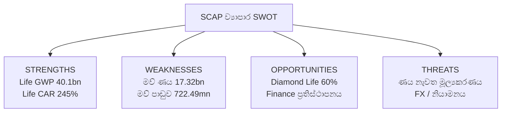

# 🧭 SCAP.N0000 — ව්‍යාපාර SWOT විශ්ලේෂණය

[← ව්‍යාපාර විශ්ලේෂණය](README.md) · [දෘශ්‍ය වාර්තා 16](VISUAL-REPORT.md) · [English](../../../01-Fundamental-Analysis/01-Business-Analysis/SWOT-ANALYSIS.md) · [தமிழ்](../../../ta/01-Fundamental-Analysis/01-Business-Analysis/SWOT-ANALYSIS.md) · **සිංහල**

> **පර්යේෂණ තත්ත්වය: 2026 සැප්තැම්බර් 30.** සමාගම: **Softlogic Capital PLC (SCAP.N0000)**. මෙය **ව්‍යාපාර SWOT** වේ; වත්මන් කොටස් මිල තක්සේරුවක් හෝ මිලදී/විකිණීමේ නිර්දේශයක් නොවේ. 2026 මාර්තු SCAP අගයන් **2026 මැයි 27 අතුරු ගොනුවේ** අගයන් වන අතර **විගණනයට යටත්ය**. රක්ෂණ වර්ෂය **2025 දෙසැම්බර්** අවසන් වන අතර Bangladesh අත්පත් කරගැනීම SCAP මාර්තු ශේෂ දිනයෙන් පසුව සිදු විය.

## SWOT දෘශ්‍ය සටහන

> **අගයන්ගේ සීමාව:** Life GWP/CAR සහ Finance capital යනු අනුබද්ධ ආයතන මිනුම්ය. ඒවා SCAP ඒකාබද්ධ ආදායම හෝ මව් බැංකු මුදල් නොවේ.

## 2×2 සාක්ෂි වගුව

| **ශක්තීන්** | **දුර්වලතා** |
|---|---|
| **Softlogic Life 2025 GWP LKR 40.1bn (+27%), life GWP වෙළෙඳපොළ කොටස 18.4%, CAR 245% බව වාර්තා කළේය.**  **Life 2025 portal මෙහෙයුම් ස්ථාන 159ක් දක්වයි; සමාගමේ ප්‍රකාශනය මිලියන 1.3ක ජනතාව ආවරණය වන බව කියයි. SCAP ව්‍යාපාර අංශ කිහිපයක් සඳහන් කරයි.**  **Finance සමාගමේ ජූලි 2026 නිවේදනය ප්‍රාග්ධන ප්‍රමාණවත්භාවය සுமார் 61% සහ තවදුරටත් සිදුවන ප්‍රතිසංවිධානයක් සඳහන් කරයි.** | **SCAP මව් තනි ගිණුම්: 2026-03-31 ණය LKR 17,324.26mn, overdraft 323.13mn, cash/bank 32.07mn.**  **SCAP FY2026 තනි පොලී වියදම LKR 1,810.84mn සහ පාඩුව 722.49mn.**  **FY2026 සමූහ PAT LKR 3,371.26mn, SCAP හිමියන්ට අයත් ලාභය 973.77mn සහ සමූහ owner-attributable equity −1,035.49mn.** |

| **අවස්ථා** | **අවදානම්** |
|---|---|
| **Diamond Life වෙබ් පිටුව සහ 2026-09-16 Bangladesh ආයෝජන-අධිකාරී ලිපිය අනුව Softlogic Life 2026 ජූලි මාසයේ එහි 60% කොටස USD 1.9m පමණට අත්පත් කරගෙන ඇත.**  **Finance ජූලි 2026 ප්‍රකාශනය ප්‍රාග්ධන ප්‍රතිසංවිධානය හා මෙහෙයුම් ප්‍රසාරණ සැලැස්ම තවමත් ක්‍රියාත්මක බව සඳහන් කරයි.**  **Life 2025 ප්‍රකාශනය AI underwriting/claims සහ protection distribution ආයෝජන සඳහන් කරයි.** | **SCAP මාර්තු 2026 මව් ණය/පොලී වියදම් පසුව ඇති මුදල් හා නැවත මූල්‍යකරණ තත්ත්වය මත රඳා පවතී.**  **Softlogic Finance CBSL යටතේත්, Softlogic Life IRCSL රක්ෂණ capital/reserve නියම යටතේත් ක්‍රියා කරයි.**  **Bangladesh අත්පත් කරගැනීම වෙනත් මුදල් ඒකකයක් හා නියාමන ක්‍රමයක් ගෙනේ; තැරැව් ආදායම CSE ගනුදෙනු ප්‍රමාණය මතද රඳා පවතී.** |

> **SWOT වර්ගීකරණය:** Strength/Weakness යනු අභ්‍යන්තර තත්ත්වයන්; Opportunity/Threat යනු බාහිර හැකි අවස්ථා/අවදානම්ය. මේවා **පර්යේෂණ අර්ථකථන** වන අතර විගණිත තීන්දු හෝ සම්භාවිතා ලකුණු නොවේ.

## මූලාශ්‍ර-පාදක නිරීක්ෂණ සහ පරීක්ෂණ

| SWOT අංශය | දිනය සහිත සාක්ෂිය | ව්‍යාපාරික අර්ථකථනය | ඊළඟ පරීක්ෂාව | මූලාශ්‍රය |
|---|---|---|---|---|
| **ශක්තීන්** | Softlogic Life 2025 GWP LKR 40.1bn (+27%), life GWP වෙළෙඳපොළ කොටස 18.4%, CAR 245% බව වාර්තා කළේය. | රක්ෂණ මෙහෙයුමට වාර්තාගත පරිමාණයක් තිබේ; Life GWP යනු SCAP හිමියන්ට අයත් ලාභය නොවේ. | අදාළ peers සමඟ persistency, claims, solvency, අලුත් ගනුදෙනුකරුවන් ලබාගැනීමේ පිරිවැය හා upstream dividends සසඳන්න. | [Life 2025 ප්‍රකාශය](https://softlogiclife.lk/news/softlogic-life-surpasses-rs-40-bn-gwp-in-fy25-doubles-key-financial-metrics-over-four-years/) |
| **ශක්තීන්** | Life 2025 portal මෙහෙයුම් ස්ථාන 159ක් දක්වයි; සමාගමේ ප්‍රකාශනය මිලියන 1.3ක ජනතාව ආවරණය වන බව කියයි. SCAP ව්‍යාපාර අංශ කිහිපයක් සඳහන් කරයි. | පාරිභෝගිකයන් වෙත ළඟාවීමේ මාර්ග ඇති නමුත් ලාභදායී cross-selling තහවුරු වී නැත. | බෙදාහැරීම් අංශ අනුව acquisition cost, retention හා සැබෑ cross-sell ප්‍රතිඵල සොයන්න. | [Life 2025 / SCAP](https://annualreport.softlogiclife.lk/) |
| **ශක්තීන්** | Finance සමාගමේ ජූලි 2026 නිවේදනය ප්‍රාග්ධන ප්‍රමාණවත්භාවය සுமார் 61% සහ තවදුරටත් සිදුවන ප්‍රතිසංවිධානයක් සඳහන් කරයි. | ප්‍රාග්ධන ප්‍රතිස්ථාපනය මෙහෙයුම් ඉඩ වැඩි කළ හැක; මෙය අනුබද්ධ ආයතනයේ අගයක් පමණි. | නවතම audited capital, loan quality සහ වත්මන් CBSL තත්ත්වය ගළපන්න. | [Finance ජූලි 2026](https://softlogicfinance.lk/news/building-a-stronger-more-resilient-softlogic-finance/) |
| **දුර්වලතා** | SCAP මව් තනි ගිණුම්: 2026-03-31 ණය LKR 17,324.26mn, overdraft 323.13mn, cash/bank 32.07mn. | මව් අරමුදල් හා ණය නැවත ගෙවීම් නිසා සාමාන්‍ය කොටස් හිමියන්ට බෙදිය හැකි මුදල් සීමා විය හැක. | මව් ණය කල්පිරීම්, ඇප, covenants, cash හා ලැබුණු dividends කාලරේඛාවක් සාදන්න. | [SCAP අතුරු පි. 6](https://cdn.cse.lk/cmt/upload_report_file/1100_1779968696398.pdf) |
| **දුර්වලතා** | SCAP FY2026 තනි පොලී වියදම LKR 1,810.84mn සහ පාඩුව 722.49mn. | සමූහ මෙහෙයුම් ලාභය මව් මූල්‍ය වියදම අනිවාර්යයෙන් ආවරණය නොකරයි. | මව් මෙහෙයුම් මුදල්, සැබැවින් ගෙවූ පොලී හා නැවත නැවත එන පිරිවැය පරීක්ෂා කරන්න. | [SCAP අතුරු පි. 3](https://cdn.cse.lk/cmt/upload_report_file/1100_1779968696398.pdf) |
| **දුර්වලතා** | FY2026 සමූහ PAT LKR 3,371.26mn, SCAP හිමියන්ට අයත් ලාභය 973.77mn සහ සමූහ owner-attributable equity −1,035.49mn. | සුළුතර හිමිකම් හා මව්/සමූහ ගිණුම් වෙනස්කම් නිසා සරල valuation අසම්පූර්ණ විය හැක. | Minority interests, parent NAV, segment dividends සහ පසුකාලීන restatements ගළපන්න. | [SCAP අතුරු පි. 2, 6](https://cdn.cse.lk/cmt/upload_report_file/1100_1779968696398.pdf) |
| **අවස්ථා** | Diamond Life වෙබ් පිටුව සහ 2026-09-16 Bangladesh ආයෝජන-අධිකාරී ලිපිය අනුව Softlogic Life 2026 ජූලි මාසයේ එහි 60% කොටස USD 1.9m පමණට අත්පත් කරගෙන ඇත. | නව රටක රක්ෂණ අවස්ථාවක් ලැබිය හැකි නමුත් SCAP මට්ටමේ අමතර ලාභය තහවුරු නැත. | අත්පත් කරගැනීමෙන් පසු ලාභ, integration පිරිවැය, FX, capital හා වක්‍ර හිමිකාරීත්වය සොයන්න. | [Diamond Life / Bangladesh](https://diamondlifebd.com/overview/) |
| **අවස්ථා** | Finance ජූලි 2026 ප්‍රකාශනය ප්‍රාග්ධන ප්‍රතිසංවිධානය හා මෙහෙයුම් ප්‍රසාරණ සැලැස්ම තවමත් ක්‍රියාත්මක බව සඳහන් කරයි. | ඇප-පාදක ණය වර්ධනයට ඉඩ තිබිය හැකි නමුත් ණය ප්‍රමාණය වැඩිවීම ලාභයක් සහතික නොකරයි. | නව ණය yield, NPL, තැන්පතු පිරිවැය, impairment හා CAR ගළපන්න. | [Finance ජූලි 2026](https://softlogicfinance.lk/news/building-a-stronger-more-resilient-softlogic-finance/) |
| **අවස්ථා** | Life 2025 ප්‍රකාශනය AI underwriting/claims සහ protection distribution ආයෝජන සඳහන් කරයි. | ඩිජිටල් ක්‍රියාදාම පිරිවැය අඩු හෝ සේවාව වේගවත් කළ හැක; වාසි ප්‍රමාණය තහවුරු නැත. | claims පිරිවැය, නව policy පිරිවැය, retention, පැමිණිලි සහ ශුද්ධ ලාභය පරීක්ෂා කරන්න. | [Life 2025 ප්‍රකාශය](https://softlogiclife.lk/news/softlogic-life-surpasses-rs-40-bn-gwp-in-fy25-doubles-key-financial-metrics-over-four-years/) |
| **අවදානම්** | SCAP මාර්තු 2026 මව් ණය/පොලී වියදම් පසුව ඇති මුදල් හා නැවත මූල්‍යකරණ තත්ත්වය මත රඳා පවතී. | පොලී අනුපාත හෝ අරමුදල් ලබාගැනීමේ හැකියාව වෙනස් වුවහොත් මුදල් අවශ්‍යතා ඉහළ යා හැක; ණය පැහැරහැරීමක් සිදුවූ බවක් නොකියයි. | ණය කාලය, ඇප, වත්මන් ගිවිසුම්, පොලී හා covenant compliance සොයන්න. | [SCAP අතුරු පි. 3, 6](https://cdn.cse.lk/cmt/upload_report_file/1100_1779968696398.pdf) |
| **අවදානම්** | Softlogic Finance CBSL යටතේත්, Softlogic Life IRCSL රක්ෂණ capital/reserve නියම යටතේත් ක්‍රියා කරයි. | credit loss, තැන්පතු තරඟය, claims හා capital නියම අනුබද්ධ dividends සීමා කළ හැක. | නවතම CBSL/IRCSL නියම, ණය ගුණාත්මකභාවය, solvency සහ dividend අවසර සොයන්න. | [SCAP අතුරු / අනුබද්ධ](https://cdn.cse.lk/cmt/upload_report_file/1100_1779968696398.pdf) |
| **අවදානම්** | Bangladesh අත්පත් කරගැනීම වෙනත් මුදල් ඒකකයක් හා නියාමන ක්‍රමයක් ගෙනේ; තැරැව් ආදායම CSE ගනුදෙනු ප්‍රමාණය මතද රඳා පවතී. | FX, integration, විදේශීය නියාමනය හා market turnover වෙනස්වීම් **හැකි අවදානම් මාර්ග** පමණි, අනාවැකි නොවේ. | Bangladesh සැබෑ ලාභ, FX treatment, ප්‍රාග්ධන අවශ්‍යතා හා තැරැව් වාර්තා ගන්න. | [Diamond Life / SCAP](https://diamondlifebd.com/overview/) |

### මෙයින් පරීක්ෂා කළ යුත්තේ කුමක්ද?

**SCAP මව් සමාගමට සැබැවින් ලැබිය හැකි මුදල් මව් ණය හා පොලී පිරිවැය ආවරණය කරනවාද?** යන ප්‍රශ්නය වෙනම ගණනය කළ යුතුය. රක්ෂණ/මූල්‍ය වර්ධනය minority interests හා නියාමන capital පසු SCAP හිමියන්ට කෙසේ බලපාන්නේද යන්න අධ්‍යයනය කරන්න. අනාගත ප්‍රතිඵලයක් මෙහි පුරෝකථනය නොවේ.

## ඊළඟ තහවුරු කිරීමේ ලැයිස්තුව

- [ ] SCAP FY2025/26 **අවසන් audited වාර්තාව** හා 2026 ජූනි මුල් interim ලබා ගළපන්න.
- [ ] SCAP → Life → Diamond Life ඇතුළු **වත්මන් සෘජු/වක්‍ර හිමිකාරීත්වය** පරීක්ෂා කරන්න.
- [ ] මව් ණය හා පොලී සැබැවින් ලැබුණු subsidiary dividends සමඟ සසඳන්න.
- [ ] Finance වත්මන් CBSL compliance, loan quality හා capital අගයන් මුල් වාර්තාවෙන් ගළපන්න.
- [ ] Bangladesh මෙහෙයුම් ලාභ, integration, FX සහ solvency වෙන වෙනම පරීක්ෂා කරන්න.
- [ ] SWOT පදනමෙන් කොටස් ඉලක්ක මිලක් නොගණනය කරන්න.

## මූලාශ්‍ර ලැයිස්තුව

1. [SCAP CSE-filed 27 May 2026 year-end interim](https://cdn.cse.lk/cmt/upload_report_file/1100_1779968696398.pdf) — **FY2026 figures subject to audit**; previous research tied group and parent accounts to PDF pp. 2–3, 6 and subsidiary notes. Original PDF could not be reopened in the latest web check. Do **not** treat these figures as later audited data.
2. [SCAP business overview](https://softlogiccapital.lk/about-us-overview/) — issuer description of the holding company and businesses, website may not show a current legal ownership table.
3. [Softlogic Life issuer calendar-2025 release](https://softlogiclife.lk/news/softlogic-life-surpasses-rs-40-bn-gwp-in-fy25-doubles-key-financial-metrics-over-four-years/) — 40.1bn GWP, 18.4% market share, 245% insurer CAR, 1.3m lives and digital services.
4. [Softlogic Life 2025 reporting portal](https://annualreport.softlogiclife.lk/) — insurer-only year-end context.
5. [Softlogic Finance July 2026 issuer business update](https://softlogicfinance.lk/news/building-a-stronger-more-resilient-softlogic-finance/) — issuer-reported circa 61% capital ratio and ongoing transformation; compare to original regulatory returns.
6. [Diamond Life company overview](https://diamondlifebd.com/overview/) — 60% acquisition, approx USD1.9m; corroborate with [Bangladesh investment authority's dated September 2026 article](https://investbangladesh.gov.bd/publications-profile-items/from-colombo-to-dhaka-softlogic-lifebuys-into-bangladeshs-insurance-frontier).
7. [CSE company announcements](https://www.cse.lk/) — primary place to check more recent SCAP parent disclosures, shareholdings and audited annual report.

**තත්ත්වය:** දිනය සහිත ගුණාත්මක විශ්ලේෂණයකි; SWOT ලකුණු, ඉලක්ක මිල හෝ වෙළෙඳ නිර්දේශ නැත.
