# 📊 SCAP.N0000 — ව්‍යාපාර විශ්ලේෂණය: දත්ත සහිත දෘශ්‍ය වාර්තා 16ක්

[← ව්‍යාපාර විශ්ලේෂණය](README.md) · [English](../../../01-Fundamental-Analysis/01-Business-Analysis/VISUAL-REPORT.md) · [தமிழ்](../../../ta/01-Fundamental-Analysis/01-Business-Analysis/VISUAL-REPORT.md)

> **පර්යේෂණ දිනය: 2026-09-30.** SCAP-න් **2026 මාර්තු 31 අවසන් CSE අතුරු** වාර්තාව, Softlogic Life-න් **2025 දෙසැම්බර්** වාර්තාව, නිකුත්කරුගේ වෙබ් පිටු සහ පැහැදිලිව සලකුණු කළ ද්විතීයික තොරතුරු භාවිතයෙන් සකස් කළ Markdown/Mermaid රූප සටහන්. **වෙනස් ව්‍යාපාර හා කාලසීමාවල අගයන් එකට එකතු නොකරන්න.** මෙය වත්මන් මිලක් හෝ ආයෝජන නිර්දේශයක් නොවේ.

## 🧭 දෘශ්‍ය දර්ශකය

| # | දෘශ්‍ය සටහන | දත්ත පදනම |
|---|---|---|
| 01 | [හිමිකාරීත්ව ගස — දින සහිත](#v01) | FY2026 ownership |
| 02 | [ව්‍යාපාර පද්ධති සිතියම](#v02) | Issuer business map |
| 03 | [ව්‍යාපාර ආකෘති සිතියම](#v03) | Business mechanisms |
| 04 | [ව්‍යාපාර අංශ ආදායම](#v04) | FY2026 interim + reconciled estimate |
| 05 | [අංශ ලාභ සහ පාඩු](#v05) | FY2026 interim |
| 06 | [සමූහ ලාභය අයත් වන්නේ කාටද?](#v06) | FY2026 interim |
| 07 | [ලාභයේ සිට මුදල් දක්වා ගමන් මග](#v07) | FY2026 parent-only |
| 08 | [සමාගම් ඉතිහාසයේ සිදුවීම්](#v08) | 2005–2026 events |
| 09 | [රක්ෂණ ගනුදෙනුකරුවන් සහ ආවරණය](#v09) | Insurer 2023–2025 |
| 10 | [සේවා බෙදාහැරීමේ මාර්ග](#v10) | Insurer FY25 / undated finance |
| 11 | [කර්මාන්තයේ වෙළෙඳපොළ තත්ත්වය](#v11) | Insurer calendar 2025 |
| 12 | [තරඟකාරී වාසි: සාක්ෂි පරීක්ෂාව](#v12) | Insurer 2025 / hypotheses |
| 13 | [සම්බන්ධිත පාර්ශ්ව මුදල් ගනුදෙනු](#v13) | FY2026 parent-only |
| 14 | [නියාමන බැඳීම් සිතියම](#v14) | Insurer 2025 / sector regulation |
| 15 | [අවස්ථා සහ සීමාවන්](#v15) | Mixed historical periods |
| 16 | [SWOT — සාක්ෂි සහිත කාණ්ඩ හතර](#v16) | 2025 insurer / Mar 2026 parent / Jul 2026 acquisition |

> **සාක්ෂි වර්ග:** *SCAP CSE interim* = 2026-05-27 නිකුත් කළ වාර්තාව; FY2026 අගයන් **විගණනයට යටත්**. *Life 2025* = වෙනත් ව්‍යාපාරයක **දෙසැම්බර්** වර්ෂ අවසානය. *දින රහිත සමාගම් වෙබ් අඩවිය* = මෙහෙයුම් විස්තරයක් පමණි. *ද්විතීයික* = මුල් ගොනුව සමඟ තහවුරු කළ යුතුය. 'Other segment' අගය **එකතුවට ගළපා ගණනය කළ** සංඛ්‍යාවකි; 04 බලන්න.

## 01 · හිමිකාරීත්ව ගස — දින සහිත

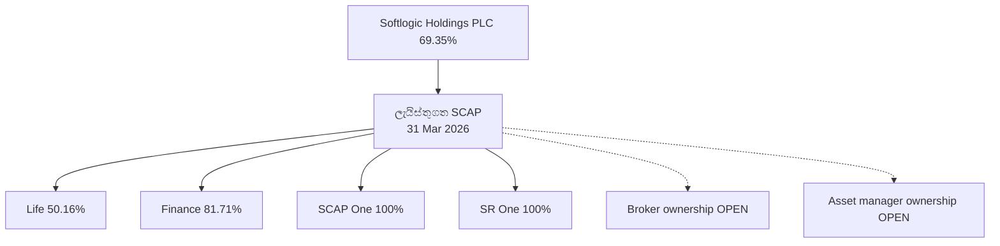

2026-03-31 දින Softlogic Holdings සතුව SCAP **69.35%**; SCAP සතුව Life **50.16%**, Finance **81.71%**, SCAP One සහ SR One **එක් එක් 100%** ලෙස ගොනුවේ ඇත. **Stockbrokers/asset manager වත්මන් නිවැරදි ප්‍රතිශත තහවුරු වී නැත.** Life විසින් අත්පත් කරගත් ආයතනය SCAP සෘජුව තවත් 100% හිමි සමාගමක් නොවේ.

**මූලාශ්‍ර / කාලය:** [මූලාශ්‍රය 1](https://cdn.cse.lk/cmt/upload_report_file/1100_1779968696398.pdf) · [මූලාශ්‍රය 2](https://softlogiccapital.lk/about-us-overview/).

## 02 · ව්‍යාපාර පද්ධති සිතියම

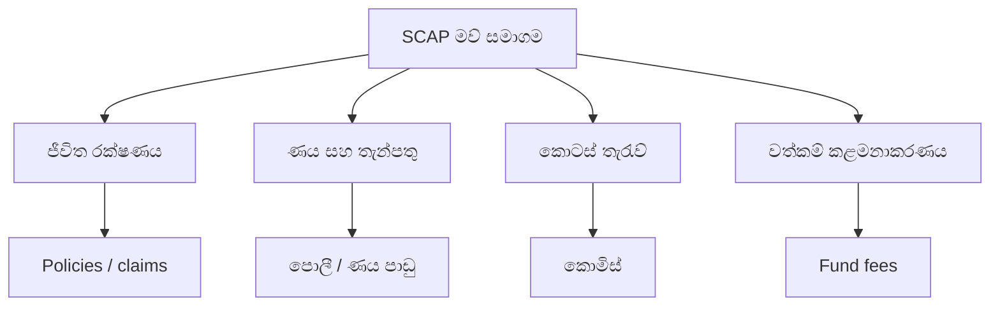

SCAP වෙත සම්බන්ධ මෙහෙයුම් රක්ෂණ, ණය/තැන්පතු, කොටස් තැරැව්, unit trust කළමනාකරණය යන අංශවලට අයත්ය. මෙය **ව්‍යාපාර කාණ්ඩ සිතියමකි**, ආදායම් බර පෙන්වන්නේ නැත. Life-න් **2025 GWP LKR 40.1bn** යනු SCAP සමූහ ආදායම නොවේ.

**මූලාශ්‍ර / කාලය:** [මූලාශ්‍රය 1](https://softlogiccapital.lk/about-us-overview/) · [මූලාශ්‍රය 2](https://softlogiccapital.lk/subsidiaries/) · [මූලාශ්‍රය 3](https://softlogiclife.lk/news/softlogic-life-surpasses-rs-40-bn-gwp-in-fy25-doubles-key-financial-metrics-over-four-years/).

## 03 · ව්‍යාපාර ආකෘති සිතියම

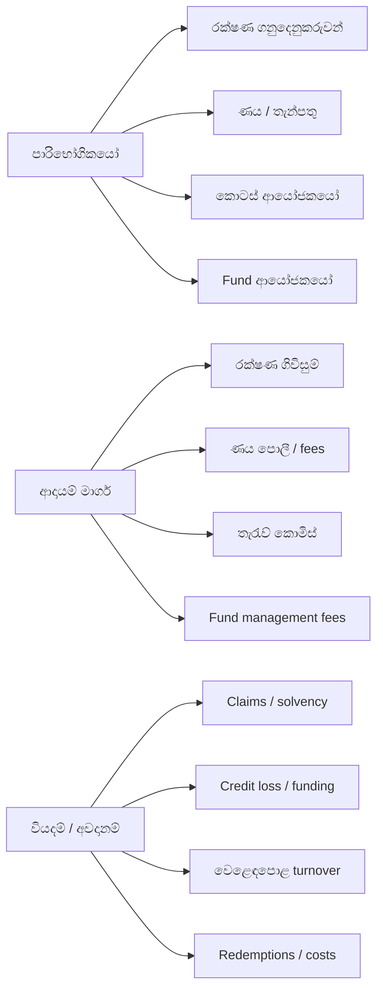

අංශ හතරේ පාරිභෝගිකයන්, ආදායම් මාර්ග, පිරිවැය සහ නියාමන සීමා වෙනස්ය. **පාරිභෝගික තැන්පතු යනු ආදායම නොවේ; fund සඳහා කළමනාකරණය කරන ගනුදෙනුකරු වත්කම් SCAP හිමියාගේම වත්කම් නොවේ.**

**මූලාශ්‍ර / කාලය:** [මූලාශ්‍රය 1](https://softlogiccapital.lk/about-us-overview/) · [මූලාශ්‍රය 2](https://softlogiccapital.lk/subsidiaries/).

## 04 · ව්‍යාපාර අංශ ආදායම

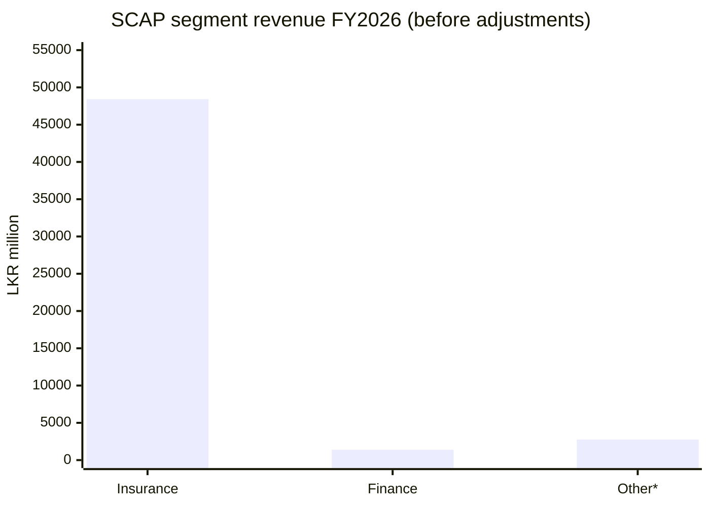

**2026 මාර්තු 31** අවසන් SCAP සමූහ අංශ ආදායම් (**LKR මිලියන**): රක්ෂණ **48,425.96**, මූල්‍ය **1,384.78**, අනෙකුත් **දළ වශයෙන් 2,759.84**, adjustments **−1,260.09**; සමූහ එකතුව **51,310.49**. **අනෙකුත් අගය එකතුවෙන් වීජීයව ගණනය කළ අගයකි**; ද්විතීයික වගුවක එය 2,760 ලෙස වටකර ඇත. මෙම වාරයේ මුල් segment පේළියෙන් නිශ්චිතව නැවත පරීක්ෂා කර නැත. GWP මෙයට එකතු නොකරන්න.

**මූලාශ්‍ර / කාලය:** [මූලාශ්‍රය 1](https://cdn.cse.lk/cmt/upload_report_file/1100_1779968696398.pdf) · [මූලාශ්‍රය 2](https://stockanalysis.com/quote/cose/SCAP.N0000/financials/) · අනෙකුත් අගය **එකතුවෙන් ගණනය කළ** අතර මුල් PDF පේළිය නැවත තහවුරු කර නැත..

## 05 · අංශ ලාභ සහ පාඩු

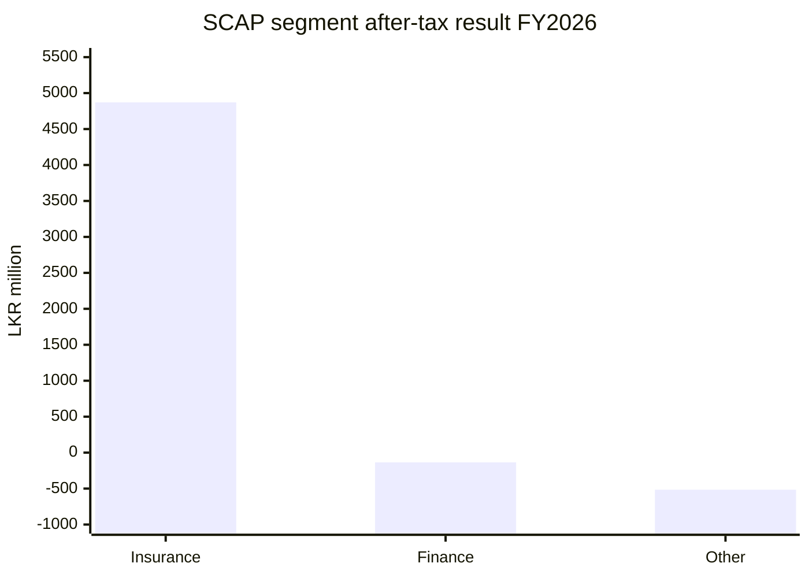

FY2026 අතුරු segment **බදු පසු ලාභ/(පාඩු)**, LKR මිලියන: රක්ෂණ **+4,870.86**, NBFI **−136.24**, අනෙකුත් **−515.40**, group adjustments **−847.95**, සමූහ PAT **+3,371.26** (0.01 rounding වෙනසක් විය හැක). සුළුතර හිමිකම් සහ මව් ණය නොසලකා ලාභයක් කොටස් වටිනාකමක් ලෙස නොගන්න.

**මූලාශ්‍ර / කාලය:** [මූලාශ්‍රය 1](https://cdn.cse.lk/cmt/upload_report_file/1100_1779968696398.pdf).

## 06 · සමූහ ලාභය අයත් වන්නේ කාටද?

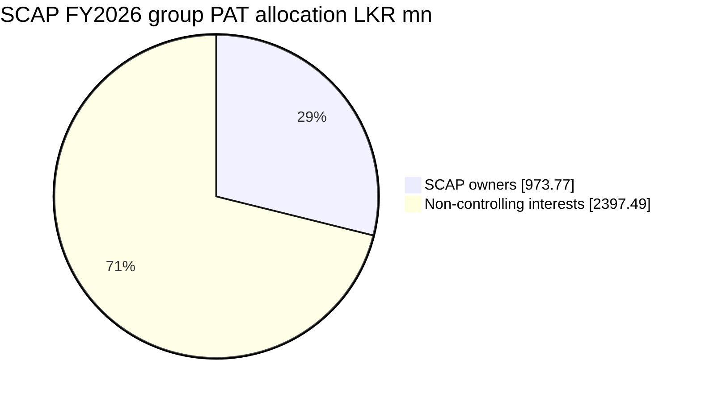

FY2026 සමූහ PAT **LKR 3,371.26mn**. එයින් **SCAP හිමියන්ට LKR 973.77mn (28.88%)**, **පාලනය නොකරන හිමිකම්වලට LKR 2,397.49mn (71.12%)**. මෙය ගිණුම් ලාභයේ අයිතියයි; මුදල් dividend ගෙවීමක් නොවේ.

**මූලාශ්‍ර / කාලය:** [මූලාශ්‍රය 1](https://cdn.cse.lk/cmt/upload_report_file/1100_1779968696398.pdf).

## 07 · ලාභයේ සිට මුදල් දක්වා ගමන් මග

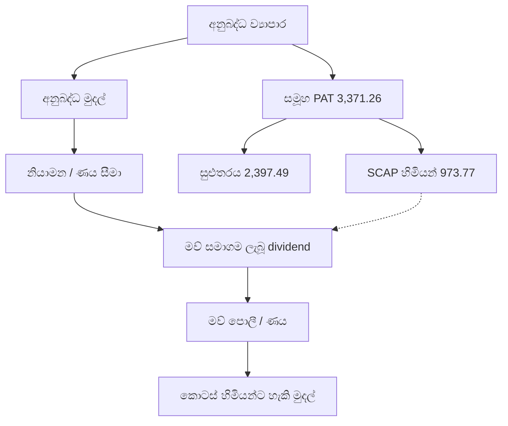

SCAP **තනි මව් සමාගම** FY2026 **dividend income 635.18mn**, **පොලී වියදම 1,810.84mn**, **පාඩුව 722.49mn** වාර්තා කරයි. 2026-03-31 මව් interest-bearing borrowings **17,324.26mn**, overdraft **323.13mn**, cash/bank **32.07mn**. මෙය ගමන් මාර්ගයක් පමණි; ගිණුම් ලාභය, ලැබුණු dividend සහ බෙදිය හැකි මුදල් එකම අගයක් නොවේ.

**මූලාශ්‍ර / කාලය:** [මූලාශ්‍රය 1](https://cdn.cse.lk/cmt/upload_report_file/1100_1779968696398.pdf).

## 08 · සමාගම් ඉතිහාසයේ සිදුවීම්

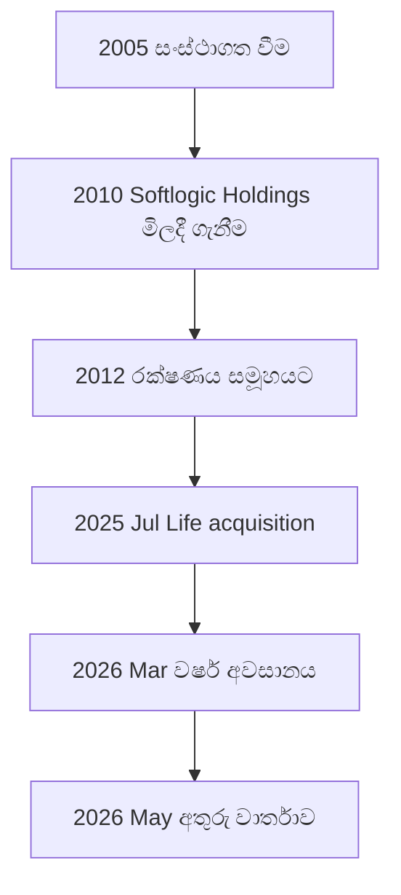

සිදුවීම්: **2005** සංස්ථාගත වීම; **2010** Softlogic Holdings අත්පත් කරගැනීම; **2012** ජීවිත රක්ෂණය එක්වීම; **2025-07-11** Softlogic Life විසින් වෙනත් රක්ෂණ සමාගමක් **LKR 1,426mn** කට අත්පත් කරගැනීම; **2026-03-31** වර්ෂ අවසානය; **2026-05-27** අතුරු ගොනුව. 2025 අත්පත් කරගැනීම SCAP සෘජු ගනුදෙනුවක් නොවේ.

**මූලාශ්‍ර / කාලය:** [මූලාශ්‍රය 1](https://softlogiccapital.lk/about-us-overview/) · [මූලාශ්‍රය 2](https://cdn.cse.lk/cmt/upload_report_file/1100_1779968696398.pdf).

## 09 · රක්ෂණ ගනුදෙනුකරුවන් සහ ආවරණය

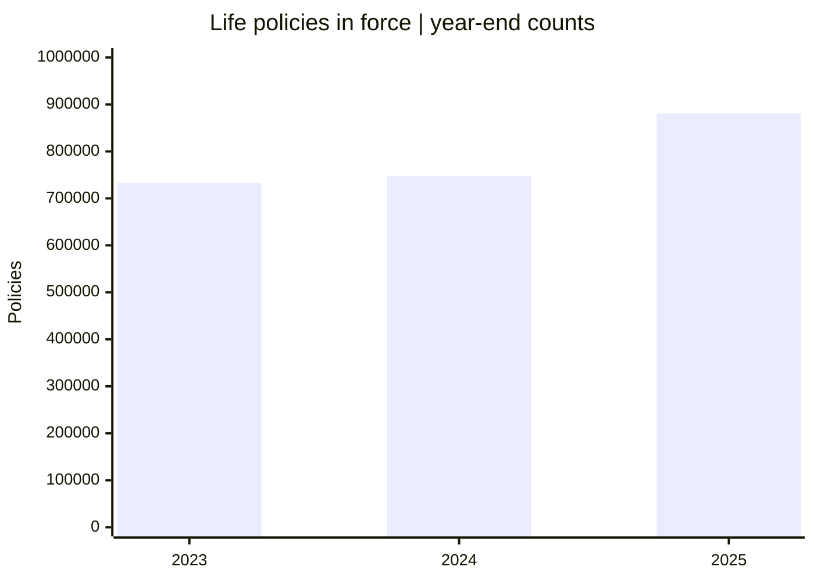

Softlogic Life **2025 වාර්ෂික වාර්තාව:** ක්‍රියාත්මක policies **880,706** (2024 **748,101**, 2023 **733,002**) සහ customer retention **88.7%** (2024 **85.4%**). සමාගම 2025 පිළිබඳ ප්‍රකාශනයෙන් **මිලියන 1.3ක ජනතාව ආවරණය** සහ **LKR 19.4bn claims/benefits** ගෙවූ බව සඳහන් වේ. Chart-හි අගය **policies** පමණි, SCAP සමූහයේ වෙනම පුද්ගලයන් ගණන නොවේ.

**මූලාශ්‍ර / කාලය:** [මූලාශ්‍රය 1](https://softlogiclife.lk/wp-content/uploads/sites/3/2026/04/Softlogic-Life-Integrated-Annual-Report-2025-3.pdf) · [මූලාශ්‍රය 2](https://softlogiclife.lk/news/softlogic-life-surpasses-rs-40-bn-gwp-in-fy25-doubles-key-financial-metrics-over-four-years/).

## 10 · සේවා බෙදාහැරීමේ මාර්ග

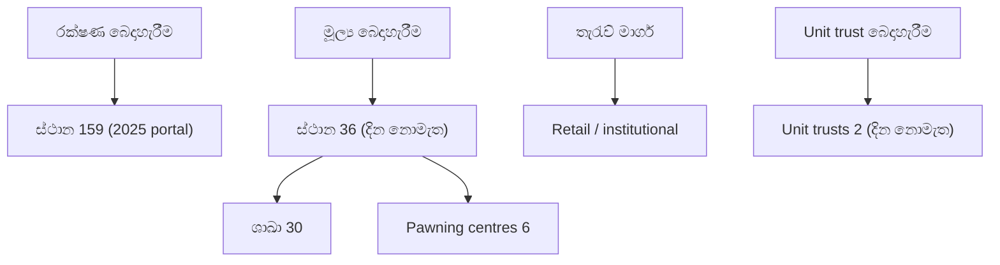

Softlogic Life **2025 annual-report portal** **මෙහෙයුම් ස්ථාන 159ක්** දක්වයි. SCAP-න් **දින රහිත වෙබ් පිටුව** Finance සඳහා **ස්ථාන 36ක් (ශාඛා 30ක් + pawning centres 6ක්)** දක්වයි. **එකම දිනයේ සසඳන දත්ත නොවේ.** Brokerage retail/institutional/high-net-worth කාණ්ඩ සලකයි; asset-management පිටුව unit trusts **දෙකක්** සඳහන් කරයි; අද අගය තහවුරු නැත.

**මූලාශ්‍ර / කාලය:** [මූලාශ්‍රය 1](https://annualreport.softlogiclife.lk/) · [මූලාශ්‍රය 2](https://softlogiccapital.lk/subsidiaries/).

## 11 · කර්මාන්තයේ වෙළෙඳපොළ තත්ත්වය

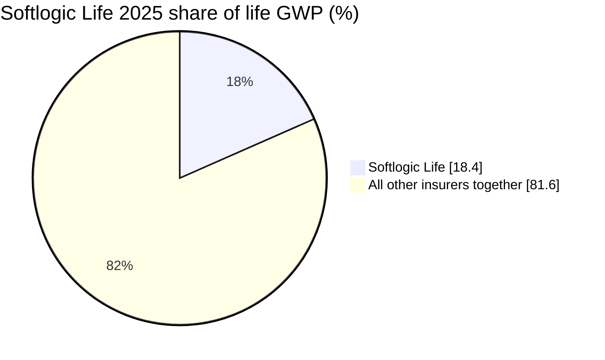

Softlogic Life-න් calendar 2025 රක්ෂණ **GWP වෙළෙඳපොළ කොටස 18.4%** ලෙස සමාගම ප්‍රකාශ කරයි. ඉතිරි **81.6%** යනු අනෙකුත් සියලු රක්ෂණකරුවන්ගේ ගණිතමය එකතුවකි; **එක් තරඟකරුවකු නොවේ**. පුවත් වාර්තාවක් 2026 Q2 හි **20.3%** සඳහන් කළද එය **ද්විතීයික** සහ වෙනත් කාලයකි; මුල් regulator/insurer ගොනුව අවශ්‍යයි. SCAP සමස්ත මූල්‍ය සේවාවලට මෙම market share නොගැළපේ.

**මූලාශ්‍ර / කාලය:** [මූලාශ්‍රය 1](https://softlogiclife.lk/news/softlogic-life-surpasses-rs-40-bn-gwp-in-fy25-doubles-key-financial-metrics-over-four-years/) · [මූලාශ්‍රය 2](https://www.dailymirror.lk/business-news/Softlogic-Life-delivers-Rs-7-2bn-GWP/273-348142).

## 12 · තරඟකාරී වාසි: සාක්ෂි පරීක්ෂාව

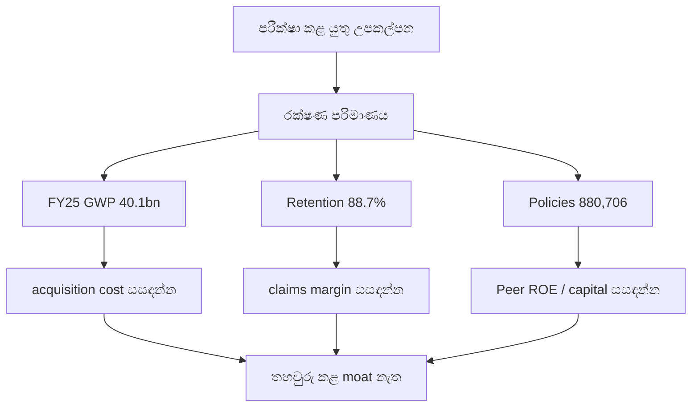

පරීක්ෂා කළ යුතු වාසි උපකල්පන: Life FY2025 **GWP LKR 40.1bn (+27%)**, **retention 88.7%**, **policies 880,706**. මේවා පාරිභෝගික සේවා සහ distribution පිළිබඳ සාක්ෂි සොයාගැනීමට උපකාරී වේ; **දිගුකාලීන moat එකක් සනාථ නොකරයි**. acquisition cost, claim margins, peer ROE, solvency එකම කාලයේ සසඳන්න.

**මූලාශ්‍ර / කාලය:** [මූලාශ්‍රය 1](https://softlogiclife.lk/wp-content/uploads/sites/3/2026/04/Softlogic-Life-Integrated-Annual-Report-2025-3.pdf) · [මූලාශ්‍රය 2](https://softlogiclife.lk/news/softlogic-life-surpasses-rs-40-bn-gwp-in-fy25-doubles-key-financial-metrics-over-four-years/).

## 13 · සම්බන්ධිත පාර්ශ්ව මුදල් ගනුදෙනු

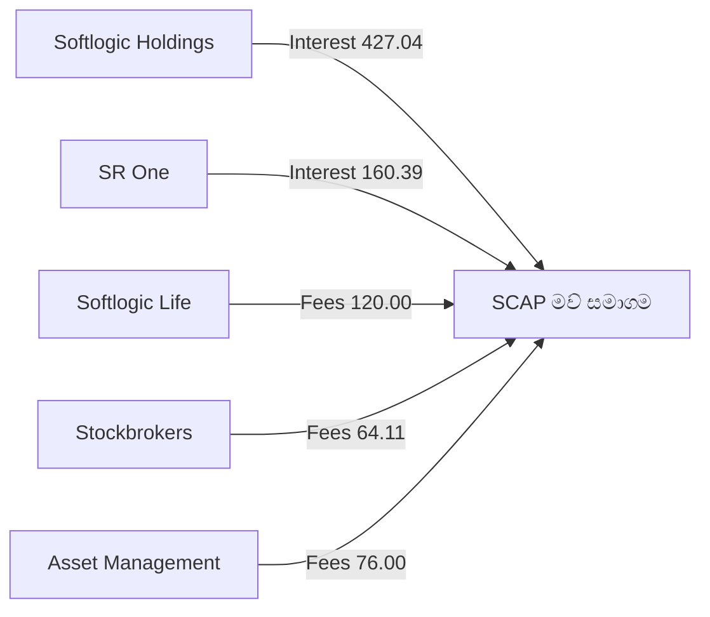

SCAP **තනි related-party FY2026 සටහනේ**, **LKR මිලියන**: Softlogic Holdings වෙතින් පොලී **427.04**, SR One වෙතින් **160.39**, Life වෙතින් consultancy fees **120.00**, Stockbrokers **64.11**, Asset Management **76.00**. මේවා **මව් ගිණුමේ සමූහ අභ්‍යන්තර ආදායම්**, consolidated external revenue ලෙස නැවත එකතු නොකරන්න; මුදල් සැබැවින් ලැබුණු බවටද සමාන නොවේ.

**මූලාශ්‍ර / කාලය:** [මූලාශ්‍රය 1](https://cdn.cse.lk/cmt/upload_report_file/1100_1779968696398.pdf).

## 14 · නියාමන බැඳීම් සිතියම

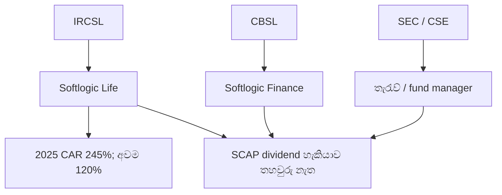

රක්ෂණ ආයතනය **IRCSL**, මූල්‍ය ආයතනය **CBSL**, තැරැව් හා කළමනාකරණය අදාළ පරිදි **SEC/CSE** යටතේය. Life-න් **2025 CAR 245%**, තමන් සඳහන් කළ **අවම 120%** සමඟ ප්‍රකාශ කරයි. මෙය insurer-only අගයකි; මව් SCAP වෙත බෙදිය හැකි මුදල් නොවේ. **2026-03-31 restricted insurer reserve LKR 1,515.80mn** මුදාහැරීමේ නියම වෙනම පරීක්ෂා කළ යුතුය.

**මූලාශ්‍ර / කාලය:** [මූලාශ්‍රය 1](https://cdn.cse.lk/cmt/upload_report_file/1100_1779968696398.pdf) · [මූලාශ්‍රය 2](https://softlogiclife.lk/news/softlogic-life-surpasses-rs-40-bn-gwp-in-fy25-doubles-key-financial-metrics-over-four-years/) · [මූලාශ්‍රය 3](https://ircsl.gov.lk/) · [මූලාශ්‍රය 4](https://www.cbsl.gov.lk/) · [මූලාශ්‍රය 5](https://www.sec.gov.lk/).

## 15 · අවස්ථා සහ සීමාවන්

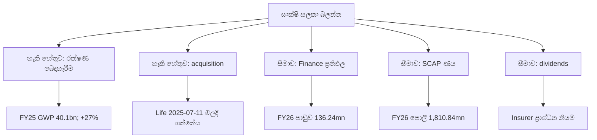

සාක්ෂි ඇති හැකි වර්ධන සාධක: Life FY2025 **GWP 40.1bn (+27%)**, බෙදාහැරීම සහ රක්ෂණ අත්පත් කරගැනීම. සීමා: FY2026 finance අංශ **136.24mn පාඩුව**, SCAP තනි පොලී **1,810.84mn**, මව් ණය **17,324.26mn**, insurer මුදල් බෙදාහැරීමේ සීමා. **වෙනස් කාලවල අගයන් මත අනාවැකියක් හෝ ශ්‍රේණිගත කිරීමක් මෙහි නැත.**

**මූලාශ්‍ර / කාලය:** [මූලාශ්‍රය 1](https://cdn.cse.lk/cmt/upload_report_file/1100_1779968696398.pdf) · [මූලාශ්‍රය 2](https://softlogiclife.lk/news/softlogic-life-surpasses-rs-40-bn-gwp-in-fy25-doubles-key-financial-metrics-over-four-years/).

## 16 · SWOT — සාක්ෂි සහිත කාණ්ඩ හතර

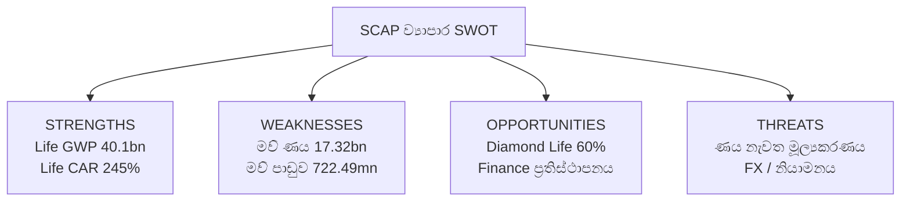

**දින සහිත දත්ත:** Life FY2025 GWP **LKR 40.1bn**, CAR **245%**; SCAP මව් FY2026 අතුරු ණය **LKR 17,324.26mn**, පාඩුව **LKR 722.49mn**; Bangladesh රක්ෂණ සමාගමේ **60%** ජූලි 2026 අත්පත් කරගැනීම. **මේවා වෙනස් ව්‍යාපාර හා කාලවල අගයන්ය.**

SWOT කාණ්ඩ හතර, මූලාශ්‍ර සහිත නිරීක්ෂණ 12 සහ තව පරීක්ෂණ සඳහා බලන්න: **[SWOT විශ්ලේෂණය](SWOT-ANALYSIS.md)**. [Softlogic Life 2025 issuer release](https://softlogiclife.lk/news/softlogic-life-surpasses-rs-40-bn-gwp-in-fy25-doubles-key-financial-metrics-over-four-years/) · [Finance July 2026 update](https://softlogicfinance.lk/news/building-a-stronger-more-resilient-softlogic-finance/) · [Diamond Life overview](https://diamondlifebd.com/overview/) · [SCAP interim March 2026](https://cdn.cse.lk/cmt/upload_report_file/1100_1779968696398.pdf).

> **අගයන්ගේ සීමාව:** Life GWP/CAR සහ Finance capital යනු අනුබද්ධ ආයතන මිනුම්ය. ඒවා SCAP ඒකාබද්ධ ආදායම හෝ මව් බැංකු මුදල් නොවේ.

## 📚 මූලාශ්‍ර සහ සීමාවන්

**SCAP original March 2026 CSE interim (FY2026 subject to audit):** [PDF](https://cdn.cse.lk/cmt/upload_report_file/1100_1779968696398.pdf) · company filing previously reviewed for pp. 2–3, 6, 10–11, 13, 15–17, 19.

**SCAP business pages:** [Overview](https://softlogiccapital.lk/about-us-overview/) · [Subsidiaries](https://softlogiccapital.lk/subsidiaries/); website figures may be undated.

**Softlogic Life 2025:** [Issuer news](https://softlogiclife.lk/news/softlogic-life-surpasses-rs-40-bn-gwp-in-fy25-doubles-key-financial-metrics-over-four-years/) · [Annual report](https://softlogiclife.lk/wp-content/uploads/sites/3/2026/04/Softlogic-Life-Integrated-Annual-Report-2025-3.pdf) · [Annual-report portal](https://annualreport.softlogiclife.lk/); reporting year ends December.

**Market-share update (secondary):** [Q2 2026 news](https://www.dailymirror.lk/business-news/Softlogic-Life-delivers-Rs-7-2bn-GWP/273-348142); not substituted for FY2025 share.

**Other segment cross-check:** [StockAnalysis](https://stockanalysis.com/quote/cose/SCAP.N0000/financials/); exact 2,759.84 remains derived/reconciliation pending original line verification.

**Supervisors:** [IRCSL](https://ircsl.gov.lk/), [CBSL](https://www.cbsl.gov.lk/), [SEC](https://www.sec.gov.lk/) and [CSE](https://www.cse.lk/).

මේවා අතීත අගයන්ය. නවතම විගණිත වාර්ෂික හා අතුරු වාර්තා සමඟ සසඳා පමණක් තීරණවලට භාවිත කරන්න.
