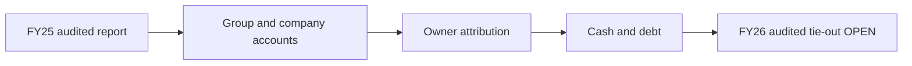

# 02 · මූල්‍ය ප්‍රකාශන විශ්ලේෂණය

**[📊 මූල්‍ය දෘශ්‍ය සටහන් 12](VISUAL-REPORT.md)**

[← මූලික විශ්ලේෂණය](../README.md) · [English](../../../01-Fundamental-Analysis/02-Financial-Statements/README.md) · [தமிழ்](../../../ta/01-Fundamental-Analysis/02-Financial-Statements/README.md) · [සිංහල](README.md)

> **Softlogic Capital PLC · CSE SCAP.N0000.** **පර්යේෂණ තත්ත්වය · 2026-09-30.** SCAP **FY2025 විගණිත** ප්‍රකාශන හා **FY2026 වර්ෂ අවසන් අතුරු** ගිණුම් වෙන වෙනම සලකා බලයි. FY2024 යනු FY2025 විගණිත වාර්තාවේ සංසන්දන වර්ෂයයි. **LKR මිලියන.** Group යනු ඒකාබද්ධ අනුබද්ධ ආයතන ඇතුළත් ගිණුම්ය; Company යනු ලැයිස්තුගත SCAP තනි සමාගමයි.
>
> **අවසන් විගණන සීමාව:** SCAP FY2026 අවසන් වාර්ෂික වාර්තාව අන්තර්ජාල ලැයිස්තුවක පවතින නමුත් එහි මුල් audited ගිණුම් හා අත්සන් කළ auditor opinion මෙහි සම්පූර්ණයෙන් ගළපා නැත. **2026 ජූනි 30 SCAP මුල් අතුරු වාර්තාවද තවමත් අවශ්‍යයි.** 2026 මැයි 27 අතුරු අගයන් **විගණනයට යටත්වේ**; ඒවා audited බව නොකියන්න. FY2025 විගණන මතය 2025 දෙසැම්බර් 1 දින අත්සන් කර ඇත.

## 🎯 ප්‍රධාන පර්යේෂණ ප්‍රශ්නය

2025 විගණිත මූල්‍ය තත්ත්වය සහ 2026 අතුරු ප්‍රතිඵල SCAP ව්‍යාපාරය—විශේෂයෙන් සාමාන්‍ය කොටස් හිමියන්ට අයත් වටිනාකම—පැහැදිලි කරන්නේ කෙසේද?

## 🔍 සාක්ෂි පදනම් වූ නිරීක්ෂණ

- **FY2025 audited Group:** total operating income **42,383.72**, Group PAT **+1,694.15**; නමුත් **SCAP හිමියන්ට අයත් PAT −280.42**, minority PAT **+1,974.57**. **[A පි.63]**
- **FY2026 වර්ෂ අවසන් අතුරු:** Group income **51,310.49**, PAT **+3,371.26**, SCAP හිමියන්ට **+973.77**, minority **+2,397.49**. **[I පි.2]**
- **FY2025 විගණිත මව් මුදල් ප්‍රවාහය:** SCAP තනි operating CFO **−4,605.10**, Group CFO **+427.54**. **[A පි.70]** පෙර සටහන් කළ FY2026 interim group CFO **−851.24**, secondary provider සමඟ ගැළපේ; මේ වාරයේ මුල් PDF පි.9 නැවත විවෘත කළ නොහැකි විය. **[I; B]**
- **SCAP තනි ණය:** 2025-03-31 audited **14,797.33**, 2026-03-31 interim **17,324.26**; cash/bank **27.89** සහ **32.07**; overdraft වෙනම. **[A පි.65–66; I පි.6]**
- **SCAP owners equity ඍණ:** FY2025 **−2,440.85**, FY2026 interim **−1,035.49**; minority equity ඇති නිසා මුළු Group equity **ධන** වේ. **[A පි.65; I පි.6]**

## 🧭 FY2025 විගණන මතය

Ernst & Young **2025-12-01** විගණන වාර්තාව FY2025 Group සහ Company සඳහා **වෙනස් නොකළ true-and-fair-view opinion** ලබා දෙයි. key audit matter කාණ්ඩ හතර: (1) insurance liabilities, (2) **IT reporting controls**, (3) expected credit losses, (4) interest-bearing borrowing. **Key audit matter එකක් modified audit opinion එකක් හෝ වැරැද්දකට සාක්ෂියක් නොවේ.** Going-concern උපකල්පන notes හි ඇත; FY2025 opinion එකෙන් FY2026 අගයන් සහතික නොවේ.

## 📊 ආදායම්: සමූහය vs හිමිකරුවන් vs මව් සමාගම

| මූල්‍ය මිනුම | FY24 audited | FY25 audited | FY26 අතුරු | මූලාශ්‍රය |
|---|---:|---:|---:|---|
| සමූහ total operating income | 36,729.68 | 42,383.72 | 51,310.49 | A63 / I2 |
| සමූහ PAT | −4,183.45 | +1,694.15 | +3,371.26 | A63 / I2 |
| SCAP හිමියන්ගේ PAT | −5,565.30 | −280.42 | +973.77 | A63 / I2 |
| Minority PAT | +1,381.85 | +1,974.57 | +2,397.49 | A63 / I2 |
| SCAP මව් total operating income | 1,933.06 | 4,093.98 | 1,485.72 | A63 / I3 |
| SCAP මව් PAT | −4,738.28 | +1,339.80 | −722.49 | A63 / I3 |
| SCAP මව් dividend income | 618.20 | 3,273.55 | 635.18 | A63 / I3 |
| SCAP මව් පොලී වියදම | 2,472.51 | 1,833.56 | 1,810.84 | A63 / I3 |

Group ගිණුම්වල පාලනය ඇති අනුබද්ධ ආයතනවල සම්පූර්ණ ආදායම් හා වත්කම් පෙන්විය හැක. එය SCAP සතුව 100% අයිතිය ඇතැයි අදහස් නොවේ. **Minority interests** වෙන්කර පමණක් SCAP හිමියන්ගේ ලාභ/equity ගැන සලකන්න. Insurer **GWP යනු Group total operating income නොවේ**; deposits ආදායම නොව වගකීම්ය.

## 🏦 ශේෂ පත්‍රය: equity අයත් කාටද?

| මූල්‍ය මිනුම | FY24 audited | FY25 audited | FY26 අතුරු | මූලාශ්‍රය |
|---|---:|---:|---:|---|
| සමූහ මුළු වත්කම් | 65,782.36 | 68,619.73 | OPEN | A65; FY26 original final not checked |
| සමූහ මුළු equity | +3,776.63 | +2,856.63 | +6,269.84 | A65 / I6 |
| සමූහ SCAP owners' equity | −2,644.47 | −2,440.85 | −1,035.49 | A65 / I6 |
| සමූහ minority equity | +6,421.10 | +5,297.48 | +7,305.34 | A65 / I6 |
| SCAP මව් තනි equity | +5,577.91 | +5,373.24 | +4,848.03 | A65 / I6 |
| SCAP මව් පොලී සහිත ණය | 13,828.16 | 14,797.33 | 17,324.26 | A66 / I6 |
| SCAP මව් cash/bank | 61.80 | 27.89 | 32.07 | A65 / I6 |
| SCAP මව් overdraft | 328.60 | 323.78 | 323.13 | A66 / I6 |
| සමූහ insurance liabilities | 27,759.13 | 33,671.06 | OPEN | A66; FY26 original final not checked |
| සමූහ public deposits | 7,481.72 | 4,273.39 | OPEN | A66; FY26 original final not checked |

2025-03-31 audited Group **assets 68,619.73** = **liabilities 65,763.10** + **total equity 2,856.63** (rounding). Total equity ඇතුළත **SCAP owners −2,440.85** + **minority +5,297.48** = **+2,856.63**. SCAP තනි equity **+5,373.24** යනු **වෙනත් විෂය පථයක අගයකි**; එය group NAV ලෙස භාවිත නොකරන්න. FY2026 අතුරුද එසේය.

## 💸 මුදල් ප්‍රවාහය: ගිණුම් ලාභය = cash නොවේ

| මූල්‍ය මිනුම | FY24 audited | FY25 audited | FY26 අතුරු | මූලාශ්‍රය |
|---|---:|---:|---:|---|
| සමූහ operating cash flow | +4,006.00 | +427.54 | −851.24 | A70 / I9 and B |
| SCAP මව් operating cash flow | −1,533.19 | −4,605.10 | OPEN | A70; FY26 company CFO not verified |
| SCAP මව් ලැබුණු dividend cash | 618.20 | 3,273.55 | OPEN | A70; FY26 receipts not checked |
| SCAP මව් සැබැවින් ගෙවූ පොලී | −1,948.80 | −2,549.88 | OPEN | A70; FY26 interest paid not checked |

FY2025 audited SCAP තනි CFO **−4,605.10**, Group CFO **+427.54**. Standalone SCAP investing activities හි ලැබුණු **dividend cash +3,273.55**; සැබැවින් **ගෙවූ පොලී −2,549.88**; income-statement **interest expense 1,833.56** යි. Cash interest paid සහ accrual interest expense වෙනස්ය. SCAP වෙත ලැබුණු dividends යනු SCAP ordinary shareholders ට ගෙවූ dividends නොවේ. **FY2026 parent CFO OPEN.**

## ⚠️ ගිණුම් සහ දත්ත සීමා

- **FY2026 audited තත්ත්වය:** 2026 මැයි 27 interim අගයන් 'subject to audit'; අවසන් annual report අත්සන් කළ මතය සමඟ තවමත් සසඳා නැත.
- **දත්ත අර්ථකථන වෙනස:** FY2025 මුල් total operating income **42,383.72**, aggregator normalized revenue **39,794**; වෙනස හඳුනාගත යුතුයි.
- **නියාමන වගකීම්:** FY2025 insurance contract liabilities **33,671.06** සහ public deposits **4,273.39** යනු Group liabilities; parent income නොවේ; equity වලින් දෙවරක් අඩු නොකරන්න.
- **Fair value / impairments:** FY2025 parent investment in subsidiaries **17,850.10**, ECL උපකල්පන සහ 2026 මැයි fair-value සටහන් අවසන් audited දත්ත සමඟ පරීක්ෂා කරන්න.

## 📝 පුරවා ඇති සාක්ෂි වගුව

| පරීක්ෂා කළ කරුණ | විගණන තත්ත්වය | මුල් මූලාශ්‍රය + පිටුව |
|---|---|---|
| FY2025 audit true-and-fair-view opinion | **AUDITED** | [SCAP original FY25 report pp.59–61](https://cdn.cse.lk/cmt/upload_report_file/1100_1764673838964.03.2025%20-%20Annual%20Report.pdf) |
| FY2025 group income and owner/minority PAT | **AUDITED** | [SCAP p.63](https://cdn.cse.lk/cmt/upload_report_file/1100_1764673838964.03.2025%20-%20Annual%20Report.pdf) |
| FY2025 Group / parent assets, liabilities, owner equity | **AUDITED** | [SCAP pp.65–66](https://cdn.cse.lk/cmt/upload_report_file/1100_1764673838964.03.2025%20-%20Annual%20Report.pdf) |
| FY2025 Group CFO and parent CFO | **AUDITED** | [SCAP pp.69–70](https://cdn.cse.lk/cmt/upload_report_file/1100_1764673838964.03.2025%20-%20Annual%20Report.pdf) |
| FY2026 PAT and owners' profit | **INTERIM, SUBJECT TO AUDIT** | [SCAP CSE FY26 interim p.2](https://cdn.cse.lk/cmt/upload_report_file/1100_1779968696398.pdf) |
| FY2026 parent interest-bearing debt and cash/bank | **INTERIM, SUBJECT TO AUDIT** | [SCAP CSE FY26 interim p.6](https://cdn.cse.lk/cmt/upload_report_file/1100_1779968696398.pdf) |
| FY2026 Group CFO −851.24 | **INTERIM + SECONDARY CROSS-CHECK** | [SCAP original p.9](https://cdn.cse.lk/cmt/upload_report_file/1100_1779968696398.pdf) · [secondary data](https://stockanalysis.com/quote/cose/SCAP.N0000/financials/cash-flow-statement/) |
| FY2026 final signed audit opinion and restatements | **OPEN** | [2026 report catalogue](https://nanayojana.com/company/SCAP.N0000?document_type=annual_report&year=2026); original audited content not independently tied out |
| 30 June 2026 SCAP original quarter | **OPEN** | [Secondary news](https://www.marketscreener.com/news/softlogic-capital-plc-reports-earnings-results-for-the-first-quarter-ended-june-30-2026-ce7859dfd88af521); original SCAP quarterly document not tied out |

## ✅ ඊළඟ සත්‍යාපන කාර්යයන්

- [ ] SCAP **FY2025/26 අවසන් audited annual report** මුල් PDF සහ අත්සන් කළ audit opinion සමඟ ගළපා FY2026 අගයන් නැවත පරීක්ෂා කරන්න.
- [ ] **2026 ජූනි 30 SCAP මුල් අතුරු ගොනුව** ලබා පසුව සිදුවීම් පරීක්ෂා කරන්න.
- [ ] FY2026 SCAP standalone CFO, **සැබැවින් ලැබුණු dividend**, ගෙවූ පොලී, ණය කල්පිරීම්, ඇප සහ guarantees සොයන්න.
- [ ] Finance තැන්පතු, insurance liabilities, ECL stages හා නියාමන capital group accounts සමඟ ගළපන්න.
- [ ] P/B, EPS හා sum-of-parts පෙර audited SCAP owners' equity සහ share count තහවුරු කරන්න.

## 📚 මුල් මූලාශ්‍ර හා සීමා

- **A — FY2025 primary audited:** [Original 186-page SCAP 2024/25 Annual Report](https://cdn.cse.lk/cmt/upload_report_file/1100_1764673838964.03.2025%20-%20Annual%20Report.pdf), auditor pp.59–61, income p.63, balance pp.65–66, CFO pp.69–70. Signed **1 December 2025**; PDF source text inspected; PDF-page-image screenshot service failed in this session.
- **I — FY2026 year-end interim:** [SCAP 27 May 2026 original CSE filing](https://cdn.cse.lk/cmt/upload_report_file/1100_1779968696398.pdf), **subject to audit**; values carried from the prior repository research pass, original PDF was **not** re-opened successfully this time.
- **B — secondary FY26 CFO cross-check:** [StockAnalysis cash flow](https://stockanalysis.com/quote/cose/SCAP.N0000/financials/cash-flow-statement/); a different normalized income definition appears on that provider.
- **N/Q — report existence, not reconciled numbers:** [SCAP FY2026 annual-report catalogue](https://nanayojana.com/company/SCAP.N0000?document_type=annual_report&year=2026) · [June 2026 results secondary news](https://www.marketscreener.com/news/softlogic-capital-plc-reports-earnings-results-for-the-first-quarter-ended-june-30-2026-ce7859dfd88af521).

[පෙර මූල්‍ය සංක්ෂිප්තය](../../../si/06-financial-snapshot.md) · [මූලාශ්‍ර ලැයිස්තුව](../../../si/SOURCES.md) · [මූල්‍ය දෘශ්‍ය සටහන් 12](VISUAL-REPORT.md) · [CSE](https://www.cse.lk/)

**ක්‍රමය:** OPEN පේළි සඳහා අනුමාන කළ සංඛ්‍යා ඇතුළත් කර නැත. Unmodified audit opinion අනාගත liquidity හෝ ලාභය සහතික නොකරයි. මෙය මූල්‍ය ප්‍රකාශන පර්යේෂණයකි; වත්මන් මිලදී/විකිණීමේ නිර්දේශයක් නොවේ.
