# 📊 SCAP මූල්‍ය ප්‍රකාශන — මූලාශ්‍ර සහිත Mermaid දෘශ්‍ය 12ක්

[← මූල්‍ය ප්‍රකාශන විශ්ලේෂණය](README.md) · [English](../../../01-Fundamental-Analysis/02-Financial-Statements/VISUAL-REPORT.md) · [தமிழ்](../../../ta/01-Fundamental-Analysis/02-Financial-Statements/VISUAL-REPORT.md) · [සිංහල](VISUAL-REPORT.md)

> **පරීක්ෂා කළ දිනය 2026-09-30.** FY2024/FY2025 අගයන් SCAP මුල් **FY2025 විගණිත** වාර්තාවෙන්; FY2026 අගයන් **2026 මැයි 27 අතුරු** වාර්තාවෙන් වන අතර **විගණනයට යටත්ය**. අවසන් FY2026 audited වාර්තාව සහ 2026 ජූනි SCAP අතුරු වාර්තාව මුල් ලේඛන සමඟ සම්පූර්ණයෙන් ගළපා නැත. **LKR මිලියන.** වත්මන් කොටස් වටිනාකමක් නොවේ.

## 01 · මූලාශ්‍ර සහ විගණන තත්ත්වය

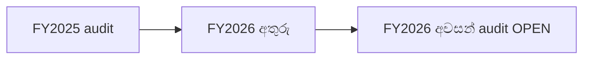

FY2025 මුල් වාර්තාවේ EY **වෙනස් නොකළ auditor opinion** (PDF පි.59). FY2026 අතුරු **subject to audit** බව සඳහන් කරයි; අවසන් වාර්තාවේ auditor opinion නොගළපා එය audited ලෙස සලකන්න එපා.

**Source / status:** [SCAP FY2025 audited report pp. 59–61](https://cdn.cse.lk/cmt/upload_report_file/1100_1764673838964.03.2025%20-%20Annual%20Report.pdf). **FY26* means FY2026 27 May 2026 interim, subject to audit.**

## 02 · සමූහ මුළු මෙහෙයුම් ආදායම

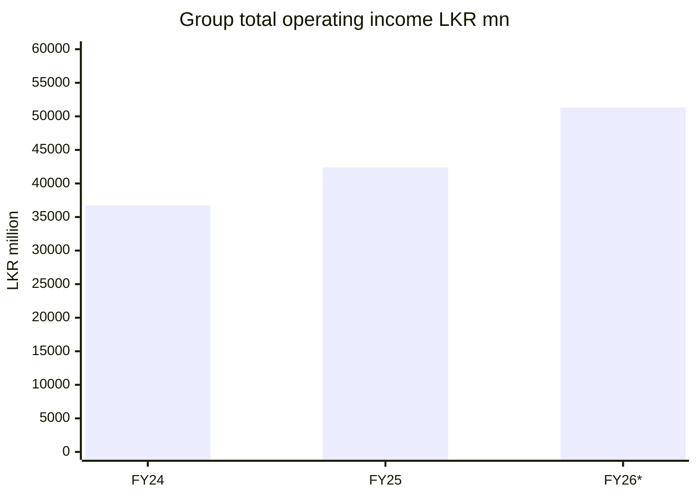

FY2024/2025 audited Group **total operating income** **36,729.68m / 42,383.72m** (වාර්තාව පි.63), FY2026 අතුරු **51,310.49m**. 2025 තෙවන පාර්ශ්ව normalized revenue **39,794m** වෙනස්ය; මෙහි issuer total operating income භාවිත කරයි.

**Source / status:** [SCAP FY2025 audited report](https://cdn.cse.lk/cmt/upload_report_file/1100_1764673838964.03.2025%20-%20Annual%20Report.pdf) · [FY2026 year-end interim](https://cdn.cse.lk/cmt/upload_report_file/1100_1779968696398.pdf). **FY26* means FY2026 27 May 2026 interim, subject to audit.**

## 03 · සමූහ බදු පසු ලාභය

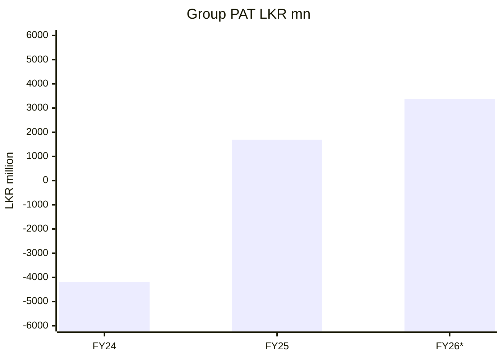

Group PAT FY2024/25/26: **−4,183.45m / +1,694.15m / +3,371.26m**. තෙවන අගය අතුරු වාර්තාවේය. Minority හිමිකම්වලට බෙදීමට පෙර සමූහ ලාභය මෙයයි.

**Source / status:** [SCAP FY2025 audited report](https://cdn.cse.lk/cmt/upload_report_file/1100_1764673838964.03.2025%20-%20Annual%20Report.pdf) · [FY2026 year-end interim](https://cdn.cse.lk/cmt/upload_report_file/1100_1779968696398.pdf). **FY26* means FY2026 27 May 2026 interim, subject to audit.**

## 04 · SCAP හිමියන්ට අයත් ලාභය

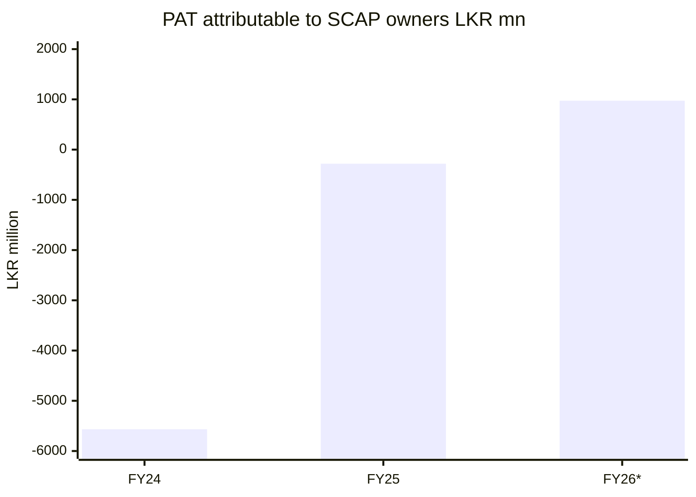

SCAP සාමාන්‍ය හිමියන්ට අයත් PAT: **−5,565.30m / −280.42m / +973.77m**. Group PAT සියල්ල SCAP හිමිකරුවන්ට නොවේ.

**Source / status:** [SCAP FY2025 audited report](https://cdn.cse.lk/cmt/upload_report_file/1100_1764673838964.03.2025%20-%20Annual%20Report.pdf) · [FY2026 year-end interim](https://cdn.cse.lk/cmt/upload_report_file/1100_1779968696398.pdf). **FY26* means FY2026 27 May 2026 interim, subject to audit.**

## 05 · FY2026 ලාභ අයිතියේ කොටස්

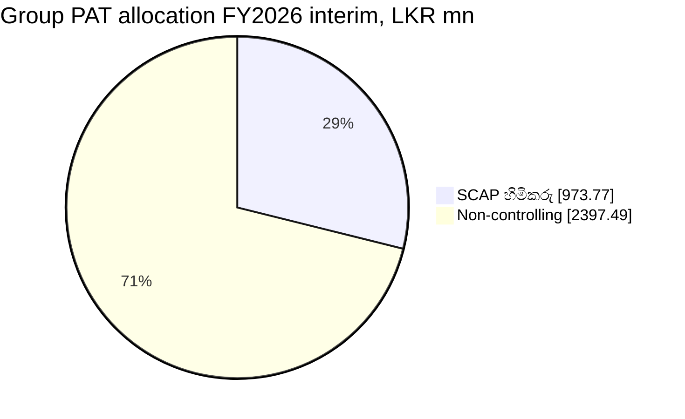

FY2026 interim Group PAT **3,371.26m** = SCAP හිමිකරුවන් **973.77m** + minority **2,397.49m**. 28.9%/71.1% යනු **ගිණුම් හිමිකාරීත්වය, මුදල් dividend නොවේ**.

**Source / status:** [SCAP FY2025 audited report](https://cdn.cse.lk/cmt/upload_report_file/1100_1764673838964.03.2025%20-%20Annual%20Report.pdf) · [SCAP FY2026 interim](https://cdn.cse.lk/cmt/upload_report_file/1100_1779968696398.pdf). **FY26* means FY2026 27 May 2026 interim, subject to audit.**

## 06 · FY2025 සමූහ equity සංසන්දනය

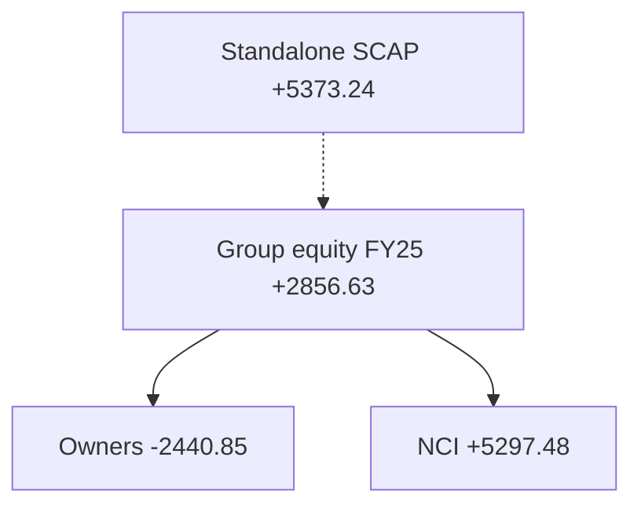

**2025-03-31** Group equity **+2,856.63m** = SCAP හිමිකරුවන් **−2,440.85m** + minority **+5,297.48m**. එදින මව් තනි equity **+5,373.24m**, වෙනත් ගිණුම් පදනමකි.

**Source / status:** [SCAP FY2025 audited report](https://cdn.cse.lk/cmt/upload_report_file/1100_1764673838964.03.2025%20-%20Annual%20Report.pdf) · [FY2026 year-end interim](https://cdn.cse.lk/cmt/upload_report_file/1100_1779968696398.pdf). **FY26* means FY2026 27 May 2026 interim, subject to audit.**

## 07 · FY2026 සමූහ equity සංසන්දනය

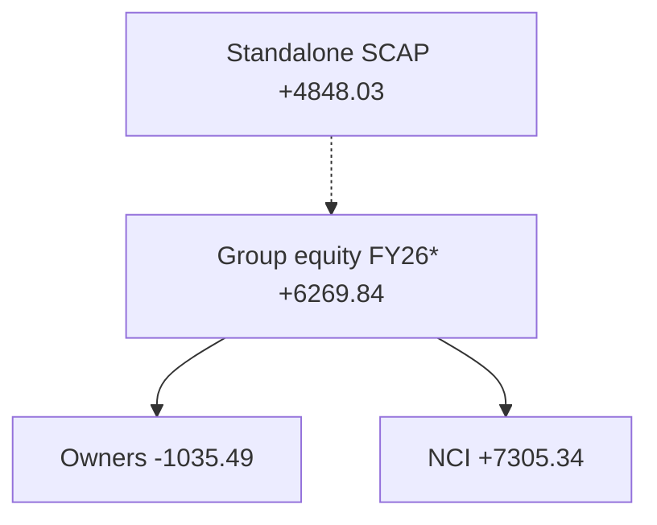

**2026-03-31 අතුරු:** Group equity **+6,269.84m** = SCAP හිමියන් **−1,035.49m** + minority **+7,305.34m** (rounding 0.01m). SCAP තනි equity **+4,848.03m**.

**Source / status:** [SCAP FY2025 audited report](https://cdn.cse.lk/cmt/upload_report_file/1100_1764673838964.03.2025%20-%20Annual%20Report.pdf) · [SCAP FY2026 interim](https://cdn.cse.lk/cmt/upload_report_file/1100_1779968696398.pdf). **FY26* means FY2026 27 May 2026 interim, subject to audit.**

## 08 · SCAP මව් තනි ලාභය

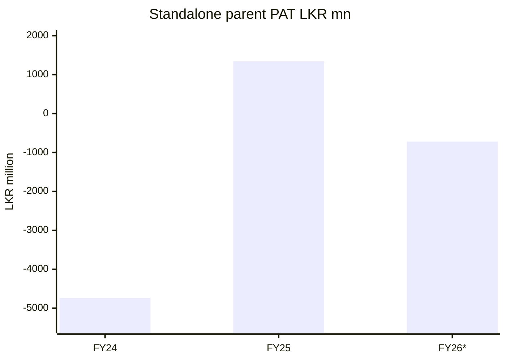

SCAP මව් තනි PAT FY2024/25/26: **−4,738.28m / +1,339.80m / −722.49m**; FY2026 අතුරුය. Dividend income/fair value අගයන් මෙයට බලපායි.

**Source / status:** [SCAP FY2025 audited report](https://cdn.cse.lk/cmt/upload_report_file/1100_1764673838964.03.2025%20-%20Annual%20Report.pdf) · [SCAP FY2026 interim](https://cdn.cse.lk/cmt/upload_report_file/1100_1779968696398.pdf). **FY26* means FY2026 27 May 2026 interim, subject to audit.**

## 09 · SCAP මව් පොලී සහිත ණය

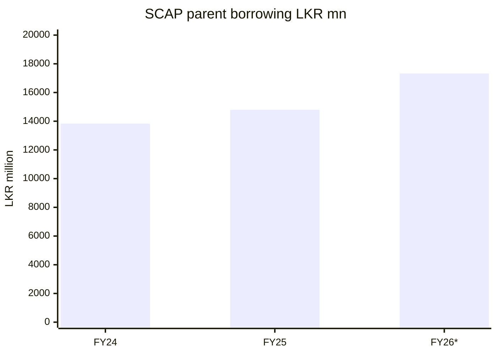

SCAP මව් interest-bearing borrowings **13,828.16m / 14,797.33m / 17,324.26m** as of **2024/25/26 මාර්තු 31**. Overdraft වෙනම FY2025 **323.78m**, FY2026 **323.13m**. කල්පිරීම් හා සැබෑ මුදල් බලන්න.

**Source / status:** [SCAP FY2025 audited report](https://cdn.cse.lk/cmt/upload_report_file/1100_1764673838964.03.2025%20-%20Annual%20Report.pdf) · [SCAP FY2026 interim](https://cdn.cse.lk/cmt/upload_report_file/1100_1779968696398.pdf). **FY26* means FY2026 27 May 2026 interim, subject to audit.**

## 10 · සමූහ මෙහෙයුම් මුදල් ප්‍රවාහය

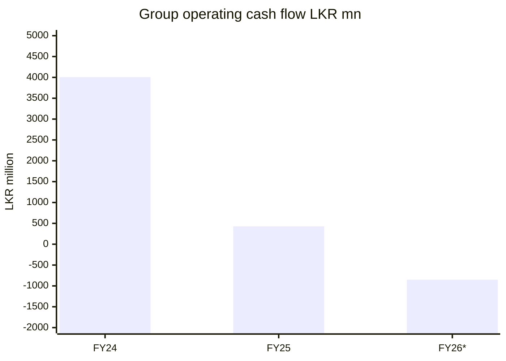

Group operating CFO FY2024/25/26 **+4,006.00m / +427.54m / −851.24m**; අවසන් අතුරු අගයට secondary cross-check ඇත. Deposit/loan/insurer assets/liabilities මුදල් ප්‍රවාහයට බලපායි; එය මව් සමාගමට free cash නොවේ.

**Source / status:** [SCAP FY2025 audited report](https://cdn.cse.lk/cmt/upload_report_file/1100_1764673838964.03.2025%20-%20Annual%20Report.pdf) · [FY2026 year-end interim](https://cdn.cse.lk/cmt/upload_report_file/1100_1779968696398.pdf) · [secondary CFO cross-check](https://stockanalysis.com/quote/cose/SCAP.N0000/financials/cash-flow-statement/). **FY26* means FY2026 27 May 2026 interim, subject to audit.**

## 11 · SCAP මව් මෙහෙයුම් මුදල් ප්‍රවාහය

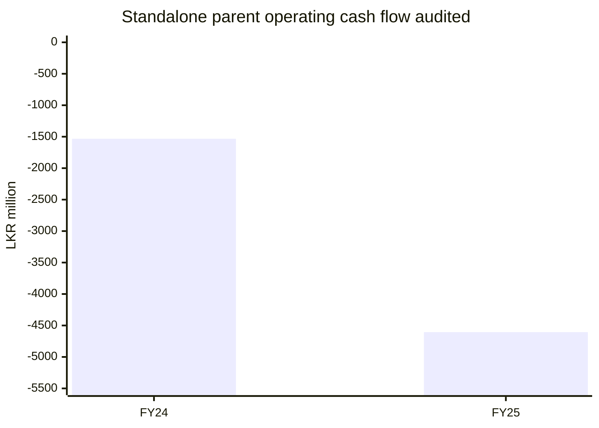

SCAP මව් operating CFO FY2024 **−1,533.19m**, FY2025 **−4,605.10m**, විගණිත පි.70. **FY2026 parent CFO තවම සත්‍යාපනය කර නැත**. FY2025 සැබැවින් ගෙවූ interest **−2,549.88m** vs income-statement interest **expense 1,833.56m**; වෙනස් මිනුම්ය.

**Source / status:** [SCAP FY2025 audited report pp. 69–70](https://cdn.cse.lk/cmt/upload_report_file/1100_1764673838964.03.2025%20-%20Annual%20Report.pdf). **FY26* means FY2026 27 May 2026 interim, subject to audit.**

## 12 · FY2025 සමූහ වගකීම් කාණ්ඩ

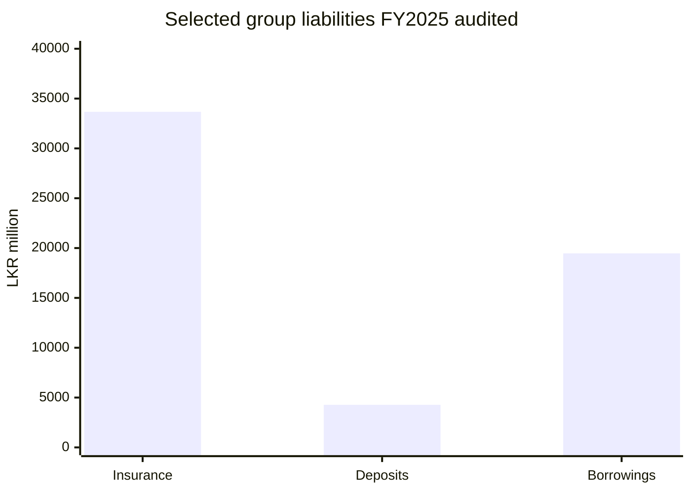

FY2025 audited තෝරාගත් Group liabilities: insurance contracts **33,671.06m**, public deposits **4,273.39m**, interest-bearing borrowing **19,467.97m**. **වෙනත් liabilities ඇතුළත් නැත**; මෙය සම්පූර්ණ liabilities pie නොවේ. Insurance, IT controls, ECL සහ borrowings audit හි අවධානයට ලක්විය.

**Source / status:** [SCAP FY2025 audited report pp. 65–66](https://cdn.cse.lk/cmt/upload_report_file/1100_1764673838964.03.2025%20-%20Annual%20Report.pdf). **FY26* means FY2026 27 May 2026 interim, subject to audit.**

## සීමා සහ සත්‍යාපනය

**ක්‍රමය:** දිනය, group/parent විෂය පථය හා audit තත්ත්වය සටහන් කරන්න. SCAP හිමියන්ට අයත් equity ඍණ වීම group total equity ඍණ බව නොවේ; සියලු liabilities සහ cash එකට මිශ්‍ර නොකරන්න.

- **A — audited:** [SCAP original FY2024/25 annual report, pp. 59–70](https://cdn.cse.lk/cmt/upload_report_file/1100_1764673838964.03.2025%20-%20Annual%20Report.pdf); EY opinion signed 1 December 2025.
- **I — interim:** [SCAP CSE year-ended 31 March 2026 interim filing](https://cdn.cse.lk/cmt/upload_report_file/1100_1779968696398.pdf); original link, research previously transcribed; FY2026 figures **subject to audit**. The PDF could not be reopened in this pass.
- **B — secondary cross-check only:** [StockAnalysis FY2026 cash flow](https://stockanalysis.com/quote/cose/SCAP.N0000/financials/cash-flow-statement/); does not replace SCAP original statement.
- **OPEN:** original SCAP FY2025/26 final audited statements, 30 June 2026 report, standalone FY2026 cash flow and any restatements must still be verified. **Softlogic Holdings PLC and Softlogic Finance PLC are different issuers.**
