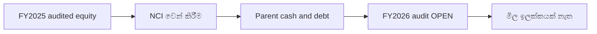

# SCAP තක්සේරුව — තහවුරු කළ දත්ත

**තත්ත්වය: PARTIAL · 2026-09-30.** මෙය කොටස් මිල ඉලක්කයක් නොවේ. FY2025 විගණිතය; FY2026 යනු 2026 මැයි 27 නිකුත් කළ **විගණනයට යටත් අතුරු ප්‍රකාශනයකි**. අගයන් **LKR මිලියන**.

| මිනුම | FY2025 audited | FY2026 interim | ගිණුම් විෂය පථය / මූලාශ්‍රය |
|---|---:|---:|---|
| SCAP හිමියන්ට අයත් සමූහ equity | −2,440.85 | −1,035.49 | Group owners; [FY25 පි.65](https://cdn.cse.lk/cmt/upload_report_file/1100_1764673838964.03.2025%20-%20Annual%20Report.pdf), [FY26 පි.6](https://cdn.cse.lk/cmt/upload_report_file/1100_1779968696398.pdf) |
| NCI ඇතුළත් සමූහ මුළු equity | +2,856.63 | +6,269.84 | Group total; එම පිටු |
| සුළුතර equity (NCI) | +5,297.48 | +7,305.34 | NCI; එම පිටු |
| SCAP මව් සමාගමේ equity | +5,373.24 | +4,848.03 | Parent-only; එම පිටු |
| මව් සමාගමේ පොලී සහිත ණය | 14,797.33 | 17,324.26 | [FY25 පි.66](https://cdn.cse.lk/cmt/upload_report_file/1100_1764673838964.03.2025%20-%20Annual%20Report.pdf), [FY26 පි.6](https://cdn.cse.lk/cmt/upload_report_file/1100_1779968696398.pdf) |
| මව් සමාගමේ cash/bank | 27.89 | 32.07 | [FY25 පි.65](https://cdn.cse.lk/cmt/upload_report_file/1100_1764673838964.03.2025%20-%20Annual%20Report.pdf), [FY26 පි.6](https://cdn.cse.lk/cmt/upload_report_file/1100_1779968696398.pdf) |
| මව් සමාගමේ overdraft | 323.78 | 323.13 | [FY25 පි.66](https://cdn.cse.lk/cmt/upload_report_file/1100_1764673838964.03.2025%20-%20Annual%20Report.pdf), [FY26 පි.6](https://cdn.cse.lk/cmt/upload_report_file/1100_1779968696398.pdf) |
| SCAP හිමියන්ට අයත් සමූහ ලාභය | −280.42 | +973.77 | [FY25 පි.63](https://cdn.cse.lk/cmt/upload_report_file/1100_1764673838964.03.2025%20-%20Annual%20Report.pdf), [FY26 පි.2](https://cdn.cse.lk/cmt/upload_report_file/1100_1779968696398.pdf) |
| NCI ඇතුළත් සමූහ මුළු ලාභය | +1,694.15 | +3,371.26 | එම ආදායම් පිටු |
| මව් සමාගමේ operating cash flow | −4,605.10 | **OPEN** | [FY25 පි.70](https://cdn.cse.lk/cmt/upload_report_file/1100_1764673838964.03.2025%20-%20Annual%20Report.pdf) |

**ගණිත පරීක්ෂාව:** FY2025 −2,440.85 + 5,297.48 = 2,856.63. FY2026 අතුරු −1,035.49 + 7,305.34 = 6,269.85; ප්‍රකාශිත 6,269.84 ට සාපේක්ෂව **0.01m වටකිරීමේ වෙනසක්** ඇත.

**අර්ථකථනය:** සමූහ මුළු equity තුළ NCI ඇතුළත් නිසා එය SCAP සාමාන්‍ය කොටස් හිමියන්ගේ P/B අගයට සෘජුව යොදාගත නොහැක. හිමියන්ට අයත් සමූහ equity ඍණය. මව් සමාගමේ equity වෙනත් ගිණුම් විෂය පථයකි. අනුබද්ධ මුදල්, රක්ෂණ සංචිත සහ තැන්පතු මව් සමාගමට නිදහසේ බෙදාහැරිය හැකි මුදල් නොවේ.

**OPEN:** FY2026 අවසන් අත්සන් කළ විගණනය, 2026 ජූනි 30 මුල් අතුරු ගොනුව, වත්මන් කොටස් ගණන සහ වෙළෙඳපොළ මිල, ඇපයට තැබූ කොටස්, ණය කල්පිරීම සහ ලාභාංශ ගලාඒම. ඒවා තහවුරු වන තුරු P/E, P/B, SOTP හෝ ඉලක්ක මිලක් ගණනය නොකරයි.

**මූලාශ්‍ර ගබඩාව:** [FY2025](../../../sources/records/SCAP-AR-2025.md) · [FY2026 interim](../../../sources/records/SCAP-FY2026-YE-INTERIM.md) · [ලේඛනය](../../../sources/SOURCE-REGISTER.md). **මුල් PDF බාහිර සබැඳියක් පමණි; GitHub හි ගබඩා කර නැත.**

