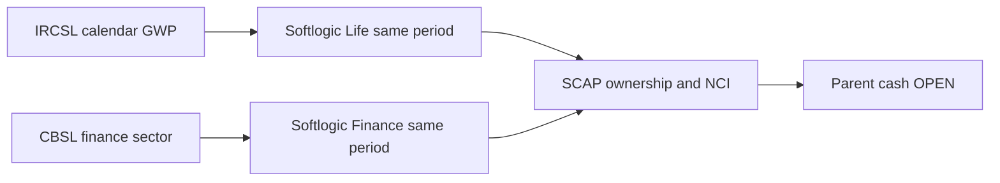

# Industry evidence — SCAP.N0000

## කර්මාන්තය: ප්‍රාථමික මූලාශ්‍ර පරීක්ෂාව · 2026-09-30

**තත්ත්වය: PARTIAL.** පහත සංඛ්‍යා කර්මාන්තයට අදාළය; SCAP සමාගමේ ආදායම හෝ වත්මන් වෙළෙඳපොළ කොටස නොවේ.

| ක්ෂේත්‍රය | තහවුරු කළ කර්මාන්ත මූලාශ්‍රය | SCAP සම්බන්ධ තවමත් විවෘත කරුණු |
|---|---|---|
| ජීවිත රක්ෂණ | IRCSL 2024 **තාවකාලික** ජීවිත GWP **LKR 183,875m**, සාමාන්‍ය රක්ෂණ **138,162m**, මුළු **322,037m**. 2025 Q1 ජීවිත **51,056m**, සාමාන්‍ය **41,172m**; ප්‍රකාශිත මුළු **92,229m** සමඟ **1m වටකිරීමේ වෙනසක්** ඇත. [IRCSL Chart 1](https://ircsl.gov.lk/wp-content/uploads/2025/08/PRESS-RELEASE-_-Reviewing-Sri-Lankas-Insurance-Sector-Performance-2020-to-2024-and-Q1-2025.pdf). | Softlogic Life හි එකම **කැලැන්ඩර් කාලය** සඳහා GWP, රක්ෂණ ඔප්පු, හිමිකම්, රඳවාගැනීම සහ solvency වෙනම පරීක්ෂා කළ යුතුය. GWP යනු SCAP සමූහ ආදායම හෝ මව් සමාගමේ මුදල් නොවේ. |
| මූල්‍ය සමාගම් | CBSL **2025 කැලැන්ඩර් වර්ෂය** සඳහා ණය ප්‍රසාරණය සහ ඉහළ ගිය credit-to-GDP gap සඳහන් කරයි. [CBSL Full Text](https://www.cbsl.gov.lk/en/node/20110). | මෙය Softlogic Finance හි ආයතනික ලාභය හෝ capital ratio නොවේ; Stage 3, තැන්පතු, funding cost සහ capital මුල් ගොනු සමඟ සසඳන්න. |
| කොටස් තැරැව් | SCAP FY2025 වාර්තාවේ තැරැව් කටයුතු සඳහන්ය; වත්මන් SEC බලපත්‍ර, CSE turnover සහ market share මෙහි තහවුරු කර නැත. [SCAP](https://cdn.cse.lk/cmt/upload_report_file/1100_1764673838964.03.2025%20-%20Annual%20Report.pdf). | නීතිමය ආයතනය, සැබෑ හිමිකාරීත්වය, ගාස්තු සහ මව් සමාගමට ලැබුණු ලාභාංශ පරීක්ෂා කරන්න. |
| වත්කම් කළමනාකරණය | SCAP FY2025 වාර්තාවේ වත්කම් කළමනාකරණය සඳහන්ය; සමාන AUM සහ fee margin දත්ත **OPEN**. [SCAP](https://cdn.cse.lk/cmt/upload_report_file/1100_1764673838964.03.2025%20-%20Annual%20Report.pdf). | SEC බලපත්‍ර, AUM, පුනරාවර්තන ගාස්තු සහ SCAP හිමිකම පරීක්ෂා කරන්න. |

**කාල පරිච්ඡේද:** IRCSL 2024 = 2024 ජනවාරි–දෙසැම්බර්; 2025 Q1 = මාර්තු 2025 දක්වා; CBSL 2025 = 2025 ජනවාරි–දෙසැම්බර්. SCAP FY2025 අවසන් වන්නේ 2025 මාර්තු 31; FY2026 අවසන් වන්නේ 2026 මාර්තු 31. මේවා සෘජුව සමාන නොකරන්න. NCI, රක්ෂණ වගකීම්, තැන්පතු සහ මව් සමාගමේ මුදල් වෙන්කර සලකන්න.

**OPEN:** IRCSL 2025 handbook/2026 Q2, සමාන කාල CBSL finance දත්ත, SEC/CSE තැරැව් දත්ත, SCAP FY2026 අවසන් විගණනය සහ 2026 ජූනි මුල් අතුරු ගොනුව. වත්මන් market-share නිගමනයක් නොමැත.

**මූලාශ්‍ර සටහන්:** [IRCSL](../../../sources/records/IRCSL-INSURANCE-SECTOR-2024-Q1-2025.md) · [CBSL](../../../sources/records/CBSL-FINANCIAL-SECTOR-PERFORMANCE-2025.md) · [SCAP FY2025](../../../sources/records/SCAP-AR-2025.md). **මුල් ලේඛන බාහිර සබැඳි පමණි; GitHub හි ගබඩා කර නැත.**

