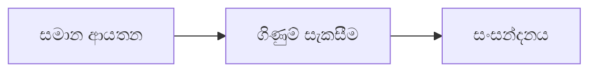

# 05 · තරඟකරුවන්ගේ විශ්ලේෂණය

[← මූලික විශ්ලේෂණය](../README.md) · [English](../../../01-Fundamental-Analysis/05-Competitors/README.md) · [தமிழ்](../../../ta/01-Fundamental-Analysis/05-Competitors/README.md) · [සිංහල](README.md)

> **SCAP.N0000 · Softlogic Capital PLC**  
> **තත්ත්වය:** මෙය පර්යේෂණ ක්‍රමවේදයක් පමණි; SCAP පිළිබඳ අවසාන නිගමන තවමත් තහවුරු වී නැත. **Reference: 2026-09-30**.

## 🎯 ප්‍රධාන පර්යේෂණ ප්‍රශ්නය

සමාන ව්‍යාපාර හා වාර්තාකරණ පදනමක් ඇති ක්‍රියාකරුවන් සමඟ සංසන්දනයේදී අනුබද්ධ සමාගම් ක්‍රියාකරන්නේ කෙසේද?

## 🔍 රැස් කළ යුතු සාක්ෂි

- [ ] රක්ෂණයට රක්ෂණකරුවන්, ණයට මූල්‍ය සමාගම්, තැරැව් සේවාවට තැරැව් ආයතන තෝරා සංසන්දන හේතු ලියන්න.
- [ ] ගිණුම් කාලසීමා, සමූහ/තනි විෂය පථය, ප්‍රාග්ධනය සහ valuation denominators එකසේ සකසන්න.
- [ ] රක්ෂණයේ persistency/solvency, මූල්‍යයේ NPL/funding, තැරැව්හි commissions/turnover සසඳන්න.

## 🧭 පර්යේෂණ ක්‍රියාවලිය

## ⚠️ වැරදි ලෙස අර්ථකථනය විය හැකි කරුණ

Holding company P/E අගයක් තනි රක්ෂණකරුවකුගේ P/E සමඟ සෘජුව සැසඳීමෙන් සුළුතර හිමිකම් සහ අවදානම් වෙනස්කම් සැඟවිය හැක.

## 🛠️ SCAP සඳහා ඊළඟ පර්යේෂණ කාර්යය

එකම ශ්‍රේණිගත කිරීමකට වඩා ව්‍යාපාර අංශ අනුව වෙන වෙනම තරඟකරුවන්ගේ වගු, මූලාශ්‍ර සහ දින සකසන්න.

## 📝 සාක්ෂි සටහන (මුල් ලේඛන පරීක්ෂා කිරීමෙන් පසු පුරවන්න)

| මිනුම / ප්‍රකාශය | කාලය / ගිණුම් විෂය පථය | මුල් මූලාශ්‍රය + පිටුව | තහවුරු කළ කරුණ |
|---|---|---|---|
| __________ | __________ | __________ | __________ |
| __________ | __________ | __________ | __________ |

**පෙර පර්යේෂණ:** [SCAP පෙර පර්යේෂණය](../../../si/03-competition.md) · [මූලාශ්‍ර ලැයිස්තුව](../../../si/SOURCES.md) · [CSE](https://www.cse.lk/).

**ක්‍රමය:** සෑම අගයක් සඳහාම දිනය, ගිණුම් විෂය පථය, ඒකකය සහ මුල් වාර්තාවේ පිටුව සටහන් කරන්න. අනුපාතයක් හෝ ප්‍රස්තාරයක් ගනුදෙනු නිර්දේශයක් නොවේ.
