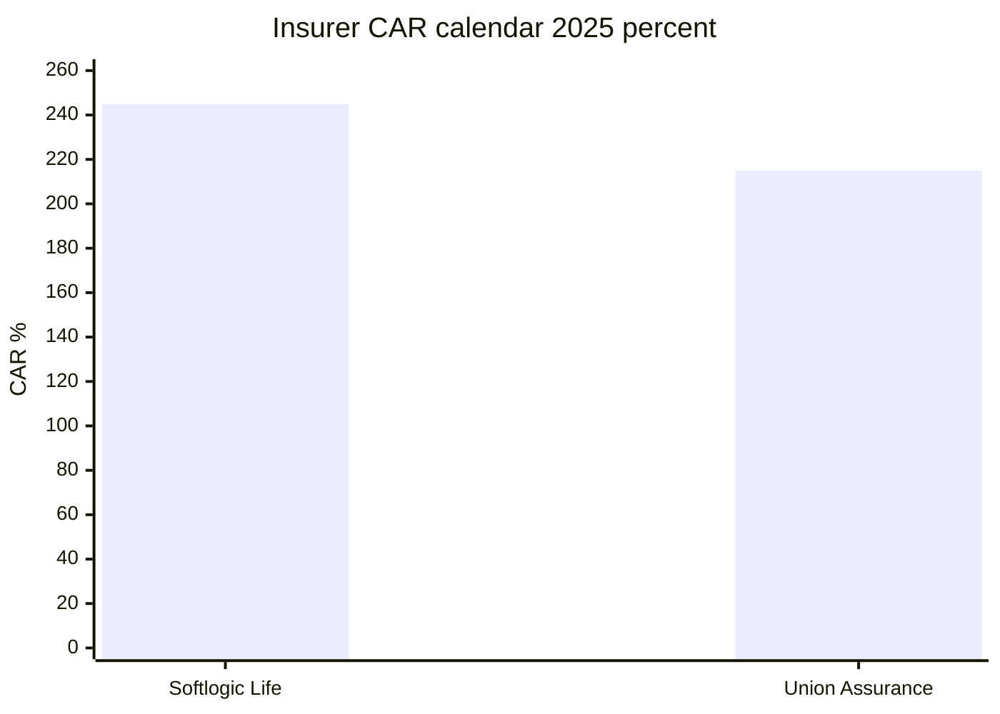

# 05 · දිනය සහිත රක්ෂණ හා මූල්‍ය තරඟකාරී දත්ත

[← Fundamental analysis](../README.md) · [English](../../../01-Fundamental-Analysis/05-Competitors/README.md) · [தமிழ்](../../../ta/01-Fundamental-Analysis/05-Competitors/README.md) · [සිංහල](README.md)

> **SCAP.N0000 · මුල් සාක්ෂි පර්යේෂණ · 2026-09-30 · වෙනත් ඒකකයක් නොකී විට LKR මිලියන.** **OPEN: SCAP FY2025/26 අවසන් audited සහ 2026 ජූනි මුල් ගොනු තවමත් ගළපා නැත. FY2025 අගයන් වත්මන් තහවුරු තත්ත්වය ලෙස සලකන්න එපා.**

## 🎯 පර්යේෂණ ප්‍රශ්නය

එකම කාලය, ආයතන වර්ගය සහ ratio නිර්වචනය අනුව සැසඳිය හැකි අගයන් කවරේද?

**SCAP Group යනු තනි insurer එකක් නොවේ.** Insurer CAR ≠ Finance CAR; insurer GWP ≠ consolidated group revenue. කාලය සහ ආයතනය වෙන්කර සැසඳීම කළ යුතුය. [SLIFE-AR-2025](../../../sources/records/SLIFE-AR-2025.md) · [UA-AR-2025-CAR](../../../sources/records/UA-AR-2025-CAR.md) · [CBSL-FC-Q1-2026](../../../sources/records/CBSL-FC-Q1-2026.md).

## 🔎 දින සහිත සාක්ෂි

| ආයතනය / ratio | අගය | කාලය / සාක්ෂිය | සසඳන සීමාව |
|---|---|---|
| Softlogic Life insurer CAR | 245% | 2025-12-31 issuer report | Insurance RBC |
| Union Assurance insurer CAR | 215% | 2025-12-31 annual | Insurer peer |
| Insurance capital minimum | 120% | 2025 reports | Regulator floor |
| Softlogic Life customer retention | 89% | 2025 issuer dashboard | Policy persistency එකම නොවිය හැක |
| Union matching retention | OPEN | එකම මිනුම නැත | නිර්මාණය නොකරන්න |
| Softlogic Finance total CAR | ~61% | 2026-03-31 management update | Finance ratio |
| CBSL finance sector total CAR | 18.4% | 2026-03-31 regulator | FC sector |
| Softlogic Finance gross NPL | 37.6% provisional | secondary 2026 report | මුල් audit note OPEN |
| FC sector same-definition gross NPL | OPEN | ඒකක සමාන විය යුතුයි | Bank Stage3 නොවේ |

### Life CAR සහ retention වෙනස්ය

Softlogic Life **calendar 2025 CAR 245%**, customer retention **89%** ලෙස issuer report දක්වයි. Union Assurance **2025-12-31 CAR 215%** සිය annual report එකේ දක්වයි. මේවා insurer ratios මිස SCAP parent cash නොවේ. Union Assurance හි **එකම cohort/denominator persistency** මෙහි තහවුරු නොවීය. [SLIFE-AR-2025](../../../sources/records/SLIFE-AR-2025.md) · [UA-AR-2025-CAR](../../../sources/records/UA-AR-2025-CAR.md).

### Finance CAR සහ credit quality

Softlogic Finance 2026 ජූලි issuer update අනුව capital adequacy **~61%**. CBSL **FC sector CAR 18.4%** 2026 මාර්තු අවසානයේ. මුල් අගය management ප්‍රකාශයකි, දෙවන අගය නියාමක දත්තයකි. Finance gross NPL **37.6%** යන අගය secondary ප්‍රකාශනයකින් පමණක් මෙහි ලැබී ඇත; annual-report gross NPL note **OPEN**. Bank Stage3 හෝ net NPL සමඟ එකට නොසසඳන්න. [SFIN-UPDATE-JUL2026](../../../sources/records/SFIN-UPDATE-JUL2026.md) · [CBSL-FC-Q1-2026](../../../sources/records/CBSL-FC-Q1-2026.md).

### Funding peers තවමත් අවශ්‍යයි

Finance issuer FY26 assets **~7.3bn**, loan portfolio **~6.5bn**, deposits **>3.7bn** කියයි. Deposit tenor, liquidity, credit losses සසඳීමට එකම 31 මාර්තු අවසන් audited finance-company tables අවශ්‍යය. Life customer retention = policy persistency යන සරල සමානකම නොකළ යුතුය. [SFIN-UPDATE-JUL2026](../../../sources/records/SFIN-UPDATE-JUL2026.md).

## සාක්ෂි සිතියම

## ⚠️ ඉතිරි සත්‍යාපනය

- [ ] සමාන cohort/denominator insurer persistency දත්ත දෙකම සොයන්න.
- [ ] Finance FY26 මුල් gross NPL, Stage3 සහ deposit maturity ලබාගන්න.
- [ ] CBSL same-definition FC gross NPL series සහ peers තහවුරු කරන්න.
- [ ] Stockbroker හා asset-manager SEC/CSE මිනුම් එකතු කරන්න.

**මූලාශ්‍ර හැඳුනුම්:** [SLIFE-AR-2025](../../../sources/records/SLIFE-AR-2025.md) · [UA-AR-2025-CAR](../../../sources/records/UA-AR-2025-CAR.md) · [SFIN-UPDATE-JUL2026](../../../sources/records/SFIN-UPDATE-JUL2026.md) · [CBSL-FC-Q1-2026](../../../sources/records/CBSL-FC-Q1-2026.md).

[Life 2025 original PDF](https://softlogiclife.lk/wp-content/uploads/sites/3/2026/03/Softlogic-Life-Integrated-Annual-Report-2025.pdf) · [Union 2025 original PDF](https://unionassurance.com/DigitalAnnualReport2025/Union-Assurance-AR-2025.pdf) · [CBSL FC sector Q1 2026](https://www.cbsl.gov.lk/en/node/20440) · [Finance issuer update](https://softlogicfinance.lk/news/building-a-stronger-more-resilient-softlogic-finance/).

[මුල් මූලාශ්‍ර](../../../sources/SOURCE-REGISTER.md) · [පර්යේෂණ ප්‍රගතිය](../../../si/RESEARCH-QUEUE.md)

මෙය මූල්‍ය සාක්ෂි පර්යේෂණයක් වන අතර කොටස් මිලදී/විකිණීමේ නිර්දේශයක් නොවේ.