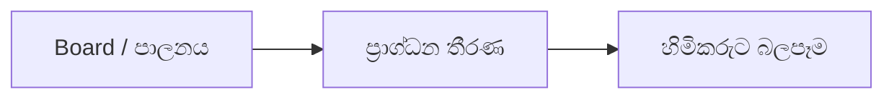

# 07 · කළමනාකරණ සහ යහපාලන විශ්ලේෂණය

[← මූලික විශ්ලේෂණය](../README.md) · [English](../../../01-Fundamental-Analysis/07-Management-Governance/README.md) · [தமிழ்](../../../ta/01-Fundamental-Analysis/07-Management-Governance/README.md) · [සිංහල](README.md)

> **SCAP.N0000 · Softlogic Capital PLC**  
> **තත්ත්වය:** මෙය පර්යේෂණ ක්‍රමවේදයක් පමණි; SCAP පිළිබඳ අවසාන නිගමන තවමත් තහවුරු වී නැත. **Reference: 2026-09-30**.

## 🎯 ප්‍රධාන පර්යේෂණ ප්‍රශ්නය

අධ්‍යක්ෂ මණ්ඩලය, ප්‍රාග්ධන වෙන්කිරීම සහ සම්බන්ධිත පාර්ශ්ව සුළුතර කොටස් හිමියන්ට බලපාන්නේ කෙසේද?

## 🔍 රැස් කළ යුතු සාක්ෂි

- [ ] දින සහිත ගොනුවල board සාමාජිකයන්, ස්වාධීනත්වය, audit committee සහ විගණන නිරීක්ෂණ සටහන් කරන්න.
- [ ] Related-party ගනුදෙනු, ඇප, වැටුප්, නව කොටස්, පෙර ප්‍රාග්ධන භාවිතය පරීක්ෂා කරන්න.
- [ ] කළමනාකරණ ප්‍රකාශයන් ලේඛනගත ප්‍රතිඵල සමඟ සසඳන්න; හේතු සාක්ෂි රහිතව අනුමාන නොකරන්න.

## 🧭 පර්යේෂණ ක්‍රියාවලිය

## ⚠️ වැරදි ලෙස අර්ථකථනය විය හැකි කරුණ

ආරම්භකයාගේ නම, සමූහ ප්‍රසිද්ධිය හෝ එක් වසරක ලාභය යහපාලනය තහවුරු නොකරයි.

## 🛠️ SCAP සඳහා ඊළඟ පර්යේෂණ කාර්යය

නවතම SCAP වාර්තාවේ governance, related-party සහ contingent-liability සටහන් පිටු අංක සමඟ ගන්න.

## 📝 සාක්ෂි සටහන (මුල් ලේඛන පරීක්ෂා කිරීමෙන් පසු පුරවන්න)

| මිනුම / ප්‍රකාශය | කාලය / ගිණුම් විෂය පථය | මුල් මූලාශ්‍රය + පිටුව | තහවුරු කළ කරුණ |
|---|---|---|---|
| __________ | __________ | __________ | __________ |
| __________ | __________ | __________ | __________ |

**පෙර පර්යේෂණ:** [SCAP පෙර පර්යේෂණය](../../../si/01-business-and-ownership.md) · [මූලාශ්‍ර ලැයිස්තුව](../../../si/SOURCES.md) · [CSE](https://www.cse.lk/).

**ක්‍රමය:** සෑම අගයක් සඳහාම දිනය, ගිණුම් විෂය පථය, ඒකකය සහ මුල් වාර්තාවේ පිටුව සටහන් කරන්න. අනුපාතයක් හෝ ප්‍රස්තාරයක් ගනුදෙනු නිර්දේශයක් නොවේ.
