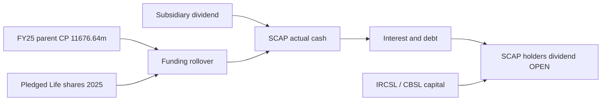

# 08 · මව් ණය, ඇප, නියාමන හා credit අවදානම්

[← Fundamental analysis](../README.md) · [English](../../../01-Fundamental-Analysis/08-Risk/README.md) · [தமிழ்](../../../ta/01-Fundamental-Analysis/08-Risk/README.md) · [සිංහල](README.md)

> **SCAP.N0000 · මුල් සාක්ෂි පර්යේෂණ · 2026-09-30 · වෙනත් ඒකකයක් නොකී විට LKR මිලියන.** **OPEN: SCAP FY2025/26 අවසන් audited සහ 2026 ජූනි මුල් ගොනු තවමත් ගළපා නැත. FY2025 අගයන් වත්මන් තහවුරු තත්ත්වය ලෙස සලකන්න එපා.**

## 🎯 පර්යේෂණ ප්‍රශ්නය

විගණිත SCAP මව් තනි ගිණුම පෙන්නුම් කරන ණය සහ ඇප මොනවාද? අලුත් තත්ත්වයෙන් තහවුරු නොවූ දේ මොනවාද?

**ගිණුම් පදනම වෙන් කරන්න:** 2025-03-31 SCAP **මව් තනි ණය 14,797.33m**, නමුත් ඒකාබද්ධ Group ණය **19,467.97m** (audit note 39, PDF පි.148). වෙනස් අගයන්ය. 2026-03-31 **අතුරු** parent debt **17,324.26m**, cash **32.07m** තවම අවසන් audited ලේඛනයෙන් ගළපා නැත. [SCAP-AR-2025](../../../sources/records/SCAP-AR-2025.md) · [SCAP-FY2026-YE-INTERIM](../../../sources/records/SCAP-FY2026-YE-INTERIM.md).

## 🔎 දින සහිත සාක්ෂි

| FY2025 audited parent item | LKR mn | මූලාශ්‍ර / සීමාව |
|---|---|---|
| Bank loans | 1,950.22 | Note 39 පි.148; වසරකින් 426.02, ඉන් පසු 1,524.20 (පි.149) |
| Commercial paper | 11,676.64 | Note 39; individual maturity OPEN |
| Securitisation | 1,154.54 | Note 39; ගිවිසුම් කල්පිරීම් OPEN |
| Lease creditors | 15.93 | වසරකින් ~3.07, ඉන් පසු ~12.86 |
| Parent debentures/subordinated debt | 0.00 | 2025-03-31 පමණි |
| Total parent borrowings | 14,797.33 | Parent-only ගිණුම |
| Parent guarantees | 75.00 | Note 44 පි.161; Stockbrokers RPT පි.168 |
| Life security shares | NDB 48,559,000 / DFCC 32,490,704 | Note 39.1.2 පි.149; **කොටස් ගණන** |
| Parent operating cash flow | −4,605.10 | Audited පි.70 |
| Dividend cash received / interest paid | +3,273.55 / −2,549.88 | Cash flow පි.70 |

### Commercial paper සහ ඇප

FY2025 board note 2.1.2 (පි.71) parent interest servicing සඳහා subsidiary dividends හා නව commercial-paper අරමුදල් ගැන විස්තර කරයි. **අතීත CP renewal experience ~82%** යනු management ප්‍රකාශයක්; ඉදිරි rollover සහතිකයක් නොවේ. NDB/DFCC Life pledge 2025 තත්ත්වයකි; අලුත් security release **OPEN**. [SCAP-AR-2025](../../../sources/records/SCAP-AR-2025.md).

### Insurance හා Finance ප්‍රාග්ධන සීමා

Life **calendar 2025 CAR 245%** යනු insurer capital මිස SCAP parent cash නොවේ. FY2025 note 41.7 (පි.157) **798.004m restricted surplus** සඳහා IRCSL කොන්දේසි ඇත. Finance **2026 ජූලි management update** CAR **~61%** සහ deposits **>3.7bn** දක්වයි; ඒවා CBSL finance සමාගම් දත්තය. Life CAR සහ Finance CAR එකට එකතු නොකරන්න. [SLIFE-AR-2025](../../../sources/records/SLIFE-AR-2025.md) · [SFIN-UPDATE-JUL2026](../../../sources/records/SFIN-UPDATE-JUL2026.md).

### Guarantee සහ dividend සීමා

SCAP note 44 (පි.161) **75m parent guarantee**; RPT note 47.4 (පි.168) Stockbrokers නම් කරයි. Life වෙතින් **3,273.546m dividend income** වෙනම ලියා ඇත. Ordinary SCAP dividends සඳහා ණය, covenants, නියාමන capital සහ board approval පරීක්ෂා කළ යුතුය. 2026 Life notice cash receipt එකක් බව තහවුරු නැත. [SLIFE-JUN2026-DIVIDEND](../../../sources/records/SLIFE-JUN2026-DIVIDEND.md).

## සාක්ෂි සිතියම

## ⚠️ ඉතිරි සත්‍යාපනය

- [ ] FY2026 audited commercial paper maturity, covenants හා SCAP June report ලබාගන්න.
- [ ] 2026 security release සහ guarantee අලුත් ලේඛන ලබාගන්න.
- [ ] FY2026 parent CFO, finance deposits සහ Life reserves ගළපන්න.
- [ ] Group funding maturity schedule parent-only ලෙස නොසලකන්න.

**මූලාශ්‍ර හැඳුනුම්:** [SCAP-AR-2025](../../../sources/records/SCAP-AR-2025.md) · [SCAP-FY2026-YE-INTERIM](../../../sources/records/SCAP-FY2026-YE-INTERIM.md) · [SLIFE-AR-2025](../../../sources/records/SLIFE-AR-2025.md) · [SFIN-UPDATE-JUL2026](../../../sources/records/SFIN-UPDATE-JUL2026.md) · [SLIFE-JUN2026-DIVIDEND](../../../sources/records/SLIFE-JUN2026-DIVIDEND.md) · [SCAP-AR-2026-CATALOGUE](../../../sources/records/SCAP-AR-2026-CATALOGUE.md) · [SCAP-JUN2026-CATALOGUE](../../../sources/records/SCAP-JUN2026-CATALOGUE.md).

[SCAP FY2025 audited original](https://cdn.cse.lk/cmt/upload_report_file/1100_1764673838964.03.2025%20-%20Annual%20Report.pdf) · [SCAP FY2026 interim](https://cdn.cse.lk/cmt/upload_report_file/1100_1779968696398.pdf) · [Finance issuer](https://softlogicfinance.lk/news/building-a-stronger-more-resilient-softlogic-finance/).

[මුල් මූලාශ්‍ර](../../../sources/SOURCE-REGISTER.md) · [පර්යේෂණ ප්‍රගතිය](../../../si/RESEARCH-QUEUE.md)

මෙය මූල්‍ය සාක්ෂි පර්යේෂණයක් වන අතර කොටස් මිලදී/විකිණීමේ නිර්දේශයක් නොවේ.

## FY2025 → FY2026 මව් සමාගම් liquidity bridge (2026-10-01)

මෙම සැසඳීම **SCAP standalone parent** පමණක් භාවිතා කරයි; Group අගයන් මිශ්‍ර නොකරයි. FY2025 audited වන අතර FY2026 යනු 2026-05-27 year-end interim එකක් සහ තවමත් **subject to audit** ය.

| Parent මිනුම | FY2025 audited | FY2026 interim | වෙනස / අර්ථය |
|---|---:|---:|---|
| Interest-bearing borrowings (LKR mn) | 14,797.33 | 17,324.26 | **+2,526.93 / +17.08%** |
| Cash and bank (LKR mn) | 27.89 | 32.07 | +4.18 |
| Borrowings less cash (mechanical, LKR mn) | 14,769.44 | 17,292.19 | **+2,522.75 / +17.08%** |
| Gross debt / cash | 530.56× | 540.20× | liquidity warning එකක් පමණි; **covenant ratio නොවේ** |

මෙය insolvency, default හෝ covenant breach සනාථ නොකරයි. Parent borrowing සැලකිය යුතු ලෙස ඉහළ ගිය අතර cash ණයට සාපේක්ෂව ඉතා කුඩා බව පෙන්වයි. FY2026 signed audit, maturity schedule සහ covenant definitions තවම OPEN. [SCAP-AR-2025](../../../sources/records/SCAP-AR-2025.md) · [SCAP-FY2026-YE-INTERIM](../../../sources/records/SCAP-FY2026-YE-INTERIM.md).

### Cash flow සහ accrual income එකම දෙයක් නොවේ

FY2025 audited parent cash flow හි **3,273.55m dividends received** සහ **2,549.88m interest paid** ඇත; historical cash ratio **1.28×**. FY2026 interim income statement හි **635.18m dividend income** සහ **1,810.84m interest expense** ඇත; mechanical ratio **0.35×**. මේවා like-for-like නොවේ: පළමුවැන්න cash-flow lines, දෙවැන්න accrual income-statement lines. එබැවින් 0.35× FY2026 cash debt-service coverage ලෙස නම් කළ නොහැක. ඒ සඳහා FY2026 standalone cash-flow statement අවශ්‍යය.

**පර්යේෂණ නිගමනය:** FY2025 operating cash flow **−4,605.10m**, subsidiary dividends/new commercial paper පිළිබඳ going-concern disclosure සහ FY2026 interim parent borrowing +17.08% නිසා refinancing සහ subsidiary cash-upstream capacity වැදගත් parent-level අවදානම්ය. මෙය payment failure සනාථ කිරීමක් නොවේ. ඊළඟ සාක්ෂි: signed FY2026 audit; CP tranche maturity/rate/covenant; FY2026 standalone cash flow; NDB/DFCC Life-share collateral release.
