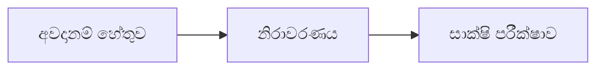

# 08 · අවදානම් විශ්ලේෂණය

[← මූලික විශ්ලේෂණය](../README.md) · [English](../../../01-Fundamental-Analysis/08-Risk/README.md) · [தமிழ்](../../../ta/01-Fundamental-Analysis/08-Risk/README.md) · [සිංහල](README.md)

> **SCAP.N0000 · Softlogic Capital PLC** · **තත්ත්වය:** පර්යේෂණ ක්‍රමවේදයකි; SCAP පිළිබඳ නවතම නිගමනයක් නොවේ. **Reference date: 2026-09-30**.

## 🎯 පර්යේෂණ ප්‍රශ්නය

මූල්‍ය, මෙහෙයුම්, නියාමන, පාලන හා වෙළෙඳපොළ අවදානම් SCAP හිමියන්ගේ වටිනාකමට කෙසේ බලපානු ඇත්ද?

## 🔎 තහවුරු කළ යුතු දේ

- [ ] සිදුවීමේ සම්භාවිතාව සහ ඇතිවිය හැකි හානිය වෙන් කරන්න; සාක්ෂි නොමැති ලකුණු නොදමන්න.
- [ ] මව් ණය/ඇප, රක්ෂණ solvency, ණය හා තැන්පතු, liquidity සහ related-party අවදානම් බලන්න.
- [ ] එක් එක් අවදානමට අවස්ථාව, අවම කිරීම, මුල් අනතුරු මිනුම, මුල් ගොනුව සහ නැවත පරීක්ෂා කිරීමේ හේතුව සටහන් කරන්න.

## 🧭 පර්යේෂණ රූප සටහන

## ⚠️ නොකළ යුතු උපකල්පනය

අවදානම් ලැයිස්තුවක් සිදුවීමක් වී ඇති බව හෝ නිශ්චිතව සිදුවන බව තහවුරු නොකරයි.

## 🛠️ SCAP සඳහා පරීක්ෂණය

SCAP අවදානම් සටහන්, මව් ණය සහ නවතම නියාමන නිවේදන සසඳා පමණක් නිරාවරණය ප්‍රමාණනය කරන්න.

## 📝 සාක්ෂි වගුව

| මිනුම / සිදුවීම | කාලය / විෂය පථය | මුල් මූලාශ්‍රය | සොයාගත් ප්‍රතිඵලය |
|---|---|---|---|
| ______ | ______ | ______ | ______ |
| ______ | ______ | ______ | ______ |

[පෙර SCAP සටහන](../../../si/05-risks-and-questions.md) · [මූලාශ්‍ර](../../../si/SOURCES.md) · [CSE](https://www.cse.lk/)

**ක්‍රමය:** ප්‍රකාශන දිනය, ගිණුම් විෂය පථය, ඒකකය සහ මුල් පිටුව ලියන්න. මෙය වෙළෙඳපොළ මිලක් හෝ ආයෝජන නිර්දේශයක් නොවේ.
