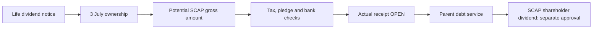

# 09 · ලාභාංශ සහ මව් සමාගමට මුදල් ලැබීම

[← මූලික විශ්ලේෂණය](../README.md) · [English](../../../01-Fundamental-Analysis/09-Dividends/README.md) · [தமிழ்](../../../ta/01-Fundamental-Analysis/09-Dividends/README.md) · [සිංහල](README.md)

> **SCAP.N0000 · Softlogic Capital PLC · සාක්ෂි තත්ත්වය · 2026-09-30.** FY2025 විගණිත අතීත සාක්ෂිය; FY2026 වර්ෂ අවසන් අතුරු — විගණනයට යටත්. **OPEN — FY2026 SCAP අවසන් විගණිත වාර්තාව සහ 2026 ජූනි මුල් SCAP වාර්තාව සම්පූර්ණයෙන් ගළපා නැත.**

## 🎯 පර්යේෂණ ප්‍රශ්නය

SCAP මව් සමාගමට සැබැවින් ලැබුණු dividend කීයද? Life dividend එක SCAP හිමියන්ට ලැබුණු dividend එකක්ද?

## විශ්ලේෂණ සැලැස්ම

### FY2025 ලැබුණු dividend cash

FY2025 audited SCAP standalone cash flow (PDF පි.70) හි investing activities යටතේ **LKR 3,273.55m ලැබුණු dividend**. Related-party note 47.4 (පි.168) එය **Softlogic Life වෙතින් dividend income 3,273.546m** ලෙස දක්වයි; **SCAP සාමාන්‍ය කොටස් හිමියන්ට ගෙවීමක් නොවේ**. Standalone operating CFO **−4,605.10m**; පොලී ඇත්තෙන්ම ගෙවා ඇත **−2,549.88m**, පොලී expense **1,833.56m**. [SCAP-AR-2025](../../../sources/records/SCAP-AR-2025.md).

### Life 2026 නිවේදනය සහ මව් මුදල් වෙනස්ය

**2026 ජූනි 22** Life CSE නිවේදනය voting share සඳහා **Rs 5.30**; ex-date **ජූලි 2**, record **ජූලි 3**, සැලසුම් කළ dispatch **ජූලි 21**; withholding tax ඇත. **ජූනි 30** Life shareholder register අනුව SCAP **158,714,972 shares**. ජූලි 3ද අයිතිය නොවෙනස් නම් **ඇස්තමේන්තු gross ~LKR 841.19m**. සැබැවින් මව් බැංකුවට ලැබීම්, අඩුකළ බදු, pledge තත්ත්වය **OPEN**. මෙය SCAP ordinary dividend නොවේ. [SLIFE-JUN2026-DIVIDEND](../../../sources/records/SLIFE-JUN2026-DIVIDEND.md) · [SLIFE-Q2-2026-REGISTER](../../../sources/records/SLIFE-Q2-2026-REGISTER.md).

### නියාමන බෙදාහැරීමේ සීමා

FY2025 audited SCAP insurer note 41.7 (පි.157) හි **798.004m restricted one-off surplus** IRCSL නියමයන්ට යටත්ය; **සියලු Life dividends තහනම්** යන අර්ථයක් නැත. SCAP interest servicing සඳහා subsidiary dividends සහ commercial-paper renewals අවශ්‍ය බව directors note 2.1.2 (පි.71) විස්තර කරයි. FY2026 අතුරු parent cash **32.07m** සහ ණය **17,324.26m** අවසන් audited ගිණුමෙන් තවමත් ගළපා නැත. [SCAP-AR-2025](../../../sources/records/SCAP-AR-2025.md).

## දින සහිත සාක්ෂි වගුව

| මුදල් / බෙදාහැරීම | LKR මිලියන / තත්ත්වය | මූලාශ්‍ර දිනය | අර්ථය |
|---|---|---|---|
| SCAP ලැබුණු dividend cash | 3,273.55 | FY25 audited පි.70 | Life → SCAP; හිමිකරු payout නොවේ |
| SCAP ගෙවූ interest | −2,549.88 | FY25 audited පි.70 | සැබෑ cash paid |
| SCAP standalone CFO | −4,605.10 | FY25 audited පි.70 | Dividend inflow නොවේ |
| Life 2026 dividend notice | Rs 5.30/share | 2026 Jun 22 CSE | Life ගෙවන මුදල |
| SCAP gross entitlement (conditional) | ~841.19 | Jun30 holding × Jul3 assumption | බැංකුවට ලැබීම තහවුරු නැත |
| Restricted one-off surplus | 798.004 | FY25 audited note 41.7 | විශේෂ reserve සීමාව |

## සාක්ෂි සහ අරමුදල් සම්බන්ධය

**මූලාශ්‍ර සටහන්:** [SCAP-AR-2025](../../../sources/records/SCAP-AR-2025.md) · [SLIFE-JUN2026-DIVIDEND](../../../sources/records/SLIFE-JUN2026-DIVIDEND.md) · [SLIFE-Q2-2026-REGISTER](../../../sources/records/SLIFE-Q2-2026-REGISTER.md) · [SCAP-AR-2026-CATALOGUE](../../../sources/records/SCAP-AR-2026-CATALOGUE.md).

[SCAP FY2025 audited original pp.70–71, 157, 168](https://cdn.cse.lk/cmt/upload_report_file/1100_1764673838964.03.2025%20-%20Annual%20Report.pdf) · [Life 2026 original dividend notice](https://cdn.cse.lk/cmt/announcement_portal_prod/INTERIM%20DIVIDEND%20ANNOUNCEMENT_4994263359860578.pdf) · [Life June 2026 register]([object Object]).

## ⚠️ තවදුරටත් පරීක්ෂා කළ යුතු කරුණු

- [ ] 2026 ජූලි Life dividend ලැබුණු සැබෑ bank receipts තහවුරු කරන්න.
- [ ] FY2026 audited parent cash flow සහ borrowings maturity සසඳන්න.
- [ ] IRCSL capital/reserves සහ Finance dividend බෙදාහැරීමේ සීමා තහවුරු කරන්න.
- [ ] SCAP ordinary dividends පමණක් අඩංගු වසර 5 timeline එකක් සකසන්න.

[මධ්‍යම මූලාශ්‍ර ලැයිස්තුව](../../../sources/SOURCE-REGISTER.md) · [පර්යේෂණ අනුපිළිවෙළ](../../../si/RESEARCH-QUEUE.md)

**Scope:** Research documents distinct dated entities and accounting sources, not an investment recommendation.