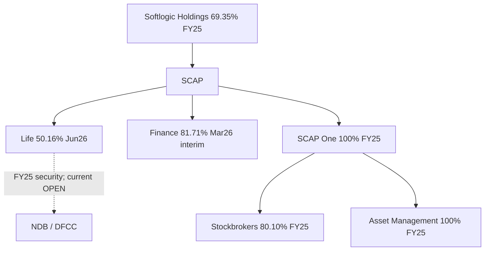

# 10 · කොටස් හිමිකාරීත්වය, අනුබද්ධ ආයතන හා ඇපයට දුන් කොටස්

[← මූලික විශ්ලේෂණය](../README.md) · [English](../../../01-Fundamental-Analysis/10-Shareholding/README.md) · [தமிழ்](../../../ta/01-Fundamental-Analysis/10-Shareholding/README.md) · [සිංහල](README.md)

> **SCAP.N0000 · Softlogic Capital PLC · සාක්ෂි තත්ත්වය · 2026-09-30.** FY2025 විගණිත අතීත සාක්ෂිය; FY2026 වර්ෂ අවසන් අතුරු — විගණනයට යටත්. **OPEN — FY2026 SCAP අවසන් විගණිත වාර්තාව සහ 2026 ජූනි මුල් SCAP වාර්තාව සම්පූර්ණයෙන් ගළපා නැත.**

## 🎯 පර්යේෂණ ප්‍රශ්නය

මව් සමාගමේ සෘජු අයිතිය කුමක්ද? SCAP One හරහා අයිතිය කුමක්ද? ණය ඇප ලෙස තබා ඇති Life කොටස් මොනවාද?

## විශ්ලේෂණ සැලැස්ම

### දිනය සහිත හිමිකාරීත්වය

**2025-03-31 SCAP විගණිත වාර්තාවේ PDF පි.4**: Softlogic Holdings → SCAP **69.35%**; SCAP → SCAP One **100%**, SR One **100%**; SCAP One → Stockbrokers **80.10%**, Asset Management **100%**. මේවා **2025** අගයන් මිස 2026 වත්මන් broker/asset-manager register නොවේ. [SCAP-AR-2025](../../../sources/records/SCAP-AR-2025.md).

### නව Life සහ Finance තොරතුරු

**2026-06-30 Softlogic Life අතුරු** හිමිකම් සටහන (note 19, පි.19/20): SCAP සතුව **158,714,972 කොටස් / 50.16%**. 2025-12-31 Life සටහනේද එම ප්‍රමාණය දැක්වේ. පෙර ලියා ඇති SCAP **2026-03-31 අතුරු** අනුව Life **50.16%**, Finance **81.71%**, SCAP One/SR One **100%**; නව audited අවසන් ගිණුම් තහවුරු නොවීය. [SLIFE-Q2-2026-REGISTER](../../../sources/records/SLIFE-Q2-2026-REGISTER.md) · [SCAP-FY2026-YE-INTERIM](../../../sources/records/SCAP-FY2026-YE-INTERIM.md).

### ඇප කොටස් සහ නිදහස් හිමිකම් වෙනස්ය

FY2025 SCAP විගණිත ණය note **39.1.2, PDF පි.149**: NDB සඳහා **48,559,000 Life කොටස්**, DFCC සඳහා **32,490,704 Life කොටස්** ඇප ලෙස සඳහන්. 2026 වන විට එම ඇප තිබේද නැද්ද යන්න **OPEN**. Life හි shareholder list එකෙන් ඇප තත්ත්වය නොපෙන්වයි. [SCAP-AR-2025](../../../sources/records/SCAP-AR-2025.md).

## දින සහිත සාක්ෂි වගුව

| සම්බන්ධය / ඇප | ප්‍රමාණය | දිනය / තත්ත්වය | මූලාශ්‍රය |
|---|---|---|---|
| Holdings → SCAP | 69.35% | 2025-03-31 audited | SCAP පි.4 |
| SCAP → SCAP One → Stockbrokers | 100% → 80.10% | 2025-03-31 audited | SCAP පි.4 |
| SCAP → SCAP One → Asset Management | 100% → 100% | 2025-03-31 audited | SCAP පි.4 |
| SCAP → Life | 158,714,972 / 50.16% | 2026-06-30 Life interim | Life පි.19 |
| SCAP → Finance | 81.71% | 2026-03-31 SCAP interim | SCAP පි.19, පෙර වාර්තා |
| NDB Life-share pledge | 48,559,000 | 2025-03-31 audited | SCAP note 39.1.2 |
| DFCC Life-share pledge | 32,490,704 | 2025-03-31 audited | SCAP note 39.1.2 |

## සාක්ෂි සහ අරමුදල් සම්බන්ධය

**මූලාශ්‍ර සටහන්:** [SCAP-AR-2025](../../../sources/records/SCAP-AR-2025.md) · [SCAP-FY2026-YE-INTERIM](../../../sources/records/SCAP-FY2026-YE-INTERIM.md) · [SLIFE-Q2-2026-REGISTER](../../../sources/records/SLIFE-Q2-2026-REGISTER.md) · [SCAP-AR-2026-CATALOGUE](../../../sources/records/SCAP-AR-2026-CATALOGUE.md).

[Original SCAP 2025 audited group structure p.4](https://cdn.cse.lk/cmt/upload_report_file/1100_1764673838964.03.2025%20-%20Annual%20Report.pdf) · [SCAP 2025 collateral note p.149](https://cdn.cse.lk/cmt/upload_report_file/1100_1764673838964.03.2025%20-%20Annual%20Report.pdf) · [Life 30 Jun 2026 shareholder note p.19]([object Object]) · [SCAP 2026 interim](https://cdn.cse.lk/cmt/upload_report_file/1100_1779968696398.pdf).

## ⚠️ තවදුරටත් පරීක්ෂා කළ යුතු කරුණු

- [ ] අවසන් FY2025/26 SCAP audited අනුබද්ධ සටහන ලබා ගළපන්න.
- [ ] 2026 ජූනි SCAP මුල් ගිණුම් හා broker/asset-manager නව හිමිකම් වාර්තා ලබාගන්න.
- [ ] NDB / DFCC ඇප කොටස් නිදහස් කළාද, වෙනස් කළාද යන්න තහවුරු කරන්න.

[මධ්‍යම මූලාශ්‍ර ලැයිස්තුව](../../../sources/SOURCE-REGISTER.md) · [පර්යේෂණ අනුපිළිවෙළ](../../../si/RESEARCH-QUEUE.md)

**Scope:** Research documents distinct dated entities and accounting sources, not an investment recommendation.