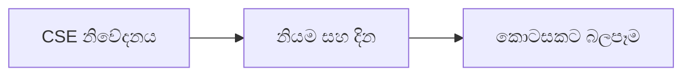

# 11 · ආයතනික ක්‍රියා විශ්ලේෂණය

[← මූලික විශ්ලේෂණය](../README.md) · [English](../../../01-Fundamental-Analysis/11-Corporate-Actions/README.md) · [தமிழ்](../../../ta/01-Fundamental-Analysis/11-Corporate-Actions/README.md) · [සිංහල](README.md)

> **SCAP.N0000 · Softlogic Capital PLC** · **තත්ත්වය:** පර්යේෂණ ක්‍රමවේදයකි; SCAP පිළිබඳ නවතම නිගමනයක් නොවේ. **Reference date: 2026-09-30**.

## 🎯 පර්යේෂණ ප්‍රශ්නය

ලාභාංශ, rights issues, splits, ඒකාබද්ධ කිරීම් හෝ වත්කම් විකුණුම් කොටස් ගණන සහ වටිනාකම වෙනස් කරන්නේද?

## 🔎 තහවුරු කළ යුතු දේ

- [ ] dividends, rights issues, splits, warrants, mergers, වත්කම් විකුණුම් හා recapitalisation දින සහිතව සටහන් කරන්න.
- [ ] මුල් හිමිකම් අනුපාත, බලපැවැත්වෙන දින, අලුත් කොටස් ගණන භාවිත කර dilution හා per-share බලපෑම ගණනය කරන්න.
- [ ] සිද්ධිය යෝජිත, අනුමත, බලපැවැත්වෙන, අවසන් වූ හෝ අවලංගු වූ තත්ත්වය වෙන් කරන්න.

## 🧭 පර්යේෂණ රූප සටහන

## ⚠️ නොකළ යුතු උපකල්පනය

Rights issue හි දැක්වූ මිල පමණක් ප්‍රමාණවත් නොවේ; entitlement සහ අවශ්‍ය මුදල් වැදගත් වේ.

## 🛠️ SCAP සඳහා පරීක්ෂණය

SCAP නිවේදන, ex-date, record date, effective date සහ කොටසකට බලපෑම් ඇතුළත් කාලරේඛාවක් සාදන්න.

## 📝 සාක්ෂි වගුව

| මිනුම / සිදුවීම | කාලය / විෂය පථය | මුල් මූලාශ්‍රය | සොයාගත් ප්‍රතිඵලය |
|---|---|---|---|
| ______ | ______ | ______ | ______ |
| ______ | ______ | ______ | ______ |

[පෙර SCAP සටහන](../../../si/RESEARCH-LOG.md) · [මූලාශ්‍ර](../../../si/SOURCES.md) · [CSE](https://www.cse.lk/)

**ක්‍රමය:** ප්‍රකාශන දිනය, ගිණුම් විෂය පථය, ඒකකය සහ මුල් පිටුව ලියන්න. මෙය වෙළෙඳපොළ මිලක් හෝ ආයෝජන නිර්දේශයක් නොවේ.
